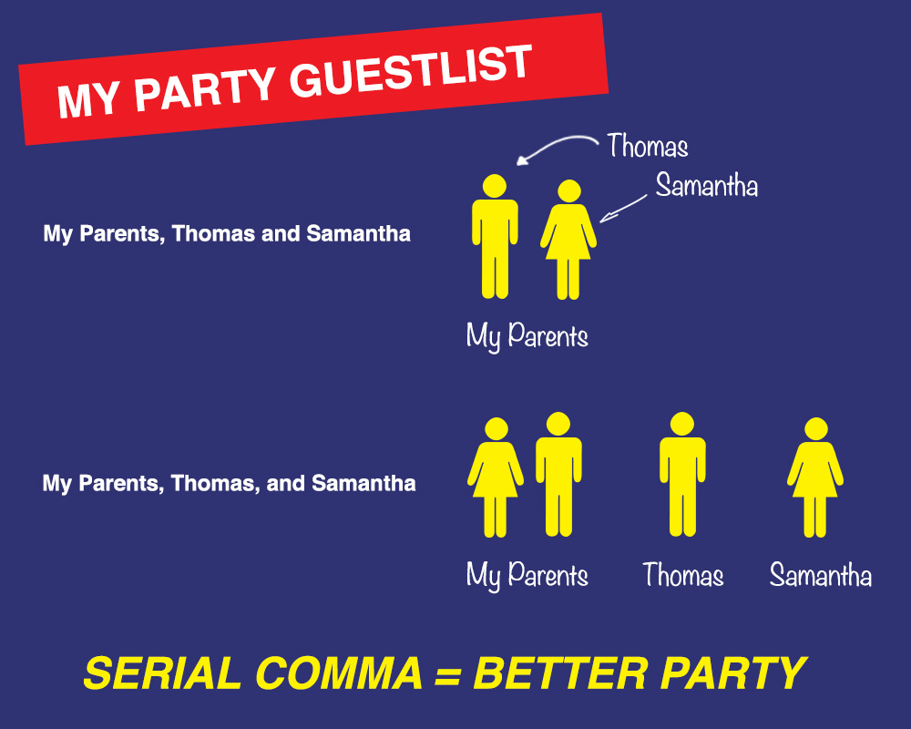

# Guide d'écriture de la documentation de Vue

La Rédaction d'une documentation est un exercice d'empathie. Nous ne décrivons pas une réalité objective - le code source le fait déjà. Notre travail consiste à aider à façonner la relation entre les utilisateurs et l'écosystème de Vue. Ce guide en constante évolution fournit des règles et des recommandations sur la façon de le faire de manière cohérente au sein de l'écosystème de Vue.

## Principes

- **Une fonctionnalité n'existe pas tant qu'elle n'est pas bien documentée.**
- **Respecter la capacité cognitive des utilisateurs (c'est-à-dire la puissance cérébrale).** Lorsqu'un utilisateur commence à lire, il commence avec une certaine quantité de puissance cérébrale limitée et lorsqu'il s'épuise, il arrête d'apprendre.
  - La capacité cognitive est **épuisée plus rapidement** par des phrases complexes, devant apprendre plus d'un concept à la fois et des exemples abstraits qui ne sont pas directement liés au travail d'un utilisateur.
  - La capacité cognitive est **épuisée plus lentement** lorsque nous les aidons à se sentir constamment intelligents, puissants et curieux. Décomposer les choses en morceaux assimilables et faire attention au flux du document peut aider à les maintenir dans cet état.
- **Toujours essayer de voir du point de vue de l'utilisateur.** Lorsque nous comprenons quelque chose à fond, cela devient évident pour nous. C'est ce qu'on appelle _la malédiction de la connaissance_. Afin de rédiger une bonne documentation, essayez de vous souvenir de ce que vous avez d'abord dû savoir lors de l'apprentissage de ce concept. Quel jargon avez-vous dû apprendre ? Qu'avez-vous mal compris ? Qu'est-ce qui a mis du temps à être vraiment saisi ? Une bonne documentation rencontre les utilisateurs là où ils se trouvent. Il peut être utile de s'entraîner à expliquer le concept aux gens en personne avant.
- **Décrivez d'abord le _problème_, puis la solution.** Avant de montrer le fonctionnement d'une fonctionnalité, il est important d'expliquer pourquoi elle existe. Sinon, les utilisateurs n'auront pas le contexte pour savoir si ces informations sont importantes pour eux (est-ce un problème qu'ils rencontrent ?) ou à quelles connaissances/expériences antérieures les associer.
- **Pendant que vous écrivez, n'ayez pas peur de poser des questions**, _surtout_ si vous craignez qu'elles ne soient "stupides". Être vulnérable est difficile, mais c'est la seule façon pour nous de mieux comprendre ce que nous devons expliquer.
- **Participez aux discussions sur les fonctionnalités.** Les meilleures API proviennent du développement basé sur la documentation, où nous créons des fonctionnalités faciles à expliquer, plutôt que d'essayer de comprendre comment les expliquer plus tard. Poser des questions (en particulier des questions "stupides") plus tôt aide souvent à révéler les confusions, les incohérences et les comportements problématiques avant qu'un changement radical ne soit nécessaire pour les résoudre.

## Organisation

- **Installation/Intégration** : Fournissez un aperçu complet de la manière d'intégrer le logiciel dans autant de types de projets différents que nécessaire.
- **Introduction/Mise en route** :
  - Fournissez un aperçu en moins de 10 minutes des problèmes que le projet résout et pourquoi il existe.
  - Fournissez un aperçu de moins de 30 minutes des problèmes que le projet résout et comment, y compris quand et pourquoi utiliser le projet et quelques exemples de code simples. À la fin, créez un lien vers la page d'installation et le début du guide Essentiels.
- **Guide** : Faites en sorte que les utilisateurs se sentent intelligents, puissants et curieux, puis maintenez cet état afin qu'ils conservent la motivation et la capacité cognitive nécessaires pour continuer à apprendre davantage. Les pages du guide sont destinées à être lues dans l'ordre, elles doivent donc généralement être classées selon le rapport puissance/effort du plus élevé au plus faible.
  - **Essentiels** : Cela ne devrait pas prendre plus de 5 heures pour lire les Essentiels, bien que plus court soit mieux. Son objectif est de fournir les 20% de connaissances qui aideront les utilisateurs à gérer 80% des cas d'utilisation. Les Essentiels peuvent être liés à des guides plus avancés et à l'API, bien que, dans la plupart des cas, vous devriez éviter de tels liens. Lorsqu'ils sont fournis, vous devez également fournir un contexte afin que les utilisateurs sachent s'ils doivent suivre ce lien lors de leur première lecture. Sinon, de nombreux utilisateurs finissent par épuiser leur capacité cognitive à sauter des liens, essayant d'apprendre pleinement tous les aspects d'une fonctionnalité avant de passer à autre chose et, par conséquent, ne terminent jamais cette première lecture des Essentials. N'oubliez pas qu'une lecture fluide est plus importante qu'une lecture approfondie. Nous voulons donner aux gens les informations dont ils ont besoin pour éviter une expérience frustrante, mais ils peuvent toujours revenir et lire plus encore, ou Googler un problème moins courant lorsqu'ils le rencontrent.
  - **Avancé** : Alors que les Essentiels aide les utilisateurs à gérer environ 80% des cas d'utilisation, les guides suivants aident les utilisateurs à atteindre 95% des cas d'utilisation, ainsi que des informations plus détaillées sur les fonctionnalités non essentielles (par exemple, les transitions, les animations), des fonctionnalités commode plus complexe (par exemple mixins, directives personnalisées) et améliorations de l'expérience de développement (par exemple JSX, plugins). Les derniers 5 % des cas d'utilisation qui sont plus spécifiques, complexes et/ou sujets aux abus seront laissés au livre de recette et à la référence de l'API, qui peuvent être liés à partir de ces guides avancés.
- **Référence/API** : Fournissez une liste complète des fonctionnalités, y compris des informations sur le type, des descriptions du problème que chacune résout, des exemples de chaque combinaison d'options et des liens vers des guides, des livres de recettes et d'autres ressources internes fournissant plus de détails. Contrairement à d'autres pages, celle-ci n'est pas destinée à être lue de haut en bas, de sorte que de nombreux détails peuvent être fournis. Ces références doivent également être plus facilement consultables que les guides, de sorte que le format doit être plus proche des entrées de dictionnaire que le format narratif des guides.
- **Migrations** :
  - **Versions** : Lorsque des modifications importantes sont apportées, il est utile d'inclure une liste complète des modifications, y compris une explication détaillée de la raison pour laquelle la modification a été apportée et comment migrer leurs projets.
  - **Provenant d'autres projets** : comment ce logiciel se compare-t-il à des logiciels similaires ? Ceci est important pour aider les utilisateurs à comprendre quels problèmes supplémentaires nous pourrions résoudre ou créer pour eux, et dans quelle mesure ils peuvent transférer les connaissances qu'ils possèdent déjà.
- **Guide de style** : Il y a nécessairement des éléments clés en développement qui nécessitent une décision, mais qui ne sont pas au cœur de l'API. Le guide de style fournit des recommandations éclairées et avisées pour aider à guider ces décisions. Ils ne doivent pas être suivis aveuglément, mais peuvent aider les équipes à gagner du temps en s'alignant sur des détails plus petits.
- **Cookbook** : Les recettes du livre de cuisine sont écrites avec une certaine hypothèse de familiarité avec Vue et son écosystème. Chacun est un document hautement structuré qui passe en revue certains détails d'implémentation courants qu'un développeur Vue peut rencontrer.

## Écriture et Grammaire

### Style

- **Les titres doivent décrire des problèmes**, pas des solutions. Par exemple, un titre moins efficace pourrait être "Utilisation des props", car il décrit une solution. Un meilleur titre pourrait être "Transmission de données aux composants enfants avec des props", car il fournit le contexte du problème que les props résolvent. Les utilisateurs ne commenceront pas vraiment à prêter attention à l'explication d'une fonctionnalité tant qu'ils n'auront pas une idée de pourquoi/quand ils l'utiliseront.
- **Lorsque vous assumez des connaissances, déclarez-les** au début et créez un lien vers des ressources pour des connaissances moins courantes que vous attendez.
- **Présentez un seul nouveau concept à la fois dans la mesure du possible** (y compris des exemples de texte et de code). Même si beaucoup de gens sont capables de comprendre quand vous en introduisez plus d'un, il y en a aussi beaucoup qui se perdront - et même ceux qui ne se perdront pas auront épuisé davantage leur capacité cognitive.
- **Dans la mesure du possible, évitez les blocs de contenu spéciaux pour les conseils et les mises en garde.** Il est généralement préférable de les intégrer plus naturellement au contenu principal, par ex. en s'appuyant sur des exemples pour démontrer un cas limite.
- **N'incluez pas plus de deux conseils et mises en garde entremêlés par page.** Si vous trouvez que plus de deux conseils sont nécessaires dans une page, envisagez d'ajouter une section de mises en garde pour résoudre ces problèmes. Le guide est destiné à être lu d'un bout à l'autre, et les conseils et mises en garde peuvent être accablants ou distrayants pour quelqu'un qui essaie de comprendre les concepts de base.
- **Évitez les appels à l'autorité** (par exemple, « vous devriez faire X, car c'est une bonne pratique » ou « X est préférable, car cela vous permet de séparer complètement vos préoccupations »). Au lieu de cela, démontrez avec des exemples les problèmes humains spécifiques causés et/ou résolus par un pattern.
- **Lorsque vous décidez quoi enseigner en premier, pensez aux connaissances qui fourniront le meilleur ratio puissance/effort.** Cela signifie enseigner tout ce qui aidera les utilisateurs à résoudre les plus grands maux ou le plus grand nombre de problèmes, avec le moins d'effort d'apprentissage. Cela aide les apprenants à se sentir intelligents, puissants et curieux, de sorte que leur capacité cognitive s'épuise plus lentement.
- **À moins que le contexte suppose un string template ou un système de build, n'écrivez que du code qui fonctionne dans n'importe quel environnement par le logiciel (par exemple, Vue, Vuex, etc.).**
- **Montrez, ne dites pas.** Par exemple, "Pour utiliser Vue sur une page, vous pouvez l'ajouter à votre code HTML" (puis afficher la balise de script), au lieu de "Pour utiliser Vue sur une page, vous pouvez ajouter un élément script avec un attribut src, la valeur dont devrait être un lien vers la source compilée de Vue".
- **Évitez presque toujours l'humour (pour les documentations en anglais)**, en particulier les références au sarcasme et à la culture pop, car cela ne se traduit pas bien d'une culture à l'autre.
- **Ne présumez jamais d'un contexte plus avancé que nécessaire.**
- **Dans la plupart des cas, préférez les liens entre les sections des documents plutôt que de répéter le même contenu dans plusieurs sections.** Certaines répétitions dans le contenu sont inévitables et même essentielles pour l'apprentissage. Cependant, trop de répétitions rend également les documents plus difficiles à maintenir, car un changement dans l'API nécessitera des changements à de nombreux endroits et il est facile de manquer quelque chose. C'est un équilibre difficile à trouver.
- **Spécifique vaut mieux que générique.** Par exemple, un exemple de composant `<BlogPost>` est mieux que `<ComposantA>`.
- **Reliable vaut mieux qu'obscure.** Par exemple, un composant `<BlogPost>` est mieux que `<CurrencyExchangeSettings>`.
- **Soyez émotionnellement pertinent.** Les explications et les exemples qui se rapportent à quelque chose que les gens ont vécu et dont ils se soucient seront toujours plus efficaces.
- **Préférez toujours un langage plus simple et plus clair au langage complexe ou au jargon.** Par exemple :
  - "vous pouvez utiliser Vue avec un élément script" au lieu de "afin d'initier l'utilisation de Vue, une option possible est de l'injecter via un élément HTML script"
  - "fonction qui renvoie une fonction" au lieu de "fonction d'ordre supérieur"
- **Évitez les termes qui invalident la difficulté**, tels que "facile", "juste", "évidemment", etc. Pour référence, voir [Mots à Éviter dans la Rédaction Pédagogique](https://css-tricks.com/words-avoid-educational-writing/).

### Grammaire

- **Évitez les abréviations** dans le texte et les exemples de code (par ex. `attribute` est mieux que `attr`, `message` est mieux que `msg`), sauf si vous faites spécifiquement référence à une abréviation dans une API (par exemple, `$attrs`). Les symboles d'abréviation inclus sur les claviers standard (par exemple `@`, `#`, `&`) sont OK.
- **Lorsque vous faites référence à un exemple qui suit directement, utilisez deux-points (`:`) pour terminer une phrase**, plutôt qu'un point (`.`).
- **Utilisez la virgule Oxford** (par exemple, "a, b, et c" au lieu de "a, b et c"). 
  - Source: [La virgule sérielle (Oxford) : quand et pourquoi l'utiliser](https://www.inkonhand.com/2015/10/the-serial-oxford-comma-when-and-why-to-use-it/)
- **Lorsque vous faites référence au nom d'un projet, utilisez le nom auquel le projet se réfère lui-même.** Par exemple, "webpack" et "npm" doivent tous deux utiliser des minuscules car c'est ainsi que leur documentation se réfère à eux.
- **Utilisez la casse du titre pour les titres** - du moins pour le moment, puisque c'est ce que nous utilisons dans le reste de la documentation. Des recherches suggèrent que la casse des phrases (seul le premier mot du titre commence par une majuscule) est en fait meilleure pour la lisibilité et réduit également la surcharge cognitive pour les rédacteurs de documentation, car ils n'ont pas à essayer de se rappeler s'il faut mettre en majuscule des mots comme "et ", "avec" et "à-propos".
- **N'utilisez pas d'émojis (sauf dans les discussions).** Les émojis sont mignons et amicaux, mais ils peuvent être une distraction dans la documentation et certains émojis véhiculent même des significations différentes selon les cultures.

## Itération & Communication

- **L'excellence vient de l'itération.** Les premiers brouillons sont toujours mauvais, mais leur rédaction est une partie essentielle du processus. Il est extrêmement difficile d'éviter la lente progression de Mauvais -> OK -> Bon -> Très Bon -> Inspirant -> Transcendant.
- **Attendez seulement que quelque chose soit "Bon" avant de le publier.** La communauté vous aidera à le pousser plus loin dans la chaîne.
- **Essayez de ne pas être sur la défensive lorsque vous recevez des commentaires.** Notre écriture peut être très personnelle pour nous, mais si nous nous fâchons contre les personnes qui nous aident à l'améliorer, elles cesseront de donner des commentaires ou commenceront à limiter le type de commentaires qu'ils donnent.
- **Relisez votre propre travail avant de le montrer à d'autres.** Si vous montrez à quelqu'un un travail avec beaucoup de fautes d'orthographe/de grammaire, vous obtiendrez des commentaires sur la grammaire/les fautes d'orthographe au lieu de notes plus utiles pour savoir si l'écriture a atteint vos objectifs.
- **Lorsque vous demandez aux utilisateurs de donner leur avis, dites-leur ce que :**
  - **vous essayez de faire**
  - **vos peurs sont**
  - **les équilibres que vous essayez d'atteindre**
- **Quand quelqu'un signale un problème, il y a presque toujours un problème**, même si la solution proposée n'est pas tout à fait la bonne. Continuez à poser des questions de suivi pour en savoir plus.
- Les gens doivent se sentir en sécurité en posant des questions lorsqu'ils contribuent/révisent du contenu. Voici comment procéder :
  - **Remerciez les gens pour leurs contributions/avis, même si vous vous sentez grincheux.** Par exemple :
    - "Grande question !"
    - "Merci d'avoir pris le temps de m'expliquer. 🙂"
    - "C'est en fait intentionnel, mais merci d'avoir pris le temps de contribuer. 😊"
  - **Écoutez ce que les gens disent et réfléchissez si vous n'êtes pas sûr de bien comprendre.** Cela peut aider à valider les sentiments et les expériences des gens, tout en permettant de comprendre si _vous_ les _comprenez_ correctement.
  - **Utilisez beaucoup d'emojis positifs et empathiques.** Il vaut toujours mieux paraître un peu étrange que méchant ou impatient.
  - **Communiquez gentiment les règles/limites.** Si quelqu'un se comporte d'une manière abusive/inappropriée, répondez uniquement avec gentillesse et maturité, mais précisez également que ce comportement n'est pas acceptable et ce qui se passera (selon le code de conduite) s'ils continuent à se comporter mal.

### Conseils, Légendes, Alertes et Mises en Surbrillance des lignes

Nous avons des styles dédiés pour désigner quelque chose qui mérite d'être souligné d'une manière particulière. Celles-ci sont enregistrées [sur cette page](https://vitepress.dev/guide/markdown#custom-containers). **Ils sont à utiliser avec parcimonie.**

Il y a une certaine tentation d'abuser de ces styles, car on peut simplement ajouter un changement à l'intérieur d'une légende. Cependant, cela interrompt le flux de lecture pour l'utilisateur et ne doit donc être utilisé que dans des circonstances particulières. Dans la mesure du possible, nous devrions essayer de créer un récit et un flux dans la page pour respecter la charge cognitive des lecteurs.

Il ne faut en aucun cas utiliser 2 alertes l'une à côté de l'autre, c'est signe qu'on n'est pas capable d'expliquer assez bien le contexte.

### Contribution

Nous apprécions les petites PRs ciblées. Si vous souhaitez apporter une modification extrêmement importante, veuillez communiquer avec les membres de l'équipe avant une pull request. Voici un [texte qui détaille pourquoi c'est si critique](https://www.netlify.com/blog/2020/03/31/how-to-scope-down-prs/) pour que nous puissions bien travailler dans cette équipe. Veuillez comprendre que même si nous apprécions toujours les contributions, nous devons finalement donner la priorité à ce qui fonctionne le mieux pour le projet dans son ensemble.

## Resources

### Logiciel

- [Grammarly](https://www.grammarly.com/) : App de bureau et extension de navigateur pour vérifier l'orthographe et la grammaire (bien que la vérification de la grammaire ne détecte pas tout et montre parfois un faux positif).
- [Code Spell Checker](https://marketplace.visualstudio.com/items?itemName=streetsidesoftware.code-spell-checker) : Une extension pour VS Code pour vous aider à vérifier l'orthographe dans les markdown et les exemples de code.

### Livres

- [On Writing Well](https://www.amazon.com/Writing-Well-30th-Anniversary-Nonfiction-ebook/dp/B0090RVGW0) (voir [popular quotes](https://www.goodreads.com/work/quotes/1139032-on-writing-well-the-classic-guide-to-writing-nonfiction))
- [Bird by Bird](https://www.amazon.com/Bird-Some-Instructions-Writing-Life/dp/0385480016) (voir [popular quotes](https://www.goodreads.com/work/quotes/841198-bird-by-bird-some-instructions-on-writing-and-life))
- [Cognitive Load Theory](https://www.amazon.com/Cognitive-Explorations-Instructional-Performance-Technologies/dp/144198125X/)
