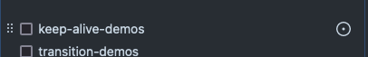

## Directives de contribution

Merci de prendre connaissance du [Guide d'écriture](https://github.com/vuejs-translations/docs-fr/blob/main/.github/contributing/writing-guide.md) pour bien appréhender la manière de formuler les phrases pour que la lecture soit la plus simple et la plus fluide possible.

### Glossaire

L'usage d'un glossaire est nécessaire pour homogénéiser les traductions.
Les mots techniques ne doivent pas être traduits.  
Consulter [le glossaire](https://github.com/vuejs-translations/docs-fr/wiki/Glossaire) en cas de doute.

Si un mot vous embête (car trop ambigu), [créez une discussion Terminologie](https://github.com/vuejs-translations/docs-fr/discussions/categories/terminologie) pour prendre une décision en commun accord.

### Partager le travail de traduction

Tout le travail de traduction est guidé par l'issue [Suivi de la traduction #125](https://github.com/vuejs-translations/docs-fr/issues/125) qui liste toutes les pages à traduire avec leur statut (avec une issue rattachée et son état).
Une issue rattachée en état ouvert sans assignation peut être considérée comme ouverte à la contribution et prise en charge par quiconque : assignez-la vous ou laissez un commentaire.  
Toutefois, une issue ouverte est peut-être en cours de traduction si une PR y est rattachée. Profitez-en pour y passez faire une relecture. 

En tant que contributeur, si une page n'a aucune issue rattachée, vous pouvez la créer depuis la liste.

> Au survol sur la ligne, cliquez sur le rond.

Renseignez les informations supplémentaires si nécessaire.

*Si vous n'êtes pas contributeur, vous pouvez créer une issue et mentionner un contributeur pour mettre à jour le suivi.  
**[Devenir contributeur ?](#devenir-contributeur-de-la-traduction-française)***

### Contribuer au projet (de A à Z)

> **Note**
Il faut conserver le même nombre de lignes entre le fichier original et le fichier traduit et s'assurer que chaque numéro de ligne original corresponde à son numéro de ligne traduit.  
Cela nous permettra de suivre plus facilement les pans de texte qui ont changé dans le futur ou même d'avoir version EN/FR en concordance dans nos pulls request ligne par ligne — ce qui est plus pratique pour les reviews.

#### Étapes

1. **Informer**

Dites ici que vous allez entreprendre la traduction d'une page. Éditez le premier post et changez l'état de la liste si vous en avez le droit.

2. **Faire un fork** (si vous n'êtes pas contributeur)

Faites un fork du dépôt `vuejs-translations/docs-fr` (ce dépôt) vers `{your-username}/docs-fr` (chez vous).

3. **Créer une branche**

Créez une nouvelle branche {branch} dédiée spécifiquement au changement de votre fichier (cf. [Partager le travail de traduction](#partager-le-travail-de-traduction)).

4. **Débuter la traduction**

Commencez à traduire votre fichier pour pouvoir effectuer au moins un premier commit.

5. **Créer une pull request**

Créer une pull request (depuis votre branche de fork `{your-username}/docs-fr:{branch}` si vous n'êtes pas contributeur) en complétant la description pré-remplie vers la  branche principale du dépôt.  
Si votre tâche est longue, vous pouvez utiliser le statut _draft_ pour signaler l'aspect _Work in Progress_ de votre PR.

> **Note**
> La PR peut être considérée comme prête lorsque toutes les coches seront cochées

6. **Réclamer des reviews**

Quand votre traduction est assez mûre pour une review, affectez des personnes en tant que reviewer (probablement celles qui vous auront aidé lors de la traduction) pour qu'elles sachent qu'elles peuvent consacrer un temps plus conséquent à la relecture minutieuse de votre travail.

7. **Itérez les ajustements**

De la même manière qu'avant review votre traduction a été mis à jour au fur et à mesure de vos commits sur la pull request ; vous mettez à jour maintenant les remarques de review pour solidifier votre travail toujours avec des commits. Au moins 3 relecteurs sont recommandés.

8. **Merger**

Une fois tout en ordre et que toutes les reviews sont approuvées, votre travail pourra être intégré dans la traduction française de Vue.
Si vous êtes contributeur, vous pourrez merger votre propre PR. Sinon, quelqu'un s'en chargera.

### Devenir contributeur de la traduction française

Être contributeur simplifie le procédé et permet de s'affranchir des forks en travaillant directement sur les branches. **Rejoignez nous sur Discord pour discuter et évoluer ensemble pour intégration dans l'équipe de traduction.**

### Extensions VS Code

Utilisez les extensions suivantes pour éviter les fautes orthographiques :

- streetsidesoftware.code-spell-checker
- streetsidesoftware.code-spell-checker-french
