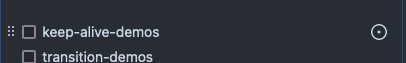

[](https://stackblitz.com/~/github.com/edimitchel/docs-fr)

# Dépôt de contribution pour la traduction française de vuejs.org

Ce projet est un fork de vuejs/docs dont le but est de centraliser les efforts pour sa traduction en français.

Merci de vous référer à la partie [Contributing](#contributing) et spécifiquement à ce dépôt la partie [Directives de contribution](#Directives-de-contribution) afin de nous prêter main forte en bonne et due forme.

Il est important également de prendre connaissances des [bonnes pratiques pour la traduction de la documentation](https://github.com/vuejs-translations/guidelines).

## Directives de contribution

Merci de prendre connaissance du [Guide d'écriture](https://github.com/edimitchel/docs-fr/blob/main/.github/contributing/writing-guide.md) pour bien appréhender la manière de formuler les phrases pour que la lecture soit la plus simple et la plus fluide.

### VS Code extensions

Utilisez les extensions suivantes pour éviter les fautes orthographiques:

- streetsidesoftware.code-spell-checker
- streetsidesoftware.code-spell-checker-french

### Partager le travail de traduction

Tout le travail de traduction est guidé par l'issue [Suivi de la traduction #125](https://github.com/edimitchel/docs-fr/issues/125) qui liste toutes les pages à traduire avec leur statut (avec une issue rattachée et son état).
Une issue rattachée en état ouvert sans assignation peut être considérée comme ouverte à la contribution et pris en charge par quiconque: assignez-la vous ou laissez un commentaire.  
Toutefois, une issue ouverte est peut-être en cours de traduction si une PR y est rattachée. Profitez-en pour y passez faire une relecture. 

Si une page n'a aucune issue rattachée, vous pouvez la créer depuis la liste (seulement pour les contributeurs).



*Si vous n'êtes pas contributeur, vous pouvez créer une issue et mentionner un contributeur pour mettre à jour le suivi.*

---

# vuejs.org

## Contribution

Ce site est construit avec [VitePress](https://github.com/vuejs/vitepress) et dépend de [@vue/theme](https://github.com/vuejs/vue-theme). Le contenu du site est écrit au format Markdown situé dans `src`. Pour des modifications simples, vous pouvez modifier directement le fichier sur GitHub et générer une Pull Request.

Pour le développement local, [pnpm](https://pnpm.io/) est préférable comme gestionnaire de packages :

```bash
pnpm i
pnpm run dev
```

This project requires Node.js to be `v14.0.0` or higher, because we use new JavaScript features in our code, such as optional chaining.

## Travail sur le contenu

- Voir la documentation de VitePress sur les [extensions Markdown](https://vitepress.vuejs.org/guide/markdown.html) prises en charge et la possibilité d'[utiliser la syntaxe Vue dans Markdown](https://vitepress.vuejs.org/guide/using-vue.html).

- Consultez le [Guide d'Écriture](https://github.com/vuejs/docs/blob/main/.github/contributing/writing-guide.md) pour nos règles et recommandations sur la rédaction et la maintenance du contenu de la documentation.

## Travail sur le le thème

Si des modifications doivent être apportées au thème, consultez les [instructions pour développer le thème parallèlement à la documentation](https://github.com/vuejs/vue-theme#developing-with-real-content).
