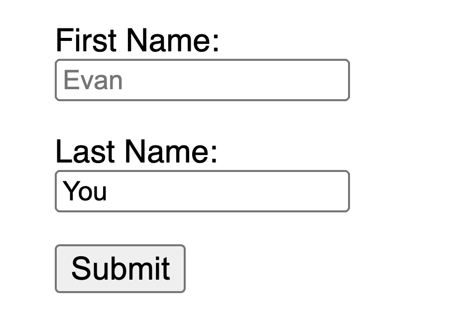

# Accessibilité {#accessibility}

L'accessibilité numérique (en abrégé a11y) fait référence aux pratiques visant à créer des sites web qui peuvent être utilisés par toutes les personnes — qu'elles aient un handicap, une connexion lente, du matériel ancien ou défectueux ou simplement un environnement défavorable. Par exemple, ajouter des sous-titres à une vidéo peut aider vos utilisateurs sourds et malentendants ainsi que ceux dans un environnement bruyant et qui ne peuvent pas entendre leur téléphone. De la même façon, s'assurer que le contraste de votre texte n'est pas trop bas aidera les utilisateurs déficients visuels ainsi que ceux qui utilisent leur téléphone en plein soleil.

Par où commencer ?

Visitez le guide de [planification et pilotage de la prise en compte de l’accessibilité Web (en anglais)](https://www.w3.org/WAI/planning-and-managing/) proposé par le [World Wide Web Consortium (W3C)](https://www.w3.org/)

## Liens d'évitement ou d'accès rapide {#skip-link}

Vous devez ajouter un lien en haut de chaque page qui mène directement à la zone de contenu principale afin que les utilisateurs puissent ignorer les zones de regroupement de contenus répétées sur plusieurs pages web.

Typiquement, cela se fait en haut de `App.vue` car ce sera le premier élément pouvant être ciblé sur toutes vos pages :

```vue-html
<span ref="backToTop" tabindex="-1" />
<ul class="skip-links">
  <li>
    <a href="#main" ref="skipLink" class="skip-link">Skip to main content</a>
  </li>
</ul>
```

Pour masquer le lien lorsqu'il n'est pas ciblé, vous pouvez ajouter le style suivant :

```css
.skip-links {
  list-style: none;
}
.skip-link {
  white-space: nowrap;
  margin: 1em auto;
  top: 0;
  position: fixed;
  left: 50%;
  margin-left: -72px;
  opacity: 0;
}
.skip-link:focus {
  opacity: 1;
  background-color: white;
  padding: 0.5em;
  border: 1px solid black;
}
```

Lorsque qu'un utilisateur change d'itinéraire, redonnez le focus au tout début de la page, juste avant le lien d'évitement. Cela peut être réalisé en appelant focus sur la ref de template du lien d'évitement (en supposant l'utilisation de `vue-router`) :

<div class="options-api">

```vue
<script>
export default {
  watch: {
    $route() {
      this.$refs.backToTop.focus()
    }
  }
}
</script>
```

</div>
<div class="composition-api">

```vue
<script setup>
import { ref, watch } from 'vue'
import { useRoute } from 'vue-router'

const route = useRoute()
const backToTop = ref()

watch(
  () => route.path,
  () => {
    backToTop.value.focus()
  }
)
</script>
```

</div>

[Lisez la documentation à propos des liens d'évitement vers le contenu principal](https://accessibilite.numerique.gouv.fr/methode/glossaire/#liens-d-evitement-ou-d-acces-rapide)

## Structuration de l'information {#content-structure}

L'un des éléments les plus importants de l'accessibilité est de s'assurer que le design peut soutenir une mise en œuvre accessible. Le design doit tenir compte non seulement du contraste des couleurs, de la sélection des polices, du dimensionnement du texte et de la langue, mais également de la structure du contenu dans l'application.

### Titres {#headings}

Les utilisateurs peuvent naviguer dans une application à travers les titres. Le fait d'avoir des titres descriptifs pour chaque section de votre application permet aux utilisateurs de prédire plus facilement le contenu de celle-ci. En ce qui concerne les titres, il existe quelques pratiques d'accessibilité recommandées :

- Imbriquez les titres dans leur ordre hiérarchique : `<h1>` - `<h6>`
- Ne sautez pas les titres à l'intérieur d'une section
- Utilisez les balises de titres plutôt que du style de texte pour représenter visuellement des titres.

[En lire plus à propos des titres](https://www.w3.org/TR/UNDERSTANDING-WCAG20/navigation-mechanisms-descriptive.html)

```vue-html
<main role="main" aria-labelledby="main-title">
  <h1 id="main-title">Main title</h1>
  <section aria-labelledby="section-title-1">
    <h2 id="section-title-1"> Section Title </h2>
    <h3>Section Subtitle</h3>
    <!-- Contenu -->
  </section>
  <section aria-labelledby="section-title-2">
    <h2 id="section-title-2"> Section Title </h2>
    <h3>Section Subtitle</h3>
    <!-- Contenu -->
    <h3>Section Subtitle</h3>
    <!-- contenu -->
  </section>
</main>
```

### Landmarks {#landmarks}

[Les rôles ARIA landmark](https://developer.mozilla.org/en-US/docs/Web/Accessibility/ARIA/Roles/landmark_role) permettent d'accéder programmatiquement aux sections d'une application. Les utilisateurs qui s'appuient sur des technologies d'assistance peuvent naviguer vers chaque section de l'application et passer d'un contenu à l'autre. Vous pouvez utiliser les [rôles ARIA](https://developer.mozilla.org/en-US/docs/Web/Accessibility/ARIA/Roles) pour vous aider à atteindre ce résultat.

| HTML    | Rôle ARIA            | But du landmark                                                                                                                |
| ------- | -------------------- | ------------------------------------------------------------------------------------------------------------------------------ |
| header  | role="banner"        | Entête principal : titre de la page.                                                                                           |
| nav     | role="navigation"    | Collection de liens utilisables lors de la navigation dans le document ou vers des documents associés                          |
| main    | role="main"          | Le contenu central ou principal du document.                                                                                   |
| footer  | role="contentinfo"   | Information à propos du document parent : notes de pied de page/copyrights/liens vers la déclaration de confidentialité        |
| aside   | role="complementary" | Supporte le contenu principal, malgré tout est séparé et a du sens par lui-même                                                |
| search  | role="search"        | Cette section contient la fonctionnalité de recherche pour l'application                                                       |
| form    | role="form"          | Collection d'éléments associés à un formulaire                                                                                 |
| section | role="region"        | Contenus pertinents vers lesquels les utilisateurs sont susceptibles de naviguer. Un libellé doit être fourni pour cet élément |

[Aller plus loin à propos des landmarks](https://www.w3.org/TR/wai-aria-1.2/#landmark_roles)

## Formulaires sémantiques {#semantic-forms}

Lors de la création d'un formulaire, vous pouvez utiliser les éléments suivants : `<form>`, `<label>`, `<input>`, `<textarea>`, et `<button>`

Les labels sont en général placés en haut ou à gauche des champs de formulaire :

```vue-html
<form action="/dataCollectionLocation" method="post" autocomplete="on">
  <div v-for="item in formItems" :key="item.id" class="form-item">
    <label :for="item.id">{{ item.label }} : </label>
    <input
      :type="item.type"
      :id="item.id"
      :name="item.id"
      v-model="item.value"
    />
  </div>
  <button type="submit">Submit</button>
</form>
```

Remarquez comment vous pouvez inclure `autocomplete='on'` sur l'élément de formulaire et il sera appliqué à tous les input de votre formulaire. Vous pouvez aussi positionner différentes [valeurs pour l'attribut autocomplete](https://developer.mozilla.org/fr/docs/Web/HTML/Attributes/autocomplete) pour chaque input.

### Labels {#labels}

Utilisez des labels pour décrire le but de chaque contrôle de formulaire ; en liant `for` et `id`.

```vue-html
<label for="name">Name: </label>
<input type="text" name="name" id="name" v-model="name" />
```

Si vous inspectez cet élément dans vos Outils de développement Chrome et que vous ouvrez l'onglet Accessibilité dans l'onglet Éléments, vous verrez comment le champ prend son nom du label :

:::warning Attention :
Vous pourriez avoir vu cette façon d'envelopper un champ de saisie par un label :

```vue-html
<label>
  Name:
  <input type="text" name="name" id="name" v-model="name" />
</label>
```

Associer les labels avec un id correspondant est mieux supporté par les technologies d'assistance.
:::

#### `aria-label` {#aria-label}

Vous pouvez aussi donner un nom accessible au champ avec [`aria-label`](https://developer.mozilla.org/en-US/docs/Web/Accessibility/ARIA/Attributes/aria-label).

```vue-html
<label for="name">Name: </label>
<input
  type="text"
  name="name"
  id="name"
  v-model="name"
  :aria-label="nameLabel"
/>
```

N'hésitez pas à inspecter cet élément dans les outils de développeur de Chrome pour voir comment le nom accessible a changé :


#### `aria-labelledby` {#aria-labelledby}

Utiliser [`aria-labelledby`](https://developer.mozilla.org/en-US/docs/Web/Accessibility/ARIA/Attributes/aria-labelledby) est similaire à `aria-label` à l'exception du fait que c'est utilisé si le libellé est visible à l'écran. Associez-le à d'autres éléments par leurs `id` et vous pourrez associer plusieurs `id`:

```vue-html
<form
  class="demo"
  action="/dataCollectionLocation"
  method="post"
  autocomplete="on"
>
  <h1 id="billing">Billing</h1>
  <div class="form-item">
    <label for="name">Name: </label>
    <input
      type="text"
      name="name"
      id="name"
      v-model="name"
      aria-labelledby="billing name"
    />
  </div>
  <button type="submit">Submit</button>
</form>
```


#### `aria-describedby` {#aria-describedby}

L'attribut [aria-describedby](https://developer.mozilla.org/en-US/docs/Web/Accessibility/ARIA/Attributes/aria-describedby) est utilisé de la même manière que `aria-labelledby` à l'exception qu'il fournit une description avec de l'information supplémentaire pour l'utilisateur. Cela peut être utilisé pour décrire le critère pour n'importe quel champ :

```vue-html
<form
  class="demo"
  action="/dataCollectionLocation"
  method="post"
  autocomplete="on"
>
  <h1 id="billing">Billing</h1>
  <div class="form-item">
    <label for="name">Full Name: </label>
    <input
      type="text"
      name="name"
      id="name"
      v-model="name"
      aria-labelledby="billing name"
      aria-describedby="nameDescription"
    />
    <p id="nameDescription">Please provide first and last name.</p>
  </div>
  <button type="submit">Submit</button>
</form>
```

Vous pouvez voir la description en inspectant depuis les outils de développeur Chrome :


### Placeholder {#placeholder}

Évitez d'utiliser des placeholders car ils perturbent beaucoup d'utilisateurs.

Un des problèmes avec les placeholders est qu'ils ne remplissent pas les [critères de contraste de couleur](https://www.w3.org/WAI/WCAG21/Understanding/contrast-minimum.html) par défaut ; corriger le contraste de couleur donne l'impression que le champ est pré-rempli avec une valeur. En regardant l'exemple suivant, vous pouvez voir que le placeholder Last Name conforme aux critères de contraste semble être pré-rempli :



```vue-html
<form
  class="demo"
  action="/dataCollectionLocation"
  method="post"
  autocomplete="on"
>
  <div v-for="item in formItems" :key="item.id" class="form-item">
    <label :for="item.id">{{ item.label }} : </label>
    <input
      type="text"
      :id="item.id"
      :name="item.id"
      v-model="item.value"
      :placeholder="item.placeholder"
    />
  </div>
  <button type="submit">Submit</button>
</form>
```

```css
/* https://www.w3schools.com/howto/howto_css_placeholder.asp */

#lastName::placeholder {
  /* Chrome, Firefox, Opera, Safari 10.1+ */
  color: black;
  opacity: 1; /* Firefox */
}

#lastName:-ms-input-placeholder {
  /* Internet Explorer 10-11 */
  color: black;
}

#lastName::-ms-input-placeholder {
  /* Microsoft Edge */
  color: black;
}
```

Il vaut mieux fournir toutes les informations dont l'utilisateur a besoin pour remplir les formulaires à l'extérieur des champs de saisie.

### Instructions {#instructions}

Lorsque vous ajoutez des instructions pour vos champs de saisie, assurez-vous de les associer correctement aux champs de saisie.
Vous pouvez fournir des instructions complémentaires et associer plusieurs ids à l'intérieur d'un [`aria-labelledby`](https://developer.mozilla.org/en-US/docs/Web/Accessibility/ARIA/Attributes/aria-labelledby). Cela permet un design plus flexible.

```vue-html
<fieldset>
  <legend>Using aria-labelledby</legend>
  <label id="date-label" for="date">Current Date: </label>
  <input
    type="date"
    name="date"
    id="date"
    aria-labelledby="date-label date-instructions"
  />
  <p id="date-instructions">MM/DD/YYYY</p>
</fieldset>
```

De façon alternative, vous pouvez attacher les instructions au champ avec [`aria-describedby`](https://developer.mozilla.org/en-US/docs/Web/Accessibility/ARIA/Attributes/aria-describedby):

```vue-html
<fieldset>
  <legend>En utilisant aria-describedby</legend>
  <label id="dob" for="dob">Date de naissance : </label>
  <input type="date" name="dob" id="dob" aria-describedby="dob-instructions" />
  <p id="dob-instructions">DD/MM/YYYY</p>
</fieldset>
```

### Cacher du contenu {#hiding-content}

En règle générale, il n'est pas recommandé de cacher visuellement des labels, même si le champ est un nom accessible. Cependant, si la fonctionnalité du champ peut être comprise à l'aide du contenu alentour, alors, nous pouvons cacher le libellé visuel.

Regardons ce champ de recherche :

```vue-html
<form role="search">
  <label for="search" class="hidden-visually">Search: </label>
  <input type="text" name="search" id="search" v-model="search" />
  <button type="submit">Search</button>
</form>
```

Nous pouvons faire cela, car le bouton de recherche va aider les utilisateurs visuels à identifier le but du champ de saisie.

Nous pouvons utiliser du CSS pour cacher visuellement des éléments, mais les laisser disponibles pour les technologies d'assistance :

```css
.hidden-visually {
  position: absolute;
  overflow: hidden;
  white-space: nowrap;
  margin: 0;
  padding: 0;
  height: 1px;
  width: 1px;
  clip: rect(0 0 0 0);
  clip-path: inset(100%);
}
```

#### `aria-hidden="true"` {#aria-hidden-true}

Ajouter `aria-hidden="true"` va cacher l'élément aux technologies d'assistance, mais les laissera disponibles visuellement pour les autres utilisateurs. Ne l'utilisez pas pour des éléments sur lesquels il est possible de faire le focus, uniquement sur des éléments décoratifs ou du contenu hors écran.

```vue-html
<p>This is not hidden from screen readers.</p>
<p aria-hidden="true">This is hidden from screen readers.</p>
```

### Boutons {#buttons}

Lorsque vous utilisez des boutons à l'intérieur d'un formulaire, vous devez en indiquer le type afin d'éviter la soumission du formulaire.
Vous pouvez aussi utiliser un input pour créer des boutons :

```vue-html
<form action="/dataCollectionLocation" method="post" autocomplete="on">
  <!-- Boutons -->
  <button type="button">Cancel</button>
  <button type="submit">Submit</button>

  <!-- Input buttons -->
  <input type="button" value="Cancel" />
  <input type="submit" value="Submit" />
</form>
```

### Images fonctionnelles {#functional-images}

Vous pouvez utiliser cette technique pour créer des images fonctionnelles.

- Champs de saisie

  - Ces images feront office de boutons de soumission pour les formulaires

  ```vue-html
  <form role="search">
    <label for="search" class="hidden-visually">Search: </label>
    <input type="text" name="search" id="search" v-model="search" />
    <input
      type="image"
      class="btnImg"
      src="https://img.icons8.com/search"
      alt="Search"
    />
  </form>
  ```

- Icônes

```vue-html
<form role="search">
  <label for="searchIcon" class="hidden-visually">Search: </label>
  <input type="text" name="searchIcon" id="searchIcon" v-model="searchIcon" />
  <button type="submit">
    <i class="fas fa-search" aria-hidden="true"></i>
    <span class="hidden-visually">Search</span>
  </button>
</form>
```

## Standards {#standards}

Le World Wide Web Consortium (W3C) Web Accessibility Initiative (WAI) développe les standards d'accessibilité pour les différents composants :

- [User Agent Accessibility Guidelines (UAAG)](https://www.w3.org/WAI/standards-guidelines/uaag/)
  - navigateurs web et lecteurs de média, incluant certains aspects de technologies d'assistance
- [Authoring Tool Accessibility Guidelines (ATAG)](https://www.w3.org/WAI/standards-guidelines/atag/)
  - outils de création de contenu
- [Web Content Accessibility Guidelines (WCAG)](https://www.w3.org/WAI/standards-guidelines/wcag/)
  - contenu web - utilisé par des développeurs, outils de création de contenu, outils d'évaluation d'accessibilité

### Web Content Accessibility Guidelines (WCAG) {#web-content-accessibility-guidelines-wcag}

[WCAG 2.1](https://www.w3.org/TR/WCAG21/) étend [WCAG 2.0](https://www.w3.org/TR/WCAG20/) et permet l'implémentation de nouvelles technologies en tenant compte de l'évolution du web. Le W3C encourage l'utilisation de la version la plus récente de WCAG lors du développement ou de la mise à jour de vos pratiques d'accessibilité Web.

#### WCAG 2.1 Quatre principaux principes de guidance (POUR en abrégé) : {#wcag-2-1-four-main-guiding-principles-abbreviated-as-pour}

- [Perceptible](https://www.w3.org/TR/WCAG21/#perceivable)
  - Les utilisateurs doivent être capables de percevoir l'information qui leur est présentée
- [Utilisable](https://www.w3.org/TR/WCAG21/#operable)
  - Les formulaires, contrôles et navigation de l'interface sont utilisables
- [Compréhensible](https://www.w3.org/TR/WCAG21/#understandable)
  - Les informations et l’utilisation de l’interface utilisateur doivent être compréhensibles par tous les utilisateurs
- [Robuste](https://www.w3.org/TR/WCAG21/#robust)
  - Les utilisateurs doivent pouvoir continuer d'accéder au contenu au fur et à mesure que la technologie avance

#### Web Accessibility Initiative – Accessible Rich Internet Applications (WAI-ARIA) {#web-accessibility-initiative-–-accessible-rich-internet-applications-wai-aria}

WAI-ARIA du W3C fournit des conseils sur comment construire du contenu dynamique et des contrôles avancés d'interface utilisateur.

- [Accessible Rich Internet Applications (WAI-ARIA) 1.2](https://www.w3.org/TR/wai-aria-1.2/)
- [WAI-ARIA Authoring Practices 1.2](https://www.w3.org/TR/wai-aria-practices-1.2/)

## Resources {#resources}

### Documentation {#documentation}

- [WCAG 2.0](https://www.w3.org/TR/WCAG20/)
- [WCAG 2.1](https://www.w3.org/TR/WCAG21/)
- [Accessible Rich Internet Applications (WAI-ARIA) 1.2](https://www.w3.org/TR/wai-aria-1.2/)
- [WAI-ARIA Authoring Practices 1.2](https://www.w3.org/TR/wai-aria-practices-1.2/)

### Technologies d'assistance {#assistive-technologies}

- Liseurs d'écran
  - [NVDA](https://www.nvaccess.org/download/)
  - [VoiceOver](https://www.apple.com/accessibility/mac/vision/)
  - [JAWS](https://www.freedomscientific.com/products/software/jaws/?utm_term=jaws%20screen%20reader&utm_source=adwords&utm_campaign=All+Products&utm_medium=ppc&hsa_tgt=kwd-394361346638&hsa_cam=200218713&hsa_ad=296201131673&hsa_kw=jaws%20screen%20reader&hsa_grp=52663682111&hsa_net=adwords&hsa_mt=e&hsa_src=g&hsa_acc=1684996396&hsa_ver=3&gclid=Cj0KCQjwnv71BRCOARIsAIkxW9HXKQ6kKNQD0q8a_1TXSJXnIuUyb65KJeTWmtS6BH96-5he9dsNq6oaAh6UEALw_wcB)
  - [ChromeVox](https://chrome.google.com/webstore/detail/chromevox-classic-extensi/kgejglhpjiefppelpmljglcjbhoiplfn?hl=en)
- Outils de loupe
  - [MAGic](https://www.freedomscientific.com/products/software/magic/)
  - [ZoomText](https://www.freedomscientific.com/products/software/zoomtext/)
  - [Magnifier](https://support.microsoft.com/fr/help/11542/windows-use-magnifier-to-make-things-easier-to-see)

### Tester l'accessibilité {#testing}

- Outils automatisés
  - [Lighthouse](https://chrome.google.com/webstore/detail/lighthouse/blipmdconlkpinefehnmjammfjpmpbjk)
  - [WAVE](https://chrome.google.com/webstore/detail/wave-evaluation-tool/jbbplnpkjmmeebjpijfedlgcdilocofh)
  - [ARC Toolkit](https://chrome.google.com/webstore/detail/arc-toolkit/chdkkkccnlfncngelccgbgfmjebmkmce?hl=fr)
- Outils de vérification des couleurs
  - [WebAim Color Contrast](https://webaim.org/resources/contrastchecker/)
  - [WebAim Link Color Contrast](https://webaim.org/resources/linkcontrastchecker)
- Autres outils utiles
  - [HeadingMap](https://chrome.google.com/webstore/detail/headingsmap/flbjommegcjonpdmenkdiocclhjacmbi?hl=fr-FR)
  - [Color Oracle](https://colororacle.org)
  - [NerdeFocus](https://chrome.google.com/webstore/detail/nerdefocus/lpfiljldhgjecfepfljnbjnbjfhennpd?hl=fr-FR)
  - [Visual Aria](https://chrome.google.com/webstore/detail/visual-aria/lhbmajchkkmakajkjenkchhnhbadmhmk?hl=fr-FR)
  - [Simulateur d'accessibilité de site web Silktide](https://chrome.google.com/webstore/detail/silktide-website-accessib/okcpiimdfkpkjcbihbmhppldhiebhhaf?hl=fr-FR)

### Utilisateurs {#users}

L'Organisation Mondiale de la Santé estime que 15% de la population mondiale est atteinte d'une forme de handicap, 2-4% d'entre elle de handicaps sévères. Ceci est estimé à 1 milliard de personnes dans le monde ; faisant des personnes avec un handicap la plus grande minorité au monde.

Il y a un large spectre de handicaps, qui peut être divisé grosso-modo en quatre catégories :

- _[Visuel](https://webaim.org/articles/visual/)_ - Ces utilisateurs peuvent bénéficier de l'utilisation de liseurs d'écran, d'outils d'agrandissement, du contrôle du contraste ou de plage braille.
- _[Auditif](https://webaim.org/articles/auditory/)_ - Ces utilisateurs peuvent bénéficier de sous-titres, de transcriptions ou de vidéos en langages des signes.
- _[Moteur](https://webaim.org/articles/motor/)_ - Ces utilisateurs peuvent bénéficier d'un large spectre de [technologies d'assistance pour les assistive technologies for handicaps moteurs ](https://webaim.org/articles/motor/assistive) : logiciels de reconnaissance vocale, eye tracking, accès par bouton unique, head wand, sip and puff switch, souris trackball surdimensionnée, clavier adaptatif ou autres technologies d'assistance.
- _[Cognitif](https://webaim.org/articles/cognitive/)_ - Ces utilisateurs peuvent bénéficier de média supplémentaire, d'une organisation structurelle du contenu, d'un style d'écriture clair et simple.

Rendez-vous aux liens suivants de WebAim pour comprendre via des retours d'expérience d'utilisateurs :

- [Perspectives sur l'accessibilité du Web : En explorer les impacts et bénéfices pour tous](https://www.w3.org/WAI/perspective-videos/)
- [Histoires d'utilisateurs du Web](https://www.w3.org/WAI/people-use-web/user-stories/)
