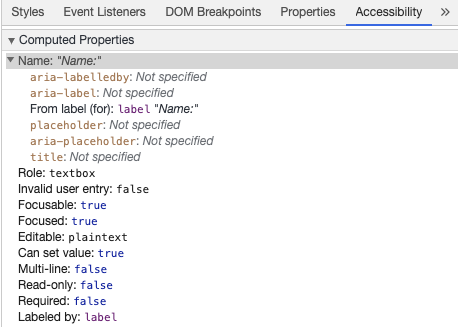
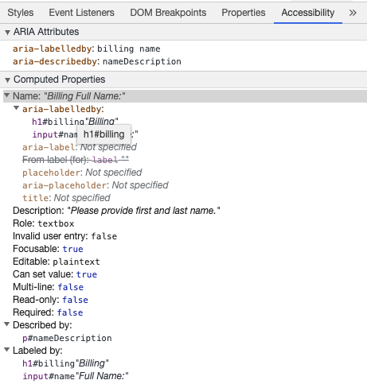

# Accessibilité {#accessibility}

L'accessibilité numérique (en abrégé a11y) fait référence aux pratiques visant à créer des sites web qui peuvent être utilisés par toutes les personnes — qu'elles aient un handicap, une connexion lente, du matériel ancien ou défectueux ou simplement un environnement défavorable. Par exemple, ajouter des sous-titres à une vidéo peut aider vos utilisateurs sourds et malentendants ainsi que ceux dans un environnement bruyant et qui ne peuvent pas entendre leur téléphone. De la même façon, s'assurer que le contraste de votre texte n'est pas trop bas aidera les utilisateurs déficients visuels ainsi que ceux qui utilisent leur téléphone en plein soleil.

Par où commencer ?

Visitez le guide de [planification et pilotage de la prise en compte de l’accessibilité Web (en anglais)](https://www.w3.org/WAI/planning-and-managing/) proposé par le [World Wide Web Consortium (W3C)](https://www.w3.org/)

## Liens d'évitement ou d'accès rapide {#skip-link}

Vous devez ajouter un lien en haut de chaque page qui mène directement à la zone de contenu principale afin que les utilisateurs puissent ignorer les zones de regroupement de contenus répétées sur plusieurs pages web.

Typiquement, cela se fait en haut de `App.vue`  car ce sera le premier élément pouvant être ciblé sur toutes vos pages:

```vue-html
<ul class="skip-links">
  <li>
    <a href="#main" ref="skipLink" class="skip-link">Aller au contenu principal</a>
  </li>
</ul>
```

Pour masquer le lien lorsqu'il n'est pas ciblé, vous pouvez ajouter le style suivant:

```css
.skip-link {
  white-space: nowrap;
  margin: 1em auto;
  top: 0;
  position: fixed;
  left: 50%;
  margin-left: -72px;
  opacity: 0;
}
.skip-link:focus {
  opacity: 1;
  background-color: white;
  padding: 0.5em;
  border: 1px solid black;
}
```

Lorsque qu'un utilisateur change d'itinéraire, redonnez le focus sur le lien d'évitement. Cela peut être réalisé en appelant focus sur la ref template du lien d'évitement (en supposant l'utilisation de `vue-router`):

<div class="options-api">

```vue
<script>
export default {
  watch: {
    $route() {
      this.$refs.skipLink.focus()
    }
  }
}
</script>
```

</div>
<div class="composition-api">

```vue
<script setup>
import { ref, watch } from 'vue'
import { useRoute } from 'vue-router'

const route = useRoute()
const skipLink = ref()

watch(
  () => route.path,
  () => {
    skipLink.value.focus()
  }
)
</script>
```

</div>

[Lisez la documentation à propos des liens d'évitement vers le contenu principal](https://accessibilite.numerique.gouv.fr/methode/glossaire/#liens-d-evitement-ou-d-acces-rapide)

## Structuration de l'information {#content-structure}

L'un des éléments les plus importants de l'accessibilité est de s'assurer que le design peut soutenir une mise en œuvre accessible. Le design doit tenir compte non seulement du contraste des couleurs, de la sélection des polices, du dimensionnement du texte et de la langue, mais également de la structure du contenu dans l'application.

### Headings {#headings}

Les utilisateurs peuvent naviguer dans une application à travers les titres. Le fait d'avoir des titres descriptifs pour chaque section de votre application permet aux utilisateurs de prédire plus facilement le contenu de celle-ci. En ce qui concerne les titres, il existe quelques pratiques d'accessibilité recommandées :

- Imbriquez les titres dans leur ordre hiérarchique : `<h1>` - `<h6>`
- Ne sautez pas les titres à l'intérieur d'une section
- Utilisez les balises de titres plutôt que du style de texte pour représenter visuellement des titres.

[En lire plus à propos des titres](https://www.w3.org/TR/UNDERSTANDING-WCAG20/navigation-mechanisms-descriptive.html)

```vue-html
<main role="main" aria-labelledby="titre-principal">
  <h1 id="main-title">Titre principal</h1>
  <section aria-labelledby="titre-de-section-1">
    <h2 id="section-title-1"> Titre de section </h2>
    <h3>Sous-titre de section</h3>
    <!-- Contenu -->
  </section>
  <section aria-labelledby="titre-de-section-2">
    <h2 id="titre-de-section-2"> Titre de section </h2>
    <h3>Sous-titre de section</h3>
    <!-- Contenu -->
    <h3>Sous-titre de section</h3>
    <!-- contenu -->
  </section>
</main>
```

### Landmarks {#landmarks}

[Les rôles ARIA landmark](https://developer.mozilla.org/en-US/docs/Web/Accessibility/ARIA/Roles/landmark_role) permettent d'accéder programmatiquement aux sections d'une application. Les utilisateurs qui s'appuient sur des technonologies d'assistance peuvent naviguer vers chaque section de l'application et passer d'un contenu à l'autre. Vous pouvez utiliser les [rôles ARIA](https://developer.mozilla.org/en-US/docs/Web/Accessibility/ARIA/Roles) pour vous aider à atteindre ce résultat.

| HTML            | ARIA Role            | But du landmark                                                                                                  |
|-----------------| -------------------- |------------------------------------------------------------------------------------------------------------------|
| `<header>`      | role="banner"        | Prime heading: title of the page\*                                                                               |
| `<nav>`         | role="navigation"    | Collection of links suitable for use when navigating the document or related documents                           |
| `<main>`        | role="main"          | Le contenu central ou principal du dpcument.                                                                     |
| `<footer>`      | role="contentinfo"   | Information about the parent document: footnotes/copyrights/links to privacy statement                           |
| `<aside>`       | role="complementary" | Supports the main content, yet is separated and meaningful on its own content                                    |
| _Not available_ | role="search"        | This section contains the search functionality for the application                                               |
| `<form>`        | role="form"          | Collection of form-associated elements                                                                           |
| `<section>`       | role="region"        | Content that is relevant and that users will likely want to navigate to. Label must be provided for this element |

:::tip Astuce:
Il est recommandé d'utiliser des éléments HTML landmark avec des attributs de rôle landmark redondants afin d'optimiser la compatibilité avec les anciens [navigateurs qui ne prennent pas en charge les éléments sémantiques HTML5](https://caniuse.com/#feat=html5semantic).
:::

https://accessibilite.numerique.gouv.fr/methode/glossaire/#landmarks

<!--
https://accessibilite.numerique.gouv.fr/methode/glossaire/#zone-d-en-tete

Zone d’en-tête 
Zone située en haut du document et contenant généralement le titre du document, un logo, un slogan…

Note : Attention à ne pas confondre cette zone d’en-tête, unique dans le site, avec tout contenu pouvant être balisé en HTML5 avec l’élément <header>.

Voir la définition technique fournie par WAI-ARIA : Banner (role).

________________________________________


https://www.w3.org/TR/wai-aria-1.1/#banner

banner (role)§
A region that contains mostly site-oriented content, rather than page-specific content.

Site-oriented content typically includes things such as the logo or identity of the site sponsor, and a site-specific search tool. A banner usually appears at the top of the page and typically spans the full width.

User agents SHOULD treat elements with the role of banner as navigational landmarks.

Within any document or application, the author SHOULD mark no more than one element with the banner role.

____________________________________

https://developer.mozilla.org/en-US/docs/Web/HTML/Element/header#usage_notes

The <header> element has an identical meaning to the site-wide banner landmark role, unless nested within sectioning content. Then, the <header> element is not a landmark.

The <header> element can define a global site header, described as a banner in the accessibility tree. It usually includes a logo, company name, search feature, and possibly the global navigation or a slogan. It is generally located at the top of the page.

Otherwise, it is a section in the accessibility tree, and usually contain the surrounding section's heading (an h1 – h6 element) and optional subheading, but this is not required.

-->

[Read more about landmarks](https://www.w3.org/TR/wai-aria-1.2/#landmark_roles)

## Semantic Forms {#semantic-forms}

Lors de la création d'un formulaire, vous pouvez utiliser les éléments suivants: `<form>`, `<label>`, `<input>`, `<textarea>`, et `<button>`

Les labels sont en général placés en haut ou à gauche des champs de formulaire:

```vue-html
<form action="/dataCollectionLocation" method="post" autocomplete="on">
  <div v-for="item in formItems" :key="item.id" class="form-item">
    <label :for="item.id">{{ item.label }}: </label>
    <input
      :type="item.type"
      :id="item.id"
      :name="item.id"
      v-model="item.value"
    />
  </div>
  <button type="submit">Submit</button>
</form>
```

<!-- <common-codepen-snippet title="Simple Form" slug="dyNzzWZ" :height="368" tab="js,result" theme="light" :preview="false" :editable="false" /> -->

Remarquez comment vous pouvez inclure `autocomplete='on'` sur l'élément de formulaure et il sera appliqué à à tous les input de votre formulaire. Vous pouvez aussi positionner différentes [valeur pour l'attribut autocomplete](https://developer.mozilla.org/fr/docs/Web/HTML/Attributes/autocomplete) pour chaque input.

### Labels {#labels}

Utilisez des labels pour décrire le but de chaque controle de formulaire; en liant `for` et `id`.

```vue-html
<label for="name">Nom</label>
<input type="text" name="name" id="name" v-model="name" />
```

<!-- <common-codepen-snippet title="Form Label" slug="XWpaaaj" :height="265" tab="js,result" theme="light" :preview="false" :editable="false" /> -->

Si vous inspectez cet élément dans vos outils de dévelopeur chrome et que vous ouvrez l'onglet Accessibilité dans l'onglet Elements, vous verrez comment le champ prends son nom du label:



:::warning Attention:
Vous pourriez avoir vu cette façon d'envelopper un champs de saisie par un label de la façon suivante:

```vue-html
<label>
  Nom:
  <input type="text" name="name" id="name" v-model="name" />
</label>
```

Associer les labels avec un id correspondant est mieux supporté par les technologies d'assistance.
:::

#### `aria-label` {#aria-label}

Vous pouvez aussi donner un nom accessible au champs avec [`aria-label`](https://developer.mozilla.org/en-US/docs/Web/Accessibility/ARIA/Attributes/aria-label).

```vue-html
<label for="name">Nom</label>
<input
  type="text"
  name="name"
  id="name"
  v-model="name"
  :aria-label="nameLabel"
/>
```

<!-- <common-codepen-snippet title="Form ARIA label" slug="NWdvvYQ" :height="265" tab="js,result" theme="light" :preview="false" :editable="false" /> -->

N'hésitez pas à inspecter cet élément dans les outils de développeur de Chrome pour voir comment le nom accessible a changé.


#### `aria-labelledby` {#aria-labelledby}

Utiliser [`aria-labelledby`](https://developer.mozilla.org/en-US/docs/Web/Accessibility/ARIA/Attributes/aria-labelledby) est similaire à `aria-label` à l'exception du fait que c'est utilisé si le libellé est visible à l'écran. Associez le à d'autres éléments par leurs `id` et vous pourrez associer plusieurs `id`s:

```vue-html
<form
  class="demo"
  action="/dataCollectionLocation"
  method="post"
  autocomplete="on"
>
  <h1 id="billing">Facturation</h1>
  <div class="form-item">
    <label for="name">Nom:</label>
    <input
      type="text"
      name="name"
      id="name"
      v-model="name"
      aria-labelledby="nom de facturation"
    />
  </div>
  <button type="submit">Envoyer</button>
</form>
```

<!-- <common-codepen-snippet title="Form ARIA labelledby" slug="MWJvvBe" :height="265" tab="js,result" theme="light" :preview="false" :editable="false" /> -->


#### `aria-describedby` {#aria-describedby}

[aria-describedby](https://developer.mozilla.org/en-US/docs/Web/Accessibility/ARIA/Attributes/aria-describedby) est utilisé de la même manière que  `aria-labelledby` à l'exception qu'il fournit une descriptio  avec de l'information supplémentaire pour l'utilisateur. Cela peut être utilisé pour décrire le critère pour n'importe que champs:

```vue-html
<form
  class="demo"
  action="/dataCollectionLocation"
  method="post"
  autocomplete="on"
>
  <h1 id="billing">Facturation</h1>
  <div class="form-item">
    <label for="name">Nom complet:</label>
    <input
      type="text"
      name="name"
      id="name"
      v-model="name"
      aria-labelledby="nom de facturation"
      aria-describedby="nameDescription"
    />
    <p id="nameDescription">Veuillez renseigner le prénom puis prénom.</p>
  </div>
  <button type="submit">Envoyer</button>
</form>
```

<!-- <common-codepen-snippet title="Form ARIA describedby" slug="gOgxxQE" :height="265" tab="js,result" theme="light" :preview="false" :editable="false" /> -->

Vous pouvez voir la description en inspectant depuis les outils de développeur Chrome:



### Placeholder {#placeholder}

Evitez d'utiliser des placeholders car ils perturbent beaucoup d'utilisateurs.

Un des problèmes avec les placeholders est qu'ils ne remplissent pas les [critères de contraste de couleur](https://www.w3.org/WAI/WCAG21/Understanding/contrast-minimum.html) par défaut; corriger le contraste de couleur donne l'impression que le champs est pré-rempli avec une valeur. En regardant l'exemple suivant, vous pouvez voir que le placeholder Last Name conforme aux critères de contraste semble être pré-rempli:


```vue-html
<form
  class="demo"
  action="/dataCollectionLocation"
  method="post"
  autocomplete="on"
>
  <div v-for="item in formItems" :key="item.id" class="form-item">
    <label :for="item.id">{{ item.label }}: </label>
    <input
      type="text"
      :id="item.id"
      :name="item.id"
      v-model="item.value"
      :placeholder="item.placeholder"
    />
  </div>
  <button type="submit">Envoyer</button>
</form>
```

```css
/* https://www.w3schools.com/howto/howto_css_placeholder.asp */

#lastName::placeholder {
  /* Chrome, Firefox, Opera, Safari 10.1+ */
  color: black;
  opacity: 1; /* Firefox */
}

#lastName:-ms-input-placeholder {
  /* Internet Explorer 10-11 */
  color: black;
}

#lastName::-ms-input-placeholder {
  /* Microsoft Edge */
  color: black;
}
```

Il vaut mieux fournir toutes les informations dont l'utilisateur a besoin pour remplir les formulaires à l'extérieur des champs de saisie.

### Instructions {#instructions}

Lorsque vous ajoutez des instructions pour vos champs de saisie, assurez-vous de les associer correctement aux champs de saisie.

Vou pouvez fournir des instructions complémentaires et associer plusieurs ids à l'intérieur d'un [`aria-labelledby`](https://developer.mozilla.org/en-US/docs/Web/Accessibility/ARIA/Attributes/aria-labelledby). Cela permet un design plus flexible.

```vue-html
<fieldset>
  <legend>Using aria-labelledby</legend>
  <label id="date-label" for="date">Date courante:</label>
  <input
    type="date"
    name="date"
    id="date"
    aria-labelledby="date-label date-instructions"
  />
  <p id="date-instructions">MM/DD/YYYY</p>
</fieldset>
```

De façon alternative, vous pouvez attacher les instructions au champ avec [`aria-describedby`](https://developer.mozilla.org/en-US/docs/Web/Accessibility/ARIA/Attributes/aria-describedby):

```vue-html
<fieldset>
  <legend>En utilisant aria-describedby</legend>
  <label id="dob" for="dob">Date de naissance:</label>
  <input type="date" name="dob" id="dob" aria-describedby="dob-instructions" />
  <p id="dob-instructions">MM/DD/YYYY</p>
</fieldset>
```

<!-- <common-codepen-snippet title="Form Instructions" slug="WNREEqv" :height="265" tab="js,result" theme="light" :preview="false" :editable="false" /> -->

### Cacher du contenu {#hiding-content}

En règle générale, il n'est pas recommendé de cacher visuellement des labels, même si le champa un nom accessible. Cependant, si la fonctionalité du champ peut être comprise à l'aide du contenu alentour, alors, nous pouvons cacher le libellé visuel.

Regardons ce champ de recherche:

```vue-html
<form role="search">
  <label for="search" class="hidden-visually">Recherche: </label>
  <input type="text" name="search" id="search" v-model="search" />
  <button type="submit">Recherche</button>
</form>
```

Nous pouvons faire cela car le bouton de recherche va aider les utilisateurs visuels à identifier le but du champ de saisie.

Nous pouvons utiliser du CSS pour cacher visuellement des éléments mais les laisser disponibles pour les technologies d'assistance:

```css
.hidden-visually {
  position: absolute;
  overflow: hidden;
  white-space: nowrap;
  margin: 0;
  padding: 0;
  height: 1px;
  width: 1px;
  clip: rect(0 0 0 0);
  clip-path: inset(100%);
}
```

<!-- <common-codepen-snippet title="Form Search" slug="QWdMqWy" :height="265" tab="js,result" theme="light" :preview="false" :editable="false" /> -->

#### `aria-hidden="true"` {#aria-hidden-true}

Ajouter `aria-hidden="true"` va cacher l'élément aux technologies d'assistance mais les laissera disponibles visuellement pour les autres utilisateurs. Ne l'utilisez pas pour des éléments focusables, uniquement sur des éléments décoratifs ou du contenu hors écran.

```vue-html
<p>Ceci n'est pas caché au liseurs d'écran.</p>
<p aria-hidden="true">Ceci est caché aux liseurs d'écran.</p>
```

### Boutons {#buttons}

Lorsque vous utilisez des boutons à l'intérieur d'un formulaire, vous devez indiquer en indiquer le type éviter la soumission du formulaire.
Vous pouvez aussi utiliser un input pour créer des boutons:

```vue-html
<form action="/dataCollectionLocation" method="post" autocomplete="on">
  <!-- Boutons -->
  <button type="button">Annuler</button>
  <button type="submit">Soumettre</button>

  <!-- Input buttons -->
  <input type="button" value="Annuler" />
  <input type="submit" value="Soumettre" />
</form>
```

<!-- <common-codepen-snippet title="Form Buttons" slug="JjEyrYZ" :height="467" tab="js,result" theme="light" :preview="false" :editable="false" /> -->

### Functional Images {#functional-images}

You can use this technique to create functional images.

- Input fields

  - These images will act as a submit type button on forms

  ```vue-html
  <form role="search">
    <label for="search" class="hidden-visually">Search: </label>
    <input type="text" name="search" id="search" v-model="search" />
    <input
      type="image"
      class="btnImg"
      src="https://img.icons8.com/search"
      alt="Search"
    />
  </form>
  ```

- Icons

```vue-html
<form role="search">
  <label for="searchIcon" class="hidden-visually">Search: </label>
  <input type="text" name="searchIcon" id="searchIcon" v-model="searchIcon" />
  <button type="submit">
    <i class="fas fa-search" aria-hidden="true"></i>
    <span class="hidden-visually">Search</span>
  </button>
</form>
```

<!-- <common-codepen-snippet title="Functional Images" slug="jOyLGqM" :height="265" tab="js,result" theme="light" :preview="false" :editable="false" /> --> 

## Standards {#standards}

The World Wide Web Consortium (W3C) Web Accessibility Initiative (WAI) develops web accessibility standards for the different components:

- [User Agent Accessibility Guidelines (UAAG)](https://www.w3.org/WAI/standards-guidelines/uaag/)
  - web browsers and media players, including some aspects of assistive technologies
- [Authoring Tool Accessibility Guidelines (ATAG)](https://www.w3.org/WAI/standards-guidelines/atag/)
  - authoring tools
- [Web Content Accessibility Guidelines (WCAG)](https://www.w3.org/WAI/standards-guidelines/wcag/)
  - web content - used by developers, authoring tools, and accessibility evaluation tools

### Web Content Accessibility Guidelines (WCAG) {#web-content-accessibility-guidelines-wcag}

[WCAG 2.1](https://www.w3.org/TR/WCAG21/) extends on [WCAG 2.0](https://www.w3.org/TR/WCAG20/) and allows implementation of new technologies by addressing changes to the web. The W3C encourages use of the most current version of WCAG when developing or updating Web accessibility policies.

#### WCAG 2.1 Four Main Guiding Principles (abbreviated as POUR): {#wcag-2-1-four-main-guiding-principles-abbreviated-as-pour}

- [Perceivable](https://www.w3.org/TR/WCAG21/#perceivable)
  - Users must be able to perceive the information being presented
- [Operable](https://www.w3.org/TR/WCAG21/#operable)
  - Interface forms, controls, and navigation are operable
- [Understandable](https://www.w3.org/TR/WCAG21/#understandable)
  - Information and the operation of user interface must be understandable to all users
- [Robust](https://www.w3.org/TR/WCAG21/#robust)
  - Users must be able to access the content as technologies advance

#### Web Accessibility Initiative – Accessible Rich Internet Applications (WAI-ARIA) {#web-accessibility-initiative-–-accessible-rich-internet-applications-wai-aria}

W3C's WAI-ARIA provides guidance on how to build dynamic content and advanced user interface controls.

- [Accessible Rich Internet Applications (WAI-ARIA) 1.2](https://www.w3.org/TR/wai-aria-1.2/)
- [WAI-ARIA Authoring Practices 1.2](https://www.w3.org/TR/wai-aria-practices-1.2/)

## Resources {#resources}

### Documentation {#documentation}

- [WCAG 2.0](https://www.w3.org/TR/WCAG20/)
- [WCAG 2.1](https://www.w3.org/TR/WCAG21/)
- [Accessible Rich Internet Applications (WAI-ARIA) 1.2](https://www.w3.org/TR/wai-aria-1.2/)
- [WAI-ARIA Authoring Practices 1.2](https://www.w3.org/TR/wai-aria-practices-1.2/)

### Assistive Technologies {#assistive-technologies}

- Screen Readers
  - [NVDA](https://www.nvaccess.org/download/)
  - [VoiceOver](https://www.apple.com/accessibility/mac/vision/)
  - [JAWS](https://www.freedomscientific.com/products/software/jaws/?utm_term=jaws%20screen%20reader&utm_source=adwords&utm_campaign=All+Products&utm_medium=ppc&hsa_tgt=kwd-394361346638&hsa_cam=200218713&hsa_ad=296201131673&hsa_kw=jaws%20screen%20reader&hsa_grp=52663682111&hsa_net=adwords&hsa_mt=e&hsa_src=g&hsa_acc=1684996396&hsa_ver=3&gclid=Cj0KCQjwnv71BRCOARIsAIkxW9HXKQ6kKNQD0q8a_1TXSJXnIuUyb65KJeTWmtS6BH96-5he9dsNq6oaAh6UEALw_wcB)
  - [ChromeVox](https://chrome.google.com/webstore/detail/chromevox-classic-extensi/kgejglhpjiefppelpmljglcjbhoiplfn?hl=en)
- Zooming Tools
  - [MAGic](https://www.freedomscientific.com/products/software/magic/)
  - [ZoomText](https://www.zoomtext.com/)
  - [Magnifier](https://support.microsoft.com/en-us/help/11542/windows-use-magnifier-to-make-things-easier-to-see)

### Testing {#testing}

- Automated Tools
  - [Lighthouse](https://chrome.google.com/webstore/detail/lighthouse/blipmdconlkpinefehnmjammfjpmpbjk)
  - [WAVE](https://chrome.google.com/webstore/detail/wave-evaluation-tool/jbbplnpkjmmeebjpijfedlgcdilocofh)
  - [ARC Toolkit](https://chrome.google.com/webstore/detail/arc-toolkit/chdkkkccnlfncngelccgbgfmjebmkmce?hl=en-US)
- Color Tools
  - [WebAim Color Contrast](https://webaim.org/resources/contrastchecker/)
  - [WebAim Link Color Contrast](https://webaim.org/resources/linkcontrastchecker)
- Other Helpful Tools
  - [HeadingMap](https://chrome.google.com/webstore/detail/headingsmap/flbjommegcjonpdmenkdiocclhjacmbi?hl=en…)
  - [Color Oracle](https://colororacle.org)
  - [Focus Indicator](https://chrome.google.com/webstore/detail/focus-indicator/heeoeadndnhebmfebjccbhmccmaoedlf?hl=en-US…)
  - [NerdeFocus](https://chrome.google.com/webstore/detail/nerdefocus/lpfiljldhgjecfepfljnbjnbjfhennpd?hl=en-US…)
  - [Visual Aria](https://chrome.google.com/webstore/detail/visual-aria/lhbmajchkkmakajkjenkchhnhbadmhmk?hl=en-US)
  - [Silktide Website Accessibility Simulator](https://chrome.google.com/webstore/detail/silktide-website-accessib/okcpiimdfkpkjcbihbmhppldhiebhhaf?hl=en-US)

### Users {#users}

The World Health Organization estimates that 15% of the world's population has some form of disability, 2-4% of them severely so. That is an estimated 1 billion people worldwide; making people with disabilities the largest minority group in the world.

There are a huge range of disabilities, which can be divided roughly into four categories:

- _[Visual](https://webaim.org/articles/visual/)_ - These users can benefit from the use of screen readers, screen magnification, controlling screen contrast, or braille display.
- _[Auditory](https://webaim.org/articles/auditory/)_ - These users can benefit from captioning, transcripts or sign language video.
- _[Motor](https://webaim.org/articles/motor/)_ - These users can benefit from a range of [assistive technologies for motor impairments](https://webaim.org/articles/motor/assistive): voice recognition software, eye tracking, single-switch access, head wand, sip and puff switch, oversized trackball mouse, adaptive keyboard or other assistive technologies.
- _[Cognitive](https://webaim.org/articles/cognitive/)_ - These users can benefit from supplemental media, structural organization of content, clear and simple writing.

Check out the following links from WebAim to understand from users:

- [Web Accessibility Perspectives: Explore the Impact and Benefits for Everyone](https://www.w3.org/WAI/perspective-videos/)
- [Stories of Web Users](https://www.w3.org/WAI/people-use-web/user-stories/)
