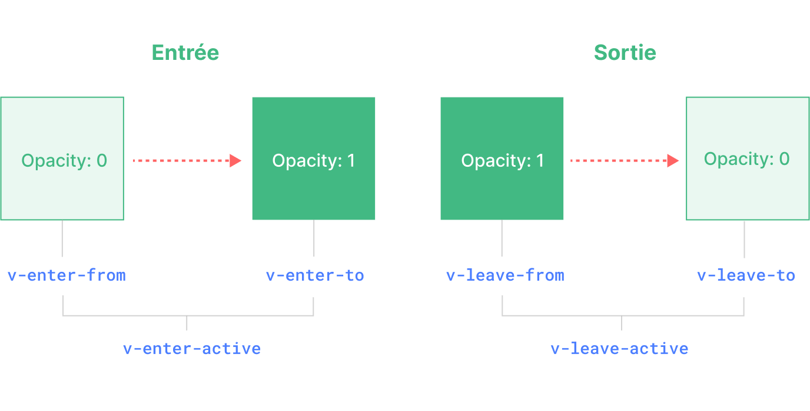

<script setup>
import Basic from './transition-demos/Basic.vue'
import SlideFade from './transition-demos/SlideFade.vue'
import CssAnimation from './transition-demos/CssAnimation.vue'
import NestedTransitions from './transition-demos/NestedTransitions.vue'
import JsHooks from './transition-demos/JsHooks.vue'
import BetweenElements from './transition-demos/BetweenElements.vue'
import BetweenComponents from './transition-demos/BetweenComponents.vue'
</script>

# Transition {#transition}

Vue propose deux composants natifs qui peuvent aider à travailler avec des transitions et des animations en réponse à un changement d'état :

- `<Transition>`pour appliquer des animations lorsqu'un élément ou un composant entre et sort du DOM. Ceci est couvert sur cette page.

- `<TransitionGroup>` pour appliquer des animations lorsqu'un élément ou un composant est inséré, supprimé ou déplacé dans une liste `v-for`. Ceci est couvert dans [le chapitre suivant](/guide/built-ins/transition-group).

Outre ces deux composants, nous pouvons également appliquer des animations dans Vue en utilisant d'autres techniques telles que le basculement des classes CSS ou des animations basées sur l'état via des liaisons de style. Ces techniques supplémentaires sont traitées dans le chapitre [Techniques d'animation](/guide/extras/animation).

## Le composant `<Transition>` {#the-transition-component}

`<Transition>` est un composant intégré : cela signifie qu'il est disponible dans n'importe quel template de composant sans avoir à l'enregistrer. Il peut être utilisé pour appliquer des animations d'entrée et de sortie sur des éléments ou des composants qui lui sont transmis via son slot par défaut. L'entrée ou la sortie peut être déclenchée par l'une des actions suivantes :

- Rendu conditionnel via `v-if`
- Affichage conditionnel via `v-show`
- Basculement des composants dynamiques via l'élément spécial `<component>`
- Changer l'attribut spécial `key`

Voici un exemple de l'utilisation la plus basique :

```vue-html
<button @click="show = !show">Toggle</button>
<Transition>
  <p v-if="show">hello</p>
</Transition>
```

```css
/* nous vous expliquerons ensuite ce que font ces classes ! */
.v-enter-active,
.v-leave-active {
  transition: opacity 0.5s ease;
}

.v-enter-from,
.v-leave-to {
  opacity: 0;
}
```

<Basic />

<div class="composition-api">

[Essayer en ligne](https://play.vuejs.org/#eNpVkEFuwyAQRa8yZZNWqu1sunFJ1N4hSzYUjRNUDAjGVJHluxcCipIV/OG/pxEr+/a+TwuykfGogvYEEWnxR2H17F0gWCHgBBtMwc2wy9WdsMIqZ2OuXtwfHErhlcKCb8LyoVoynwPh7I0kzAmA/yxEzsKXMlr9HgRr9Es5BTue3PlskA+1VpFTkDZq0i3niYfU6anRmbqgMY4PZeH8OjwBfHhYIMdIV1OuferQEoZOKtIJ328TgzJhm8BabHR3jeC8VJqusO8/IqCM+CnsVqR3V/mfRxO5amnkCPuK5B+6rcG2fydshks=)

</div>
<div class="options-api">

[Essayer en ligne](https://play.vuejs.org/#eNpVkMFuAiEQhl9lyqlNuouXXrZo2nfwuBeKs0qKQGBAjfHdZZfVrAmB+f/M/2WGK/v1vs0JWcdEVEF72vQWz94Fgh0OMhmCa28BdpLk+0etAQJSCvahAOLBnTqgkLA6t/EpVzmCP7lFEB69kYRFAYi/ROQs/Cij1f+6ZyMG1vA2vj3bbN1+b1Dw2lYj2yBt1KRnXRwPudHDnC6pAxrjBPe1n78EBF8MUGSkixnLNjdoCUMjFemMn5NjUGacnboqPVkdOC+Vpgus2q8IKCN+T+suWENwxyWJXKXMyQ5WNVJ+aBqD3e6VSYoi)

</div>

:::tip
`<Transition>` ne prend en charge qu'un seul élément ou composant comme contenu du slot. Si le contenu est un composant, le composant doit également avoir un seul élément racine.
:::

Lorsqu'un élément d'un composant `<Transition>` est inséré ou supprimé, voici ce qui se passe :

1. Vue détectera automatiquement si l'élément cible a des transitions CSS ou des animations appliquées. Si c'est le cas, un certain nombre de [classes de transition CSS](#transition-classes) seront ajoutées / supprimées aux moments appropriés.

2. S'il existe des écouteurs pour les [hooks JavaScript](#javascript-hooks), ces hooks seront appelés aux moments appropriés.

3. Si aucune transition / animation CSS n'est détectée et qu'aucun hook JavaScript n'est fourni, les opérations DOM d'insertion et / ou de suppression seront exécutées lors du prochain rafraîchissement d'animation du navigateur.

## Transitions basées sur le CSS {#css-based-transitions}

### Classes de transition {#transition-classes}

Six classes sont appliquées pour les transitions entrée / sortie.



<!-- https://www.figma.com/file/fOt2CGHzhxoBDBOv7L5omL/Transition-Classes -->

1. `v-enter-from` : état de départ pour l'entrée. Ajoutée avant l'insertion de l'élément, supprimée une frame après l'insertion de l'élément.

2. `v-enter-active` : état actif pour l'entrée. Appliquée pendant toute la phase d'entrée. Ajoutée avant l'insertion de l'élément, supprimée à la fin de la transition / animation. Cette classe peut être utilisée pour définir la durée, le retard et la courbe d'accélération de la transition entrante.

3. `v-enter-to` : état de fin pour l'entrée. Ajoutée une frame après l'insertion de l'élément (en même temps `v-enter-from` est supprimée), supprimée lorsque la transition / animation se termine.

4. `v-leave-from` : état de départ pour la sortie. Ajoutée immédiatement lorsqu'une transition de sortie est déclenchée, supprimée après une frame.

5. `v-leave-active` : état actif pour la sortie. Appliquée pendant toute la phase de sortie. Ajoutée immédiatement lorsqu'une transition de sortie est déclenchée, supprimée lorsque la transition/animation se termine. Cette classe peut être utilisée pour définir la durée, le retard et la courbe d'accélération de la transition de sortie.

6. `v-leave-to` : état de fin pour la sortie. Ajoutée une frame après le déclenchement d'une transition de sortie (en même temps `v-leave-from` est supprimée), supprimée lorsque la transition/animation se termine.

`v-enter-active` et `v-leave-active` nous donnent la possibilité de spécifier différentes courbes d'accélération pour les transitions entrée/sortie, dont nous verrons un exemple dans les sections suivantes.

### Transitions nommées {#named-transitions}

Une transition peut être nommée via la prop `name` :

```vue-html
<Transition name="fade">
  ...
</Transition>
```

Pour une transition nommée, ses classes de transition seront préfixées par son nom au lieu de `v`. Par exemple, la classe appliquée pour la transition ci-dessus sera `fade-enter-active` au lieu de `v-enter-active`. Le CSS pour la transition de fondu devrait ressembler à ceci :

```css
.fade-enter-active,
.fade-leave-active {
  transition: opacity 0.5s ease;
}

.fade-enter-from,
.fade-leave-to {
  opacity: 0;
}
```

### Transitions CSS {#css-transitions}

`<Transition>` est le plus souvent utilisé en combinaison avec [les transitions CSS natives](https://developer.mozilla.org/fr/docs/Web/CSS/CSS_Transitions/Using_CSS_transitions), comme on le voit dans l'exemple basique ci-dessus. La propriété CSS `transition` est un raccourci qui nous permet de spécifier plusieurs aspects d'une transition, y compris les propriétés qui doivent être animées, la durée de la transition et les [courbes d'accélération](https://developer.mozilla.org/fr/docs/Web/CSS/easing-function).

Voici un exemple plus avancé qui effectue la transition de plusieurs propriétés, avec différentes durées et courbes d'accélération pour l'entrée et la sortie :

```vue-html
<Transition name="slide-fade">
  <p v-if="show">hello</p>
</Transition>
```

```css
/*
  Les animations d'entrée et de sortie peuvent utiliser différentes
  durées et fonctions de temporisation.
*/
.slide-fade-enter-active {
  transition: all 0.3s ease-out;
}

.slide-fade-leave-active {
  transition: all 0.8s cubic-bezier(1, 0.5, 0.8, 1);
}

.slide-fade-enter-from,
.slide-fade-leave-to {
  transform: translateX(20px);
  opacity: 0;
}
```

<SlideFade />

<div class="composition-api">

[Essayer en ligne](https://play.vuejs.org/#eNqFkc9uwjAMxl/F6wXQKIVNk1AX0HbZC4zDDr2E4EK0NIkStxtDvPviFQ0OSFzyx/m+n+34kL16P+lazMpMRBW0J4hIrV9WVjfeBYIDBKzhCHVwDQySdFDZyipnY5Lu3BcsWDCk0OKosqLoKcmfLoSNN5KQbyTWLZGz8KKMVp+LKju573ivsuXKbbcG4d3oDcI9vMkNiqL3JD+AWAVpoyadGFY2yATW5nVSJj9rkspDl+v6hE/hHRrjRMEdpdfiDEkBUVxWaEWkveHj5AzO0RKGXCrSHcKBIfSPKEEaA9PJYwSUEXPX0nNlj8y6RBiUHd5AzCOodq1VvsYfjWE4G6fgEy/zMcxG17B9ZTyX8bV85C5y1S40ZX/kdj+GD1P/zVQA56XStC9h2idJI/z7huz4CxoVvE4=)

</div>
<div class="options-api">

[Essayer en ligne](https://play.vuejs.org/#eNqFkc1uwjAMgF/F6wk0SmHTJNQFtF32AuOwQy+hdSFamkSJ08EQ776EbMAkJKTIf7I/O/Y+ezVm3HvMyoy52gpDi0rh1mhL0GDLvSTYVwqg4cQHw2QDWCRv1Z8H4Db6qwSyHlPkEFUQ4bHixA0OYWckJ4wesZUn0gpeainqz3mVRQzM4S7qKlss9XotEd6laBDu4Y03yIpUE+oB2NJy5QSJwFC8w0iIuXkbMkN9moUZ6HPR/uJDeINSalaYxCjOkBBgxeWEijnayWiOz+AcFaHNeU2ix7QCOiFK4FLCZPzoALnDXHt6Pq7hP0Ii7/EGYuag9itR5yv8FmgH01EIPkUxG8F0eA2bJmut7kbX+pG+6NVq28WTBTN+92PwMDHbSAXQhteCdiVMUpNwwuMassMP8kfAJQ==)

</div>

### Animations CSS {#css-animations}

[Les animations CSS natives](https://developer.mozilla.org/fr/docs/Web/CSS/CSS_Animations/Using_CSS_animations) sont appliquées de la même manière que les transitions CSS, à la différence que `*-enter-from` n'est pas supprimée immédiatement après l'insertion de l'élément, mais lors d'un événement `animationend`.

Pour la plupart des animations CSS, nous pouvons simplement les déclarer sous les classes `*-enter-active` et `*-leave-active`. Voici un exemple :

```vue-html
<Transition name="bounce">
  <p v-if="show" style="text-align: center;">
    Hello here is some bouncy text!
  </p>
</Transition>
```

```css
.bounce-enter-active {
  animation: bounce-in 0.5s;
}
.bounce-leave-active {
  animation: bounce-in 0.5s reverse;
}
@keyframes bounce-in {
  0% {
    transform: scale(0);
  }
  50% {
    transform: scale(1.25);
  }
  100% {
    transform: scale(1);
  }
}
```

<CssAnimation />

<div class="composition-api">

[Essayer en ligne](https://play.vuejs.org/#eNqNksGOgjAQhl9lJNmoBwRNvCAa97YP4JFLbQZsLG3TDqzG+O47BaOezCYkpfB9/0wHbsm3c4u+w6RIyiC9cgQBqXO7yqjWWU9wA4813KH2toUpo9PKVEZaExg92V/YRmBGvsN5ZcpsTGGfN4St04Iw7qg8dkTWwF5qJc/bKnnYk7hWye5gm0ZjmY0YKwDlwQsTFCnWjGiRpaPtjETG43smHPSpqh9pVQKBrjpyrfCNMilZV8Aqd5cNEF4oFVo1pgCJhtBvnjEAP6i1hRN6BBUg2BZhKHUdvMmjWhYHE9dXY/ygzN4PasqhB75djM2mQ7FUSFI9wi0GCJ6uiHYxVsFUGcgX67CpzP0lahQ9/k/kj9CjDzgG7M94rT1PLLxhQ0D+Na4AFI9QW98WEKTQOMvnLAOwDrD+wC0Xq/Ubusw/sU+QL/45hskk9z8Bddbn)

</div>
<div class="options-api">

[Essayer en ligne](https://play.vuejs.org/#eNqNUs2OwiAQfpWxySZ66I8mXioa97YP4LEXrNNKpEBg2tUY330pqOvJmBBgyPczP1yTb2OyocekTJirrTC0qRSejbYEB2x4LwmulQI4cOLTWbwDWKTeqkcE4I76twSyPcaX23j4zS+WP3V9QNgZyQnHiNi+J9IKtrUU9WldJaMMrGEynlWy2em2lcjyCPMUALazXDlBwtMU79CT9rpXNXp4tGYGhlQ0d7UqAUcXOeI6bluhUtKmhEVhzisgPFPKpWhVCTUqQrt6ygD8oJQajmgRhAOnO4RgdQm8yd0tNzGv/D8x/8Dy10IVCzn4axaTTYNZymsSA8YuciU6PrLL6IKpUFBkS7cKXXwQJfIBPyP6IQ1oHUaB7QkvjfUdcy+wIFB8PeZIYwmNtl0JruYSp8XMk+/TXL7BzbPF8gU6L95hn8D4OUJnktsfM1vavg==)

</div>

### Classes de transition personnalisées {#custom-transition-classes}

Vous pouvez également spécifier des classes de transition personnalisées en transmettant les props suivantes à `<Transition>` :

- `enter-from-class`
- `enter-active-class`
- `enter-to-class`
- `leave-from-class`
- `leave-active-class`
- `leave-to-class`

Celles-ci remplaceront les noms de classes conventionnels. Ceci est particulièrement utile lorsque vous souhaitez combiner le système de transition de Vue avec une bibliothèque d'animation CSS existante, telle que [Animate.css](https://daneden.github.io/animate.css/) :

```vue-html
<!-- en supposant que Animate.css est inclus sur la page -->
<Transition
  name="custom-classes"
  enter-active-class="animate__animated animate__tada"
  leave-active-class="animate__animated animate__bounceOutRight"
>
  <p v-if="show">hello</p>
</Transition>
```

<div class="composition-api">

[Essayer en ligne](https://play.vuejs.org/#eNqNUctuwjAQ/BXXF9oDsZB6ogbRL6hUcbSEjLMhpn7JXtNWiH/vhqS0R3zxPmbWM+szf02pOVXgSy6LyTYhK4A1rVWwPsWM7MwydOzCuhw9mxF0poIKJoZC0D5+stUAeMRc4UkFKcYpxKcEwSenEYYM5b4ixsA2xlnzsVJ8Yj8Mt+LrbTwcHEgxwojCmNxmHYpFG2kaoxO0B2KaWjD6uXG6FCiKj00ICHmuDdoTjD2CavJBCna7KWjZrYK61b9cB5pI93P3sQYDbxXf7aHHccpVMolO7DS33WSQjPXgXJRi2Cl1xZ8nKkjxf0dBFvx2Q7iZtq94j5jKUgjThmNpjIu17ZzO0JjohT7qL+HsvohJWWNKEc/NolncKt6Goar4y/V7rg/wyw9zrLOy)

</div>
<div class="options-api">

[Essayer en ligne](https://play.vuejs.org/#eNqNUcFuwjAM/RUvp+1Ao0k7sYDYF0yaOFZCJjU0LE2ixGFMiH9f2gDbcVKU2M9+tl98Fm8hNMdMYi5U0tEEXraOTsFHho52mC3DuXUAHTI+PlUbIBLn6G4eQOr91xw4ZqrIZXzKVY6S97rFYRqCRabRY7XNzN7BSlujPxetGMvAAh7GtxXLtd/vLSlZ0woFQK0jumTY+FJt7ORwoMLUObEfZtpiSpRaUYPkmOIMNZsj1VhJRWeGMsFmczU6uCOMHd64lrCQ/s/d+uw0vWf+MPuea5Vp5DJ0gOPM7K4Ci7CerPVKhipJ/moqgJJ//8ipxN92NFdmmLbSip45pLmUunOH1Gjrc7ezGKnRfpB4wJO0ZpvkdbJGpyRfmufm+Y4Mxo1oK16n9UwNxOUHwaK3iQ==)

</div>

### Utiliser les transitions et les animations ensemble {#using-transitions-and-animations-together}

Vue doit attacher des écouteurs d'événements afin de savoir quand une transition est terminée. Cela peut être `transitionend` ou `animationend`, selon le type de règles CSS appliquées. Si vous n'utilisez que l'un ou l'autre, Vue peut automatiquement détecter le bon type.

Cependant, dans certains cas, vous voudrez peut-être avoir les deux sur le même élément, par exemple avoir une animation CSS déclenchée par Vue, ainsi qu'un effet de transition CSS au survol. Dans ces cas, vous devrez déclarer explicitement le type dont vous voulez que Vue se soucie en passant la prop `type`, avec une valeur de `animation` ou `transition` :

```vue-html
<Transition type="animation">...</Transition>
```

### Transitions imbriquées et durées de transition explicites {#nested-transitions-and-explicit-transition-durations}

Bien que les classes de transition ne soient appliquées qu'à l'élément enfant direct dans `<Transition>`, nous pouvons effectuer la transition d'éléments imbriqués à l'aide de sélecteurs CSS imbriqués :

```vue-html
<Transition name="nested">
  <div v-if="show" class="outer">
    <div class="inner">
      Hello
    </div>
  </div>
</Transition>
```

```css
/* règles qui ciblent les éléments imbriqués */
.nested-enter-active .inner,
.nested-leave-active .inner {
  transition: all 0.3s ease-in-out;
}

.nested-enter-from .inner,
.nested-leave-to .inner {
  transform: translateX(30px);
  opacity: 0;
}

/* ... autre CSS nécessaire omis */
```

Nous pouvons même ajouter un délai de transition à l'élément imbriqué lors de l'entrée, ce qui crée une séquence d'animation d'entrée décalée :

```css{3}
/* retarde l'entrée de l'élément imbriqué pour un effet décalé */
.nested-enter-active .inner {
  transition-delay: 0.25s;
}
```

Cependant, cela crée un petit problème. Par défaut, le composant `<Transition>` tente de déterminer automatiquement quand la transition est terminée en écoutant le **premier** événement `transitionend` ou `animationend` sur l'élément de transition racine. Avec une transition imbriquée, le comportement souhaité doit attendre que les transitions de tous les éléments internes soient terminées.

Dans de tels cas, vous pouvez spécifier une durée de transition explicite (en millisecondes) à l'aide de la prop `duration` sur le composant `<Transition>`. La durée totale doit correspondre au délai plus la durée de transition de l'élément interne :

```vue-html
<Transition :duration="550">...</Transition>
```

<NestedTransitions />

[Essayer en ligne](https://play.vuejs.org/#eNqVVd9v0zAQ/leO8LAfrE3HNKSFbgKmSYMHQNAHkPLiOtfEm2NHttN2mvq/c7bTNi1jgFop9t13d9995ziPyfumGc5bTLJkbLkRjQOLrm2uciXqRhsHj2BwBiuYGV3DAUEPcpUrrpUlaKUXcOkBh860eJSrcRqzUDxtHNaNZA5pBzCets5pBe+4FPz+Mk+66Bf+mSdXE12WEsdphMWQiWHKCicoLCtaw/yKIs/PR3kCitVIG4XWYUEJfATFFGIO84GYdRUIyCWzlra6dWg2wA66dgqlts7c+d8tSqk34JTQ6xqb9TjdUiTDOO21TFvrHqRfDkPpExiGKvBITjdl/L40ulVFBi8R8a3P17CiEKrM4GzULIOlFmpQoSgrl8HpKFpX3kFZu2y0BNhJxznvwaJCA1TEYcC4E3MkKp1VIptjZ43E3KajDJiUMBqeWUBmcUBUqJGYOT2GAiV7gJAA9Iy4GyoBKLH2z+N0W3q/CMC2yCCkyajM63Mbc+9z9mfvZD+b071MM23qLC69+j8PvX5HQUDdMC6cL7BOTtQXCJwpas/qHhWIBdYtWGgtDWNttWTmThu701pf1W6+v1Hd8Xbz+k+VQxmv8i7Fv1HZn+g/iv2nRkjzbd6npf/Rkz49DifQ3dLZBBYOJzC4rqgCwsUbmLYlCAUVU4XsCd1NrCeRHcYXb1IJC/RX2hEYCwJTvHYVMZoavbBI09FmU+LiFSzIh0AIXy1mqZiFKaKCmVhiEVJ7GftHZTganUZ56EYLL3FykjhL195MlMM7qxXdmEGDPOG6boRE86UJVPMki+p4H01WLz4Fm78hSdBo5xXy+yfsd3bpbXny1SA1M8c82fgcMyW66L75/hmXtN44a120ktDPOL+h1bL1HCPsA42DaPdwge3HcO/TOCb2ZumQJtA15Yl65Crg84S+BdfPtL6lezY8C3GkZ7L6Bc1zNR0=)

Si nécessaire, vous pouvez également spécifier des valeurs distinctes pour les durées d'entrée et de sortie à l'aide d'un objet :

```vue-html
<Transition :duration="{ enter: 500, leave: 800 }">...</Transition>
```

### Considérations relatives aux performances {#performance-considerations}

Vous remarquerez peut-être que les animations présentées ci-dessus utilisent principalement des propriétés telles que "transform" et "opacity". Ces propriétés sont efficaces pour animer car :

1. Elles n'affectent pas la mise en page du document pendant l'animation, elles ne déclenchent donc pas de calculs de mise en page CSS coûteux sur chaque image d'animation.

2. La plupart des navigateurs modernes peuvent tirer parti de l'accélération matérielle GPU lors de l'animation de `transform`.

En comparaison, des propriétés telles que `height` ou `margin` déclencheront la mise en page CSS, elles sont donc beaucoup plus coûteuses à animer et doivent être utilisées avec prudence.

## Hooks JavaScript {#javascript-hooks}

Vous pouvez vous connecter au processus de transition avec JavaScript en écoutant les événements sur le composant `<Transition>` :

```vue-html
<Transition
  @before-enter="onBeforeEnter"
  @enter="onEnter"
  @after-enter="onAfterEnter"
  @enter-cancelled="onEnterCancelled"
  @before-leave="onBeforeLeave"
  @leave="onLeave"
  @after-leave="onAfterLeave"
  @leave-cancelled="onLeaveCancelled"
>
  <!-- ... -->
</Transition>
```

<div class="composition-api">

```js
// appelée avant que l'élément ne soit inséré dans le DOM.
// utilisez ceci pour définir l'état "enter-from" de l'élément.
function onBeforeEnter(el) {}

// appelée une frame après l'insertion de l'élément.
// utilisez ceci pour démarrer l'animation d'entrée.
function onEnter(el, done) {
  // appelle la fonction de rappel done pour indiquer la fin de la transition
  // facultative si utilisée en combinaison avec CSS
  done()
}

// appelée lorsque la transition enter est terminée.
function onAfterEnter(el) {}

// appelée lorsque la transition enter est annulée avant la fin.
function onEnterCancelled(el) {}

// appelée avant le hook de sortie.
// la plupart du temps, vous devez simplement utiliser le hook de sortie.
function onBeforeLeave(el) {}

// appelée lorsque la transition de sortie démarre.
// utilisez ceci pour démarrer l'animation de sortie.
function onLeave(el, done) {
  // appelle la fonction de rappel done pour indiquer la fin de la transition
  // facultative si utilisée en combinaison avec CSS
  done()
}

// appelée lorsque la transition de sortie est terminée et que
// l'élément a été supprimé du DOM.
function onAfterLeave(el) {}

// uniquement disponible avec les transitions v-show
function onLeaveCancelled(el) {}
```

</div>
<div class="options-api">

```js
export default {
  // ...
  methods: {
    // appelée avant que l'élément ne soit inséré dans le DOM.
    // utilisez ceci pour définir l'état "enter-from" de l'élément
    onBeforeEnter(el) {},

    // appelée une frame après l'insertion de l'élément.
    // utilisez ceci pour démarrer l'animation d'entrée.
    onEnter(el, done) {
      // appelle la fonction de rappel done pour indiquer la fin de la transition.
      // facultative si utilisée en combinaison avec CSS
      done()
    },

    // appelée lorsque la transition enter est terminée.
    onAfterEnter(el) {},

    // appelée lorsque la transition d'entrée est annulée avant d'être achevée.
    onEnterCancelled(el) {},

    // appelée avant le hook de sortie.
    // la plupart du temps, vous devez simplement utiliser le hook de sortie.
    onBeforeLeave(el) {},

    // appelée lorsque la transition de sortie démarre.
    // utilisez ceci pour démarrer l'animation de sortie.
    onLeave(el, done) {
      // appelle la fonction de rappel done pour indiquer la fin de la transition
      // facultative si utilisée en combinaison avec CSS
      done()
    },

    // appelée lorsque la transition de sortie est terminée et que
    // l'élément a été supprimé du DOM.
    onAfterLeave(el) {},

    // uniquement disponible avec les transitions v-show
    onLeaveCancelled(el) {}
  }
}
```

</div>

Ces hooks peuvent être utilisés en combinaison avec des transitions / animations CSS ou seuls.

Lors de l'utilisation de transitions JavaScript uniquement, il est généralement judicieux d'ajouter la prop `:css="false"`. Cela indique explicitement à Vue d'ignorer la détection automatique des transitions CSS. En plus d'être légèrement plus performant, cela empêche également les règles CSS d'interférer accidentellement avec la transition :

```vue-html{3}
<Transition
  ...
  :css="false"
>
  ...
</Transition>
```

Avec `:css="false"`, nous sommes également entièrement responsables du contrôle de la fin de la transition. Dans ce cas, les rappels `done` sont requis pour les hooks `@enter` et `@leave`. Sinon, les hooks seront appelés de manière synchrone et la transition se terminera immédiatement.

Voici une démo utilisant la [bibliothèque GSAP](https://gsap.com/) pour réaliser les animations. Vous pouvez bien sûr utiliser toute autre bibliothèque d'animation de votre choix, par exemple [Anime.js](https://animejs.com/) ou [Motion One](https://motion.dev/) :

<JsHooks />

<div class="composition-api">

[Essayer en ligne](https://play.vuejs.org/#eNqNVMtu2zAQ/JUti8I2YD3i1GigKmnaorcCveTQArpQFCWzlkiCpBwHhv+9Sz1qKYckJ3FnlzvD2YVO5KvW4aHlJCGpZUZoB5a7Vt9lUjRaGQcnMLyEM5RGNbDA0sX/VGWpHnB/xEQmmZIWe+zUI9z6m0tnWr7ymbKVzAklQclvvFSG/5COmyWvV3DKJHTdQiRHZN0jAJbRmv9OIA432/UE+jODlKZMuKcErnx8RrazP8woR7I1FEryKaVTU8aiNdRfwWZTQtQwi1HAGF/YB4BTyxNY8JpaJ1go5K/WLTfhdg1Xq8V4SX5Xja65w0ovaCJ8Jvsnpwc+l525F2XH4ac3Cj8mcB3HbxE9qnvFMRzJ0K3APuhIjPefmTTyvWBAGvWbiDuIgeNYRh3HCCDNW+fQmHtWC7a/zciwaO/8NyN3D6qqap5GfVnXAC89GCqt8Bp77vu827+A+53AJrOFzMhQdMnO8dqPpMO74Yx4wqxFtKS1HbBOMdIX4gAMffVp71+Qq2NG4BCIcngBKk8jLOvfGF30IpBGEwcwtO6p9sdwbNXPIadsXxnVyiKB9x83+c3N9WePN9RUQgZO6QQ2sT524KMo3M5Pf4h3XFQ7NwFyZQpuAkML0doEtvEHhPvRDPRkTfq/QNDgRvy1SuIvpFOSDQmbkWTckf7hHsjIzjltkyhqpd5XIVNN5HNfGlW09eAcMp3J+R+pEn7L)

</div>
<div class="options-api">

[Essayer en ligne](https://play.vuejs.org/#eNqNVFFvmzAQ/is3pimNlABNF61iaddt2tukvfRhk/xiwIAXsJF9pKmq/PedDTSwh7ZSFLjvzvd9/nz4KfjatuGhE0ES7GxmZIu3TMmm1QahtLyFwugGFu51wRQAU+Lok7koeFcjPDk058gvlv07gBHYGTVGALbSDwmg6USPnNzjtHL/jcBK5zZxxQwZavVNFNqIHwqF8RUAWs2jn4IffCfqQz+mik5lKLWi3GT1hagHRU58aAUSshpV2YzX4ncCcbjZDp099GcG6ZZnEh8TuPR8S0/oTJhQjmQryLUSU0rUU8a8M9wtoWZTQtIwi0nAGJ/ZB0BwKxJYiJpblFko1a8OLzbhdgWXy8WzP99109YCqdIJmgifyfYuzmUzfFF2HH56o/BjAldx/BbRo7pXHKMjGbrl1IcciWn9fyaNfC8YsIueR5wCFFTGUVAEsEs7pOmDu6yW2f6GBW5o4QbeuScLbu91WdZiF/VlvgEtujdcWek09tx3qZ+/tXAzQU1mA8mCoeicneO1OxKP9yM+4ElmLaEFr+2AecVEn8sDZOSrSzv/1qk+sgAOa1kMOyDlu4jK+j1GZ70E7KKJAxRafKzdazi26s8h5dm+NLpTeQLvP27S6+urz/7T5aaUao26TWATt0cPPsgcK3f6Q1wJWVY4AVJtcmHWhueyo89+G38guD+agT5YBf39s25oIv5arehu8krYkLAs8BeG86DfuANYUCG2NomiTrX7Msx0E7ncl0bnXT04566M4PQPykWaWw==)

</div>

## Réutiliser les transitions {#reusable-transitions}

Les transitions peuvent être réutilisées via le système de composants de Vue. Pour créer une transition réutilisable, nous pouvons créer un composant qui encapsule le composant `<Transition>` et transmet le contenu de l'emplacement :

```vue{5}
<!-- MyTransition.vue -->
<script>
// Logique du hook JavaScript...
</script>

<template>
  <!-- envelopper le composant de transition natif -->
  <Transition
    name="my-transition"
    @enter="onEnter"
    @leave="onLeave">
    <slot></slot> <!-- passer le contenu du slot -->
  </Transition>
</template>

<style>
/*
  CSS nécessaire...
  Remarque : évitez d'utiliser <style scoped> ici car il
  ne s'applique pas au contenu des slots.
*/
</style>
```

Désormais, `MyTransition` peut être importé et utilisé comme la version native :

```vue-html
<MyTransition>
  <div v-if="show">Hello</div>
</MyTransition>
```

## Transition à l'apparition {#transition-on-appear}

Si vous souhaitez également appliquer une transition sur le rendu initial d'un nœud, vous pouvez ajouter la prop `appear` :

```vue-html
<Transition appear>
  ...
</Transition>
```

## Transition entre élements {#transition-between-elements}

En plus de basculer un élément avec `v-if` /`v-show`, nous pouvons également faire la transition entre deux éléments en utilisant `v-if` /`v-else` /`v-else-if`, tant que nous nous assurons qu'un seul élément est affiché à tout moment :

```vue-html
<Transition>
  <button v-if="docState === 'saved'">Edit</button>
  <button v-else-if="docState === 'edited'">Save</button>
  <button v-else-if="docState === 'editing'">Cancel</button>
</Transition>
```

<BetweenElements />

[Essayer en ligne](https://play.vuejs.org/#eNqdk8tu2zAQRX9loI0SoLLcFN2ostEi6BekmwLa0NTYJkKRBDkSYhj+9wxJO3ZegBGu+Lhz7syQ3Bd/nJtNIxZN0QbplSMISKNbdkYNznqCPXhcwwHW3g5QsrTsTGekNYGgt/KBBCEsouimDGLCvrztTFtnGGN4QTg4zbK4ojY4YSDQTuOiKwbhN8pUXm221MDd3D11xfJeK/kIZEHupEagrbfjZssxzAgNs5nALIC2VxNILUJg1IpMxWmRUAY9U6IZ2/3zwgRFyhowYoieQaseq9ElDaTRrkYiVkyVWrPiXNdiAcequuIkPo3fMub5Sg4l9oqSevmXZ22dwR8YoQ74kdsL4Go7ZTbR74HT/KJfJlxleGrG8l4YifqNYVuf251vqOYr4llbXz4C06b75+ns1a3BPsb0KrBy14Aymnerlbby8Vc8cTajG35uzFITpu0t5ufzHQdeH6LBsezEO0eJVbB6pBiVVLPTU6jQEPpKyMj8dnmgkQs+HmQcvVTIQK1hPrv7GQAFt9eO9Bk6fZ8Ub52Qiri8eUo+4dbWD02exh79v/nBP+H2PStnwz/jelJ1geKvk/peHJ4BoRZYow==)

## Modes des transitions {#transition-modes}

Dans l'exemple précédent, les éléments d'entrée et de sortie sont animés en même temps, et nous avons dû les appliquer `position: absolute` pour éviter le problème de mise en page lorsque les deux éléments sont présents dans le DOM.

Cependant, dans certains cas, ce n'est pas une option, ou ce n'est tout simplement pas le comportement souhaité. Nous pouvons vouloir que l'élément sortant soit animé en premier, et que l'élément entrant ne soit inséré **qu'après** que l'animation de départ soit terminée. Orchestrer manuellement de telles animations serait très compliqué - heureusement, nous pouvons activer ce comportement en passant à `<Transition>` la prop `mode` :

```vue-html
<Transition mode="out-in">
  ...
</Transition>
```

Voici la démo précédente avec `mode="out-in"` :

<BetweenElements mode="out-in" />

`<Transition>` prend également en charge `mode="in-out"`, bien qu'il soit beaucoup moins fréquemment utilisé.

## Transition entre composants {#transition-between-components}

`<Transition>` peut également être utilisé autour des [composants dynamiques](/guide/essentials/component-basics#dynamic-components) :

```vue-html
<Transition name="fade" mode="out-in">
  <component :is="activeComponent"></component>
</Transition>
```

<BetweenComponents />

<div class="composition-api">

[Essayer en ligne](https://play.vuejs.org/#eNqtksFugzAMhl/F4tJNKtDLLoxWKnuDacdcUnC3SCGJiMmEqr77EkgLbXfYYZyI8/v77dinZG9M5npMiqS0dScMgUXqzY4p0RrdEZzAfnEp9fc7HuEMx063sPIZq6viTbdmHy+yfDwF5K2guhFUUcBUnkNvcelBGrjTooHaC7VCRXBAoT6hQTRyAH2w2DlsmKq1sgS8JuEwUCfxdgF7Gqt5ZqrMp+58X/5A2BrJCcOJSskPKP0v+K8UyvQENBjcsqTjjdAsAZe2ukHpI3dm/q5wXPZBPFqxZAf7gCrzGfufDlVwqB4cPjqurCChFSjeBvGRN+iTA9afdE+pUD43FjG/bSHsb667Mr9qJot89vCBMl8+oiotDTL8ZsE39UnYpRN0fQlK5A5jEE6BSVdiAdrwWtAAm+zFAnKLr0ydA3pJDDt0x/PrMrJifgGbKdFPfCwpWU+TuWz5omzfVCNcfJJ5geL8pqtFn5E07u7fSHFOj6TzDyUDNEM=)

</div>
<div class="options-api">

[Essayer en ligne](https://play.vuejs.org/#eNqtks9ugzAMxl/F4tJNamGXXVhWqewVduSSgStFCkkUDFpV9d0XJyn9t8MOkxBg5/Pvi+Mci51z5TxhURdi7LxytG2NGpz1BB92cDvYezvAqqxixNLVjaC5ETRZ0Br8jpIe93LSBMfWAHRBYQ0aGms4Jvw6Q05rFvSS5NNzEgN4pMmbcwQgO1Izsj5CalhFRLDj1RN/wis8olpaCQHh4LQk5IiEll+owy+XCGXcREAHh+9t4WWvbFvAvBlsjzpk7gx5TeqJtdG4LbawY5KoLtR/NGjYoHkw+PTSjIqUNWDkwOK97DHUMjVEdqKNMqE272E5dajV+JvpVlSLJllUF4+QENX1ERox0kHzb8m+m1CEfpOgYYgpqVHOmJNpgLQQa7BOdooO8FK+joByxLc4tlsiX6s7HtnEyvU1vKTCMO+4pWKdBnO+0FfbDk31as5HsvR+Hl9auuozk+J1/hspz+mRdPoBYtonzg==)

</div>

## Transitions dynamiques {#dynamic-transitions}

Les props de `<Transition>` comme `name` peuvent aussi être dynamiques ! Il nous permet d'appliquer dynamiquement différentes transitions en fonction du changement d'état :

```vue-html
<Transition :name="transitionName">
  <!-- ... -->
</Transition>
```

Cela peut être utile lorsque vous avez défini des transitions/animations CSS à l'aide des conventions de classes de transition de Vue et que vous souhaitez basculer entre elles.

Vous pouvez également appliquer un comportement différent avec les hooks de transition JavaScript en fonction de l'état actuel de votre composant. Enfin, le moyen ultime de créer des transitions dynamiques consiste à utiliser des [composants de transition réutilisables](#reusable-transitions) qui acceptent des props pour modifier la nature de la ou des transitions à utiliser. Cela peut sembler ringard, mais la seule limite est vraiment votre imagination.

## Transitions avec l'attribut key {#transitions-with-the-key-attribute}

Parfois, vous devez forcer le nouveau rendu d'un élément DOM pour qu'une transition se produise.

Prenons par exemple ce composant de compteur :

<div class="composition-api">

```vue
<script setup>
import { ref } from 'vue'
const count = ref(0)

setInterval(() => count.value++, 1000)
</script>

<template>
  <Transition>
    <span :key="count">{{ count }}</span>
  </Transition>
</template>
```

</div>
<div class="options-api">

```vue
<script>
export default {
  data() {
    return {
      count: 1,
      interval: null
    }
  },
  mounted() {
    this.interval = setInterval(() => {
      this.count++
    }, 1000)
  },
  beforeDestroy() {
    clearInterval(this.interval)
  }
}
</script>
<template>
  <Transition>
    <span :key="count">{{ count }}</span>
  </Transition>
</template>
```

</div>

Si nous avions exclu l'attribut `key`, seul le nœud de texte serait mis à jour et donc aucune transition ne serait produit. Cependant, avec l'attribut `key`, Vue sait créer un nouvel élément `span` chaque fois que `count` change et donc le composant `Transition` a 2 éléments différents entre lesquels faire la transition.

<div class="composition-api">

[Essayer en ligne](https://play.vuejs.org/#eNp9UsFu2zAM/RVCl6Zo4nhYd/GcAtvQQ3fYhq1HXTSFydTKkiDJbjLD/z5KMrKgLXoTHx/5+CiO7JNz1dAja1gbpFcuQsDYuxtuVOesjzCCxx1MsPO2gwuiXnzkhhtpTYggbW8ibBJlUV/mBJXfmYh+EHqxuITNDYzcQGFWBPZ4dUXEaQnv6jrXtOuiTJoUROycFhEpAmi3agCpRQgbzp68cA49ZyV174UJKiprckxIcMJA84hHImc9oo7jPOQ0kQ4RSvH6WXW7JiV6teszfQpDPGqEIK3DLSGpQbazsyaugvqLDVx77JIhbqp5wsxwtrRvPFI7NWDhEGtYYVrQSsgELzOiUQw4I2Vh8TRgA9YJqeIR6upDABQh9TpTAPE7WN3HlxLp084Foi3N54YN1KWEVpOMkkO2ZJHsmp3aVw/BGjqMXJE22jml0X93STRw1pReKSe0tk9fMxZ9nzwVXP5B+fgK/hAOCePsh8dAt4KcnXJR+D3S16X07a9veKD3KdnZba+J/UbyJ+Zl0IyF9rk3Wxr7jJenvcvnrcz+PtweItKuZ1Np0MScMp8zOvkvb1j/P+776jrX0UbZ9A+fYSTP)

</div>
<div class="options-api">

[Essayer en ligne](https://play.vuejs.org/#eNp9U8tu2zAQ/JUFTwkSyw6aXlQ7QB85pIe2aHPUhZHWDhOKJMiVYtfwv3dJSpbbBgEMWJydndkdUXvx0bmi71CUYhlqrxzdVAa3znqCBtey0wT7ygA0kuTZeX4G8EidN+MJoLadoRKuLkdAGULfS12C6bSGDB/i3yFx2tiAzaRIjyoUYxesICDdDaczZq1uJrNETY4XFx8G5Uu4WiwW55PBA66txy8YyNvdZFNrlP4o/Jdpbq4M/5bzYxZ8IGydloR8Alg2qmcVGcKqEi9eOoe+EqnExXsvTVCkrBkQxoKTBspn3HFDmprp+32ODA4H9mLCKDD/R2E5Zz9+Ws5PpuBjoJ1GCLV12DASJdKGa2toFtRvLOHaY8vx8DrFMGdiOJvlS48sp3rMHGb1M4xRzGQdYU6REY6rxwHJGdJxwBKsk7WiHSyK9wFQhqh14gDyIVjd0f8Wa2/bUwOyWXwQLGGRWzicuChvKC4F8bpmrTbFU7CGL2zqiJm2Tmn03100DZUox5ddCam1ffmaMPJd3Cnj9SPWz6/gT2EbsUr88Bj4VmAljjWSfoP88mL59tc33PLzsdjaptPMfqP4E1MYPGOmfepMw2Of8NK0d238+JTZ3IfbLSFnPSwVB53udyX4q/38xurTuO+K6/Fqi8MffqhR/A==)

</div>

---

**Référence**

- [`<Transition>` API](/api/built-in-components#transition)
