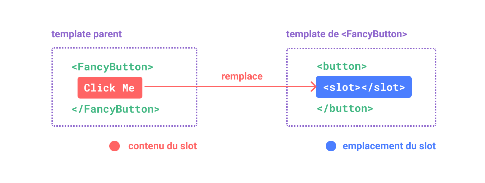
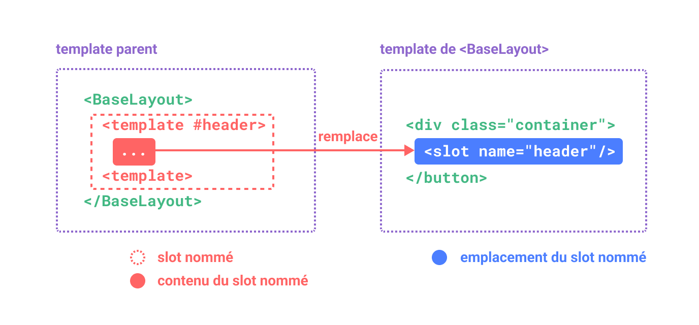
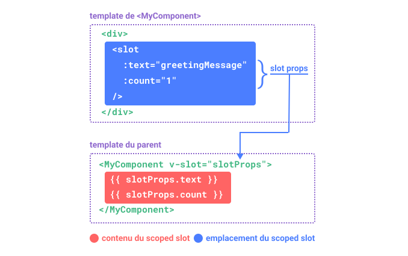

# Slots {#slots}

> Cette page suppose que vous avez déjà lu les [bases à propos des composants](/guide/essentials/component-basics). Lisez-les d'abord si vous débutez avec les composants.

<VueSchoolLink href="https://vueschool.io/lessons/vue-3-component-slots" title="Free Vue.js Slots Lesson"/>

## Les contenus de slot {#slot-content-and-outlet}

Nous avons appris que les composants peuvent accepter des props, qui peuvent être des valeurs JavaScript de n'importe quel type. Mais qu'en est-il du contenu du template ? Dans certains cas, nous pouvons vouloir transmettre un fragment de template à un composant enfant et laisser le composant enfant afficher le fragment dans son propre template.

Par exemple, nous pouvons avoir un composant `<FancyButton>` qui prend en charge l'utilisation suivante :

```vue-html{2}
<FancyButton>
  Click me! <!-- contenu du slot -->
</FancyButton>
```

Le template de `<FancyButton>` ressemble à ceci :

```vue-html{2}
<button class="fancy-btn">
  <slot></slot> <!-- emplacement du slot -->
</button>
```

L'élément `<slot>` est un **emplacement du slot** qui indique où le **contenu du slot** fourni par le parent doit être affiché.



<!-- https://www.figma.com/file/uXgOHSQYUcc1elWGPTskfs/slot -->

Et le DOM rendu final :

```html
<button class="fancy-btn">Click me!</button>
```

<div class="composition-api">

[Essayer en ligne](https://play.vuejs.org/#eNpdUdlqAyEU/ZVbQ0kLMdNsXabTQFvoV8yLcRkkjopLSQj596oTwqRvnuM9y9UT+rR2/hs5qlHjqZM2gOch2m2rZW+NC/BDND1+xRCMBuFMD9N5NeKyeNrqphrUSZdA4L1VJPCEAJrRdCEAvpWke+g5NHcYg1cmADU6cB0A4zzThmYckqimupqiGfpXILe/zdwNhaki3n+0SOR5vAu6ReU++efUajtqYGJQ/FIg5w8Wt9FlOx+OKh/nV1c4ZVNqlHE1TIQQ7xnvCN13zkTNalBSc+Jw5wiTac2H1WLDeDeDyXrJVm9LWG7uE3hev3AhHge1cYwnO200L4QljEnd1bCxB1g82UNhe+I6qQs5kuGcE30NrxeaRudzOWtkemeXuHP5tLIKOv8BN+mw3w==)

</div>
<div class="options-api">

[Essayer en ligne](https://play.vuejs.org/#eNpdUdtOwzAM/RUThAbSurIbl1ImARJf0ZesSapoqROlKdo07d9x0jF1SHmIT+xzcY7sw7nZTy9Zwcqu9tqFTYW6ddYH+OZYHz77ECyC8raFySwfYXFsUiFAhXKfBoRUvDcBjhGtLbGgxNAVcLziOlVIp8wvelQE2TrDg6QKoBx1JwDgy+h6B62E8ibLoDM2kAAGoocsiz1VKMfmCCrzCymbsn/GY95rze1grja8694rpmJ/tg1YsfRO/FE134wc2D4YeTYQ9QeKa+mUrgsHE6+zC+vfjoz1Bdwqpd5iveX1rvG2R1GA0Si5zxrPhaaY98v5WshmCrerhVi+LmCxvqPiafUslXoYpq0XkuiQ1p4Ax4XQ2BSwdnuYP7p9QlvuG40JHI1lUaenv3o5w3Xvu2jOWU179oQNn5aisNMvLBvDOg==)

</div>

Avec les slots, le `<FancyButton>` est responsable du rendu du `<button>` externe (et de son style), tandis que le contenu interne est fourni par le composant parent.

Une autre façon de comprendre les slots consiste à les comparer aux fonctions JavaScript :

```js
// composant parent passant le contenu du slot
FancyButton('Click me!')

// FancyButton effectue le rendu du contenu du slot dans son propre template
function FancyButton(slotContent) {
  return `<button class="fancy-btn">
      ${slotContent}
    </button>`
}
```

Le contenu du slot ne se limite pas à du texte. Il peut s'agir de n'importe quel contenu de template valide. Par exemple, nous pouvons passer plusieurs éléments, voire d'autres composants :

```vue-html
<FancyButton>
  <span style="color:red">Click me!</span>
  <AwesomeIcon name="plus" />
</FancyButton>
```

<div class="composition-api">

[Essayer en ligne](https://play.vuejs.org/#eNp1UmtOwkAQvspQYtCEgrx81EqCJibeoX+W7bRZaHc3+1AI4QyewH8ewvN4Aa/gbgtNIfFf5+vMfI/ZXbCQcvBmMYiCWFPFpAGNxsp5wlkphTLwQjjdPlljBIdMiRJ6g2EL88O9pnnxjlqU+EpbzS3s0BwPaypH4gqDpSyIQVcBxK3VFQDwXDC6hhJdlZi4zf3fRKwl4aDNtsDHJKCiECqiW8KTYH5c1gEnwnUdJ9rCh/XeM6Z42AgN+sFZAj6+Ux/LOjFaEK2diMz3h0vjNfj/zokuhPFU3lTdfcpShVOZcJ+DZgHs/HxtCrpZlj34eknoOlfC8jSCgnEkKswVSRlyczkZzVLM+9CdjtPJ/RjGswtX3ExvMcuu6mmhUnTruOBYAZKkKeN5BDO5gdG13FRoSVTOeAW2xkLPY3UEdweYWqW9OCkYN6gctq9uXllx2Z09CJ9dJwzBascI7nBYihWDldUGMqEgdTVIq6TQqCEMfUpNSD+fX7/fH+3b7P8AdGP6wA==)

</div>
<div class="options-api">

[Essayer en ligne](https://play.vuejs.org/#eNptUltu2zAQvMpGQZEWsOzGiftQ1QBpgQK9g35oaikwkUiCj9aGkTPkBPnLIXKeXCBXyJKKBdoIoA/tYGd3doa74tqY+b+ARVXUjltp/FWj5GC09fCHKb79FbzXCoTVA5zNFxkWaWdT8/V/dHrAvzxrzrC3ZoBG4SYRWhQs9B52EeWapihU3lWwyxfPDgbfNYq+ejEppcLjYHrmkSqAOqMmAOB3L/ktDEhV4+v8gMR/l1M7wxQ4v+3xZ1Nw3Wtb8S1TTXG1H3cCJIO69oxc5mLUcrSrXkxSi1lxZGT0//CS9Wg875lzJELE/nLto4bko69dr31cFc8auw+3JHvSEfQ7nwbsHY9HwakQ4kes14zfdlYH1VbQS4XMlp1lraRMPl6cr1rsZnB6uWwvvi9hufpAxZfLryjEp5GtbYs0TlGICTCsbaXqKliZDZx/NpuEDsx2UiUwo5VxT6Dkv73BPFgXxRktlUdL2Jh6OoW8O3pX0buTsoTgaCNQcDjoGwk3wXkQ2tJLGzSYYI126KAso0uTSc8Pjy9P93k2d6+NyRKa)

</div>

En utilisant des slots, notre `<FancyButton>` est plus flexible et réutilisable. Nous pouvons maintenant l'utiliser à différents endroits avec un contenu différent, mais tous avec le même style appliqué.

Le mécanisme de slot des composants Vue est inspiré de l'[élément natif Web Component `<slot>`](https://developer.mozilla.org/fr/docs/Web/HTML/Element/slot), mais avec des fonctionnalités supplémentaires que nous verrons plus tard.

## Portée du rendu {#render-scope}

Le contenu du slot a accès à la portée des données du composant parent, car il est défini dans le parent. Par exemple :

```vue-html
<span>{{ message }}</span>
<FancyButton>{{ message }}</FancyButton>
```

Ici, les deux interpolations <span v-pre>`{{ message }}`</span> rendront le même contenu.

Le contenu du slot **n'a pas** accès aux données du composant enfant. Les expressions dans les templates Vue ne peuvent accéder qu'à la portée de déclaration dans laquelle elles sont définies, conformément à la portée lexicale de JavaScript. Autrement dit :

> Les expressions présentes dans le template du parent n'ont accès qu'à la portée du parent ; les expressions dans le template de l'enfant n'ont accès qu'à la portée du composant enfant.

## Contenu par défaut {#fallback-content}

Il existe des cas où il est utile de spécifier un contenu par défaut pour un slot, à rendre uniquement lorsqu'aucun contenu n'est fourni. Par exemple, dans un composant `<SubmitButton>` :

```vue-html
<button type="submit">
  <slot></slot>
</button>
```

Nous pourrions souhaiter que le texte "Submit" soit rendu à l'intérieur du `<button>` si le parent n'a fourni aucun contenu pour le slot. Pour faire de "Submit" le contenu par défaut, nous pouvons le placer entre les balises `<slot>` :

```vue-html{3}
<button type="submit">
  <slot>
    Submit <!-- contenu par défaut -->
  </slot>
</button>
```

Maintenant, lorsque nous utilisons `<SubmitButton>` dans un composant parent, en ne fournissant aucun contenu pour le slot :

```vue-html
<SubmitButton />
```

Cela rendra le contenu par défaut, "Submit":

```html
<button type="submit">Submit</button>
```

Mais si nous fournissons le contenu :

```vue-html
<SubmitButton>Save</SubmitButton>
```

Alors, le contenu fourni sera affiché à la place :

```html
<button type="submit">Save</button>
```

<div class="composition-api">

[Essayer en ligne](https://play.vuejs.org/#eNp1kMsKwjAQRX9lzMaNbfcSC/oL3WbT1ikU8yKZFEX8d5MGgi2YVeZxZ86dN7taWy8B2ZlxP7rZEnikYFuhZ2WNI+jCoGa6BSKjYXJGwbFufpNJfhSaN1kflTEgVFb2hDEC4IeqguARpl7KoR8fQPgkqKpc3Wxo1lxRWWeW+Y4wBk9x9V9d2/UL8g1XbOJN4WAntodOnrecQ2agl8WLYH7tFyw5olj10iR3EJ+gPCxDFluj0YS6EAqKR8mi9M3Td1ifLxWShcU=)

</div>
<div class="options-api">

[Essayer en ligne](https://play.vuejs.org/#eNp1UEEOwiAQ/MrKxYu1d4Mm+gWvXChuk0YKpCyNxvh3lxIb28SEA8zuDDPzEucQ9mNCcRAymqELdFKu64MfCK6p6Tu6JCLvoB18D9t9/Qtm4lY5AOXwMVFu2OpkCV4ZNZ51HDqKhwLAQjIjb+X4yHr+mh+EfbCakF8AclNVkCJCq61ttLkD4YOgqsp0YbGesJkVBj92NwSTIrH3v7zTVY8oF8F4SdazD7ET69S5rqXPpnigZ8CjEnHaVyInIp5G63O6XIGiIlZMzrGMd8RVfR0q4lIKKV+L+srW+wNTTZq3)

</div>

## Slots nommés {#named-slots}

Il y a des moments où il est utile d'avoir plusieurs emplacements de slot dans un seul composant. Par exemple, dans un composant `<BaseLayout>` avec le template suivant :

```vue-html
<div class="container">
  <header>
    <!-- Nous voulons le contenu du header ici -->
  </header>
  <main>
    <!-- Nous voulons le contenu principal ici -->
  </main>
  <footer>
    <!-- Nous voulons le contenu du footer ici -->
  </footer>
</div>
```

Dans ces cas, l'élément `<slot>` a un attribut spécial, `name`, qui peut être utilisé pour attribuer un ID unique à différents slots afin que vous puissiez déterminer où le contenu doit être affiché :

```vue-html
<div class="container">
  <header>
    <slot name="header"></slot>
  </header>
  <main>
    <slot></slot>
  </main>
  <footer>
    <slot name="footer"></slot>
  </footer>
</div>
```

Une balise `<slot>` sans attribut `name` porte implicitement le nom "default".

Dans un composant parent utilisant `<BaseLayout>`, nous avons besoin d'un moyen de transmettre plusieurs fragments de contenu de slot, chacun ciblant un emplacement de slot différent. C'est là qu'interviennent les **slots nommés**.

Pour passer un slot nommé, nous devons utiliser un élément `<template>` avec la directive `v-slot`, puis passer le nom du slot comme argument à `v-slot` :

```vue-html
<BaseLayout>
  <template v-slot:header>
    <!-- contenu pour le slot header -->
  </template>
</BaseLayout>
```

`v-slot` a un raccourci dédié `#`, donc `<template v-slot:header>` peut être raccourci en juste `<template #header>`. Pensez-y comme "rendre ce fragment de template dans le slot 'header' du composant enfant".



<!-- https://www.figma.com/file/2BhP8gVZevttBu9oUmUUyz/named-slot -->

Voici le code transmettant le contenu des trois slots à `<BaseLayout>` en utilisant la syntaxe abrégée :

```vue-html
<BaseLayout>
  <template #header>
    <h1>Here might be a page title</h1>
  </template>

  <template #default>
    <p>A paragraph for the main content.</p>
    <p>And another one.</p>
  </template>

  <template #footer>
    <p>Here's some contact info</p>
  </template>
</BaseLayout>
```

Lorsqu'un composant accepte à la fois un emplacement par défaut et des emplacements nommés, tous les nœuds de niveau supérieur non `<template>` sont implicitement traités comme du contenu pour le slot par défaut. Donc ce qui précède peut aussi s'écrire :

```vue-html
<BaseLayout>
  <template #header>
    <h1>Here might be a page title</h1>
  </template>

  <!-- slot par défaut implicite -->
  <p>A paragraph for the main content.</p>
  <p>And another one.</p>

  <template #footer>
    <p>Here's some contact info</p>
  </template>
</BaseLayout>
```

Désormais, tout ce qui se trouve à l'intérieur des éléments `<template>` sera transmis aux slots correspondants. Le rendu HTML final sera :

```html
<div class="container">
  <header>
    <h1>Here might be a page title</h1>
  </header>
  <main>
    <p>A paragraph for the main content.</p>
    <p>And another one.</p>
  </main>
  <footer>
    <p>Here's some contact info</p>
  </footer>
</div>
```

<div class="composition-api">

[Essayer en ligne](https://play.vuejs.org/#eNp9UsFuwjAM/RWrHLgMOi5o6jIkdtphn9BLSF0aKU2ixEVjiH+fm8JoQdvRfu/5xS8+ZVvvl4cOsyITUQXtCSJS5zel1a13geBdRvyUR9cR1MG1MF/mt1YvnZdW5IOWVVwQtt5IQq4AxI2cau5ccZg1KCsMlz4jzWrzgQGh1fuGYIcgwcs9AmkyKHKGLyPykcfD1Apr2ZmrHUN+s+U5Qe6D9A3ULgA1bCK1BeUsoaWlyPuVb3xbgbSOaQGcxRH8v3XtHI0X8mmfeYToWkxmUhFoW7s/JvblJLERmj1l0+T7T5tqK30AZWSMb2WW3LTFUGZXp/u8o3EEVrbI9AFjLn8mt38fN9GIPrSp/p4/Yoj7OMZ+A/boN9KInPeZZpAOLNLRDAsPZDgN4p0L/NQFOV/Ayn9x6EZXMFNKvQ4E5YwLBczW6/WlU3NIi6i/sYDn5Qu2qX1OF51MsvMPkrIEHg==)

</div>
<div class="options-api">

[Essayer en ligne](https://play.vuejs.org/#eNp9UkFuwjAQ/MoqHLiUpFxQlaZI9NRDn5CLSTbEkmNb9oKgiL934wRwQK3ky87O7njGPicba9PDHpM8KXzlpKV1qWVnjSP4FB6/xcnsCRpnOpin2R3qh+alBig1HgO9xkbsFcG5RyvDOzRq8vkAQLSury+l5lNkN1EuCDurBCFXAMWdH2pGrn2YtShqdCPOnXa5/kKH0MldS7BFEGDFDoEkKSwybo8rskjjaevo4L7Wrje8x4mdE7aFxjiglkWE1GxQE9tLi8xO+LoGoQ3THLD/qP2/dGMMxYZs8DP34E2HQUxUBFI35o+NfTlJLOomL8n04frXns7W8gCVEt5/lElQkxpdmVyVHvP2yhBo0SHThx5z+TEZvl1uMlP0oU3nH/kRo3iMI9Ybes960UyRsZ9pBuGDeTqpwfBAvn7NrXF81QUZm8PSHjl0JWuYVVX1PhAqo4zLYbZarUak4ZAWXv5gDq/pG3YBHn50EEkuv5irGBk=)

</div>

Encore une fois, cela peut vous aider à mieux comprendre les slots nommés en utilisant l'analogie avec une fonction JavaScript :

```js
// passage de plusieurs fragments de slot avec des noms différents
BaseLayout({
  header: `...`,
  default: `...`,
  footer: `...`
})

// <BaseLayout> les affiche à différents emplacements
function BaseLayout(slots) {
  return `<div class="container">
      <header>${slots.header}</header>
      <main>${slots.default}</main>
      <footer>${slots.footer}</footer>
    </div>`
}
```

## Slots conditionnels {#conditional-slots}

Il arrive que l'on veuille rendre quelque chose en fonction de la transmission ou non d'un contenu à un slot.

Vous pouvez utiliser la propriété [$slots](/api/component-instance.html#slots) en combinaison avec un [v-if](/guide/essentials/conditional.html#v-if) pour y parvenir.

Dans l'exemple ci-dessous, nous définissons un composant Card avec trois slots conditionnels : `header`, `footer` et `default`.
Lorsque l'en-tête / le pied de page / du texte par défaut est présent, nous voulons l'envelopper pour lui donner un style supplémentaire :

```vue-html
<template>
  <div class="card">
    <div v-if="$slots.header" class="card-header">
      <slot name="header" />
    </div>

    <div v-if="$slots.default" class="card-content">
      <slot />
    </div>

    <div v-if="$slots.footer" class="card-footer">
      <slot name="footer" />
    </div>
  </div>
</template>
```

[Essayer en ligne](https://play.vuejs.org/#eNqVVMtu2zAQ/BWCLZBLIjVoTq4aoA1yaA9t0eaoCy2tJcYUSZCUKyPwv2dJioplOw4C+EDuzM4+ONYT/aZ1tumBLmhhK8O1IxZcr29LyTutjCN3zNRkZVRHLrLcXzz9opRFHvnIxIuDTgvmAG+EFJ4WTnhOCPnQAqvBjHFE2uvbh5Zbgj/XAolwkWN4TM33VI/UalixXvjyo5yeqVVKOpCuyP0ob6utlHL7vUE3U4twkWP4hJq/jiPP4vSSOouNrHiTPVolcclPnl3SSnWaCzC/teNK2pIuSEA8xoRQ/3+GmDM9XKZ41UK1PhF/tIOPlfSPAQtmAyWdMMdMAy7C9/9+wYDnCexU3QtknwH/glWi9z1G2vde1tj2Hi90+yNYhcvmwd4PuHabhvKNeuYu8EuK1rk7M/pLu5+zm5BXyh1uMdnOu3S+95pvSCWYtV9xQcgqaXogj2yu+AqBj1YoZ7NosJLOEq5S9OXtPZtI1gFSppx8engUHs+vVhq9eVhq9ORRrXdpRyseSqfo6SmmnONK6XTw9yis24q448wXSG+0VAb3sSDXeiBoDV6TpWDV+ktENatrdMGCfAoBfL1JYNzzpINJjVFoJ9yKUKho19ul6OFQ6UYPx1rjIpPYeXIc/vXCgjetawzbni0dPnhhJ3T3DMVSruI=)

## Noms de slot dynamiques {#dynamic-slot-names}

[Les arguments de directive dynamique](/guide/essentials/template-syntax.md#dynamic-arguments) fonctionnent également sur `v-slot`, permettant la définition de noms de slots dynamiques :

```vue-html
<base-layout>
  <template v-slot:[dynamicSlotName]>
    ...
  </template>

  <!-- avec syntaxe abrégée -->
  <template #[dynamicSlotName]>
    ...
  </template>
</base-layout>
```

Notez que l'expression est soumise aux [contraintes de syntaxe](/guide/essentials/template-syntax.md#dynamic-argument-syntax-constraints) des arguments de directive dynamiques.

## Scoped Slots {#scoped-slots}

Comme indiqué dans [Portée du rendu](#render-scope), le contenu du slot n'a pas accès à l'état dans le composant enfant.

Cependant, il existe des cas où il peut être utile que le contenu d'un slot puisse utiliser des données provenant à la fois de la portée du parent et de la portée de l'enfant. Pour y parvenir, nous avons besoin d'un moyen pour l'enfant de transmettre des données à un slot pour son affichage.

En fait, nous pouvons faire exactement cela - nous pouvons transmettre des attributs à un emplacement de slot comme on transmettrait des props à un composant :

```vue-html
<!-- template de <MyComponent> -->
<div>
  <slot :text="greetingMessage" :count="1"></slot>
</div>
```

La réception des props de slot est un peu différente lorsque vous utilisez un seul slot par défaut par rapport à l'utilisation de slots nommés. Nous allons d'abord montrer comment recevoir des props en utilisant un seul slot par défaut, en utilisant `v-slot` directement sur la balise du composant enfant :

```vue-html
<MyComponent v-slot="slotProps">
  {{ slotProps.text }} {{ slotProps.count }}
</MyComponent>
```



<!-- https://www.figma.com/file/QRneoj8eIdL1kw3WQaaEyc/scoped-slot -->

<div class="composition-api">

[Essayer en ligne](https://play.vuejs.org/#eNp9kMEKgzAMhl8l9OJlU3aVOhg7C3uAXsRlTtC2tFE2pO++dA5xMnZqk+b/8/2dxMnadBxQ5EL62rWWwCMN9qh021vjCMrn2fBNoya4OdNDkmarXhQnSstsVrOOC8LedhVhrEiuHca97wwVSsTj4oz1SvAUgKJpgqWZEj4IQoCvZm0Gtgghzss1BDvIbFkqdmID+CNdbbQnaBwitbop0fuqQSgguWPXmX+JePe1HT/QMtJBHnE51MZOCcjfzPx04JxsydPzp2Szxxo7vABY1I/p)

</div>
<div class="options-api">

[Essayer en ligne](https://play.vuejs.org/#eNqFkNFqxCAQRX9l8CUttAl9DbZQ+rzQD/AlJLNpwKjoJGwJ/nvHpAnusrAg6FzHO567iE/nynlCUQsZWj84+lBmGJ31BKffL8sng4bg7O0IRVllWnpWKAOgDF7WBx2em0kTLElt975QbwLkhkmIyvCS1TGXC8LR6YYwVSTzH8yvQVt6VyJt3966oAR38XhaFjjEkvBCECNcia2d2CLyOACZQ7CDrI6h4kXcAF7lcg+za6h5et4JPdLkzV4B9B6RBtOfMISmxxqKH9TarrGtATxMgf/bDfM/qExEUCdEDuLGXAmoV06+euNs2JK7tyCrzSNHjX9aurQf)

</div>

Les props passés au slot par l'enfant sont disponibles en tant que valeur de la directive `v-slot` correspondante, accessible par les expressions à l'intérieur du slot.

Vous pouvez considérer un "scoped slot" comme une fonction transmise au composant enfant. Le composant enfant l'appelle ensuite, en passant des props comme arguments :

```js
MyComponent({
  // passage du slot par défaut, mais en tant que fonction
  default: (slotProps) => {
    return `${slotProps.text} ${slotProps.count}`
  }
})

function MyComponent(slots) {
  const greetingMessage = 'hello'
  return `<div>${
    // appel de la fonction slot avec les props !
    slots.default({ text: greetingMessage, count: 1 })
  }</div>`
}
```

En fait, c'est très proche de la façon dont les "scoped slots" sont compilés et de la façon dont vous utiliseriez les "scoped slots" dans les [fonctions de rendu](/guide/extras/render-function) manuelles.

Remarquez comment `v-slot="slotProps"` correspond à la signature de la fonction slot. Tout comme avec les arguments de fonction, nous pouvons utiliser la déstructuration dans `v-slot` :

```vue-html
<MyComponent v-slot="{ text, count }">
  {{ text }} {{ count }}
</MyComponent>
```

### Scoped slots nommés {#named-scoped-slots}

Les Scoped slots nommés fonctionnent de la même manière - les props du slot sont accessibles en tant que valeur de la directive `v-slot` : `v-slot:name="slotProps"`. Lorsque vous utilisez le raccourci, cela ressemble à ceci :

```vue-html
<MyComponent>
  <template #header="headerProps">
    {{ headerProps }}
  </template>

  <template #default="defaultProps">
    {{ defaultProps }}
  </template>

  <template #footer="footerProps">
    {{ footerProps }}
  </template>
</MyComponent>
```

Passer des props à un slot nommé :

```vue-html
<slot name="header" message="hello"></slot>
```

Notez que l'attribut `name` d'un slot ne sera pas inclus dans les props car il est réservé - donc le `headerProps` résultant serait `{ message: 'hello' }`.

Si vous mélangez des slots nommés avec des "scoped slots" par défaut, vous devez utiliser une balise `<template>` explicite pour le slot par défaut. Tenter de placer la directive `v-slot` directement sur le composant entraînera une erreur de compilation. Ceci afin d'éviter toute ambiguïté sur la portée des props du slot par défaut. Par exemple :

```vue-html
<!-- <MyComponent> template -->
<div>
  <slot :message="hello"></slot>
  <slot name="footer" />
</div>
```

```vue-html
<!-- Ce template ne compilera pas -->
<MyComponent v-slot="{ message }">
  <p>{{ message }}</p>
  <template #footer>
    <!-- message appartient au slot par défaut, et n'est pas disponible ici -->
    <p>{{ message }}</p>
  </template>
</MyComponent>
```

L'utilisation explicite d'une balise `<template>` pour le slot par défaut aide à indiquer clairement que la prop `message` n'est pas disponible dans l'autre slot :

```vue-html
<MyComponent>
  <!-- Utiliser un slot par défaut explicit -->
  <template #default="{ message }">
    <p>{{ message }}</p>
  </template>

  <template #footer>
    <p>Here's some contact info</p>
  </template>
</MyComponent>
```

### Exemple Fancy List {#fancy-list-example}

Vous vous demandez peut-être quel serait un bon cas d'utilisation pour les scoped slots. Voici un exemple : imaginez un composant `<FancyList>` qui affiche une liste d'éléments - il peut encapsuler la logique de chargement des données distantes, utiliser les données pour afficher une liste, ou même des fonctionnalités avancées comme la pagination ou le défilement infini. Cependant, nous voulons qu'il soit flexible avec l'apparence de chaque élément et laisse la définition du style de chaque élément au composant parent qui le consomme. Ainsi, l'utilisation souhaitée peut ressembler à ceci :

```vue-html
<FancyList :api-url="url" :per-page="10">
  <template #item="{ body, username, likes }">
    <div class="item">
      <p>{{ body }}</p>
      <p>by {{ username }} | {{ likes }} likes</p>
    </div>
  </template>
</FancyList>
```

Dans `<FancyList>`, nous pouvons afficher le même `<slot>` plusieurs fois avec différentes données (notez que nous utilisons `v-bind` pour passer un objet en tant que props du slot) :

```vue-html
<ul>
  <li v-for="item in items">
    <slot name="item" v-bind="item"></slot>
  </li>
</ul>
```

<div class="composition-api">

[Essayer en ligne](https://play.vuejs.org/#eNqFU2Fv0zAQ/StHJtROapNuZTBCNwnQQKBpTGxCQss+uMml8+bYlu2UlZL/zjlp0lQa40sU3/nd3Xv3vA7eax0uSwziYGZTw7UDi67Up4nkhVbGwScm09U5tw5yowoYhFEX8cBBImdRgyQMHRwWWjCHdAKYbdFM83FpxEkS0DcJINZoxpotkCIHkySo7xOixcMep19KrmGustUISotGsgJHIPgDWqg6DKEyvoRUMGsJ4HG9HGX16bqpAlU1izy5baqDFegYweYroMttMwLAHx/Y9Kyan36RWUTN2+mjXfpbrei8k6SjdSuBYFOlMaNI6AeAtcflSrqx5b8xhkl4jMU7H0yVUCaGvVeH8+PjKYWqWnpf5DQYBTtb+fc612Awh2qzzGaBiUyVpBVpo7SFE8gw5xIv/Wl4M9gsbjCCQbuywe3+FuXl9iiqO7xpElEEhUofKFQo2mTGiFiOLr3jcpFImuiaF6hKNxzuw8lpw7kuEy6ZKJGK3TR6NluLYXBVqwRXQjkLn0ueIc3TLonyZ0sm4acqKVovKIbDCVQjGsb1qvyg2telU4Yzz6eHv6ARBWdwjVqUNCbbFjqgQn6aW1J8RKfJhDg+5/lStG4QHJZjnpO5XjT0BMqFu+uZ81yxjEQJw7A1kOA76FyZjaWBy0akvu8tCQKeQ+d7wsy5zLpz1FlzU3kW1QP+x40ApWgWAySEJTv6/NitNMkllcTakwCaZZ5ADEf6cROas/RhYVQps5igEpkZLwzRROmG04OjDBcj7+Js+vYQDo9e0uH1qzeY5/s1vtaaqG969+vTTrsmBTMLLv12nuy7l+d5W673SBzxkzlfhPdWSXokdZMkSFWhuUDzTTtOnk6CuG2fBEwI9etrHXOmRLJUE0/vMH14In5vH30sCS4Nkr+WmARdztHQ6Jr02dUFPtJ/lyxUVgq6/UzyO1olSj9jc+0DcaWxe/fqab/UT51Uu7Znjw6lbUn5QWtR6vtJQM//4zPUt+NOw+lGzCqo/gLm1QS8)

</div>
<div class="options-api">

[Essayer en ligne](https://play.vuejs.org/#eNqNVNtq20AQ/ZWpQnECujhO0qaqY+hD25fQl4RCifKwllbKktXushcT1/W/d1bSSnYJNCCEZmbPmcuZ1S76olS6cTTKo6UpNVN2VQjWKqktfCOi3N4yY6HWsoVZmo0eD5kVAqAQ9KU7XNGaOG5h572lRAZBhTV574CJzJv7QuCzzMaMaFjaKk4sRQtgOeUmiiVO85siwncRQa6oThRpKHrO50XUnUdEwMMJw08M7mAtq20MzlAtSEtj4OyZGkweMIiq2AZKToxBgMcdxDCqVrueBfb7ZaaOQiOspZYgbL0FPBySIQD+eMeQc99/HJIsM0weqs+O258mjfZREE1jt5yCKaWiFXpSX0A/5loKmxj2m+YwT69p+7kXg0udw8nlYn19fYGufvSeZBXF0ZGmR2vwmrJKS4WiPswGWWYxzIIgs8fYH6mIJadnQXdNrdMiWAB+yJ7gsXdgLfjqcK10wtJqgmYZ+spnpGgl6up5oaa2fGKi6U8Yau9ZS6Wzpwi7WU1p7BMzaZcLbuBh0q2XM4fZXTc+uOPSGvjuWEWxlaAexr9uiIBf0qG3Uy6HxXwo9B+mn47CvbNSM+LHccDxAyvmjMA9Vdxh1WQiO0eywBVGEaN3Pj972wVxPKwOZ7BJWI2b+K5rOOVUNPbpYJNvJalwZmmahm3j7AhdSz3sPzDRS3R4SQwOCXxP4yVBzJqJarSzcY8H5mXWFfif1QVwPGjGcQWTLp7YrcLxCfyDdAuMW0cq30AOV+plcK1J+dxoXJkqR6igRCeNxjbxp3N6cX5V0Sb2K19dfFrA4uo9Gh8uP9K6Puvw3eyx9SH3IT/qPCZpiW6Y8Gq9mvekrutAN96o/V99ALPj)

</div>

### Composants sans affichage {#renderless-components}

Le cas d'utilisation `<FancyList>` dont nous avons parlé ci-dessus encapsule à la fois la logique réutilisable (récupération de données, pagination, etc.) et l'affichage, tout en déléguant une partie de l'affichage au composant consommateur via des scoped slots.

Si nous poussons ce concept un peu plus loin, nous pouvons proposer des composants qui encapsulent uniquement la logique et n'affichent rien par eux-mêmes - l'affichage est entièrement délégué au composant consommateur avec des scoped slots. Nous appelons ce type de composant un **Composant sans affichage** (Renderless Component).

Un exemple de composant sans affichage pourrait être un composant qui encapsule la logique de suivi de la position actuelle de la souris :

```vue-html
<MouseTracker v-slot="{ x, y }">
  Mouse is at: {{ x }}, {{ y }}
</MouseTracker>
```

<div class="composition-api">

[Essayer en ligne](https://play.vuejs.org/#eNqNUcFqhDAQ/ZUhF12w2rO4Cz301t5aaCEX0dki1SQko6uI/96J7i4qLPQQmHmZ9+Y9ZhQvxsRdiyIVmStsZQgcUmtOUlWN0ZbgXbcOP2xe/KKFs9UNBHGyBj09kCpLFj4zuSFsTJ0T+o6yjUb35GpNRylG6CMYYJKCpwAkzWNQOcgphZG/YZoiX/DQNAttFjMrS+6LRCT2rh6HGsHiOQKtmKIIS19+qmZpYLrmXIKxM1Vo5Yj9HD0vfD7ckGGF3LDWlOyHP/idYPQCfdzldTtjscl/8MuDww78lsqHVHdTYXjwCpdKlfoS52X52qGit8oRKrRhwHYdNrrDILouPbCNVZCtgJ1n/6Xx8JYAmT8epD3fr5cC0oGLQYpkd4zpD27R0vA=)

</div>
<div class="options-api">

[Essayer en ligne](https://play.vuejs.org/#eNqVUU1rwzAM/SvCl7SQJTuHdLDDbttthw18MbW6hjW2seU0oeS/T0lounQfUDBGepaenvxO4tG5rIkoClGGra8cPUhT1c56ghcbA756tf1EDztva0iy/Ds4NCbSAEiD7diicafigeA0oFvLPAYNhWICYEE5IL00fMp8Hs0JYe0OinDIqFyIaO7CwdJGihO0KXTcLriK59NYBlUARTyMn6Hv0yHgIp7ARAvl3FXm8yCRiuu1Fv/x23JakVqtz3t5pOjNOQNoC7hPz0nHyRSzEr7Ghxppb/XlZ6JjRlzhTAlA+ypkLWwAM6c+8G2BdzP+/pPbRkOoL/KOldH2mCmtnxr247kKhAb9KuHKgLVtMEkn2knG+sIVzV9sfmy8hfB/swHKwV0oWja4lQKKjoNOivzKrf4L/JPqaQ==)

</div>

Bien qu'il s'agisse d'un pattern intéressant, la plupart de ce qui peut être réalisé avec les composants sans affichage peut être réalisé de manière plus efficace avec la Composition API, sans subir les coûts liés à l'imbrication de composants supplémentaires. Plus tard, nous verrons comment nous pouvons implémenter la même fonctionnalité de suivi de la souris mais avec un [Composable](/guide/reusability/composables).

Cela dit, les scoped slots sont toujours utiles dans les cas où nous devons à la fois encapsuler la logique **et** composer un affichage, comme dans l'exemple `<FancyList>`.
