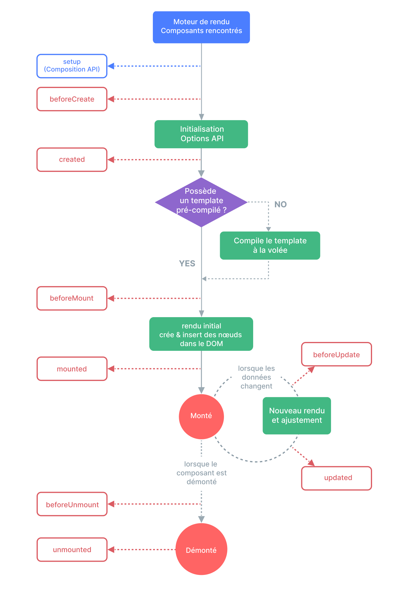

# Les hooks du cycle de vie {#lifecycle-hooks}

Chaque instance d'un composant Vue passe par une série d'étapes d'initialisation lorsqu'elle est créée - par exemple, il faut paramétrer l'observation des données, compiler le template, monter l'instance sur le DOM, et le mettre à jour lorsque les données changent. En cours de route, des fonctions appelées hooks du cycle de vie sont également exécutées, donnant la possibilité à l'utilisateur d'ajouter son propre code à des étapes spécifiques.

## Enregistrement des hooks du cycle de vie {#registering-lifecycle-hooks}

Par exemple, le hook <span class="composition-api">`onMounted`</span><span class="options-api">`mounted`</span>  peut être utilisé pour exécuter du code après que le composant ait terminé son rendu initial et créé les nœuds du DOM :

<div class="composition-api">

```vue
<script setup>
import { onMounted } from 'vue'

onMounted(() => {
  console.log(`the component is now mounted.`)
})
</script>
```

</div>
<div class="options-api">

```js
export default {
  mounted() {
    console.log(`the component is now mounted.`)
  }
}
```

</div>

Il y a également d'autres hooks qui peuvent être appelés à différentes étapes du cycle de vie de l'instance, dont les plus couramment utilisés sont <span class="composition-api">[`onMounted`](/api/composition-api-lifecycle#onmounted), [`onUpdated`](/api/composition-api-lifecycle#onupdated), et [`onUnmounted`](/api/composition-api-lifecycle#onunmounted).</span><span class="options-api">[`mounted`](/api/options-lifecycle#mounted), [`updated`](/api/options-lifecycle#updated), and [`unmounted`](/api/options-lifecycle#unmounted).</span>

<div class="options-api">

Tous les hooks du cycle de vie sont appelés via leur contexte `this` qui pointe sur l'instance active actuelle qui l'invoque. Notez que vous devez éviter d'utiliser les fonctions fléchées lorsque vous déclarez des hooks du cycle de vie, puisque dans ce cas vous ne pourrez pas accéder à l'instance du composant via `this`.

</div>

<div class="composition-api">

Lorsque vous appelez `onMounted`, Vue associe automatiquement la fonction de rappel enregistrée et l'instance active actuelle du composant. Cela nécessite que ces hooks soient enregistrés **de manière synchrone** pendant la configuration du composant. Par exemple, ne faites pas ça :

```js
setTimeout(() => {
  onMounted(() => {
    // cela ne fonctionnera pas.
  })
}, 100)
```

Notez que cela ne signifie pas que l'appel doit être placé littéralement dans `setup()` ou `<script setup>`. `onMounted()` peut être appelé dans une fonction externe tant que le contenu de l'appel est synchrone et provient de `setup()`.

</div>

## Diagramme du cycle de vie {#lifecycle-diagram}

Ci-dessous figure le diagramme du cycle de vie d'une instance. Vous n'avez pas besoin de le comprendre entièrement pour le moment, mais au fur et à mesure que vous apprendrez et construirez, il sera une référence utile.



<!-- https://www.figma.com/file/Xw3UeNMOralY6NV7gSjWdS/Vue-Lifecycle -->

Consultez la <span class="composition-api">[référence de l'API des hooks du cycle de vie](/api/composition-api-lifecycle)</span><span class="options-api">[référence de l'API des hooks du cycle de vie](/api/options-lifecycle)</span> pour plus de détails sur tous les hooks du cycle de vie et leurs utilisations respectives.
