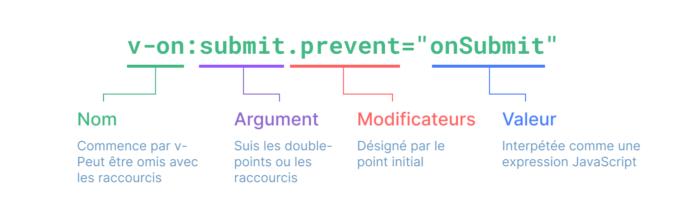

# Syntaxe de template {#template-syntax}

<ScrimbaLink href="https://scrimba.com/links/vue-template-syntax" title="Leçon gratuite sur la syntaxe des templates Vue.js" type="scrimba">
  Voir une leçon vidéo interactive sur Scrimba
</ScrimbaLink>

Vue utilise une syntaxe de template basée sur HTML pour permettre de lier de manière déclarative le DOM rendu aux données de l'instance du composant sous-jacent. Tous les templates Vue sont du HTML syntaxiquement valide qui peut être analysé par des navigateurs et des analyseurs HTML conformes aux spécifications.

Sous le capot, Vue compile les templates en code JavaScript hautement optimisé. Combiné avec le système de réactivité, Vue est capable de déterminer intelligemment le nombre minimal de composants à restituer et d'appliquer la quantité minimale de manipulations DOM lorsque l'état de l'application change.

Si vous connaissez les concepts de DOM virtuel et préférez la puissance brute de JavaScript, vous pouvez également [écrire directement des fonctions de rendu](/guide/extras/render-function) au lieu des templates, avec en option la prise en charge de JSX. Cependant, notez qu'elles ne bénéficient pas du même niveau d'optimisation au moment de la compilation que les templates.

## Interpolation de texte {#text-interpolation}

La forme la plus élémentaire de liaison de données est l'interpolation de texte à l'aide de la syntaxe "Moustache" (doubles accolades) :

```vue-html
<span>Message : {{ msg }}</span>
```

La balise moustache sera remplacée par la valeur de la propriété `msg` de [l'instance du composant correspondant](/guide/essentials/reactivity-fundamentals#declaring-reactive-state). Elle sera également mise à jour chaque fois que la propriété `msg` changera.

## HTML brut {#raw-html}

Les doubles moustaches interprètent les données comme du texte brut et non comme du HTML. Afin de produire du vrai HTML, vous devrez utiliser la directive [`v-html`](/api/built-in-directives#v-html) :

```vue-html
<p>Using text interpolation: {{ rawHtml }}</p>
<p>Using v-html directive: <span v-html="rawHtml"></span></p>
```

<script setup>
  const htmlBrut = '<span style="color: red">Ceci doit être rouge.</span>'
</script>

<div class="demo">
  <p>Using text interpolation: {{ rawHtml }}</p>
  <p>Using v-html directive: <span v-html="htmlBrut"></span></p>
</div>

Ici, nous rencontrons quelque chose de nouveau. L'attribut `v-html` que vous voyez s'appelle une **directive**. Les directives sont préfixées par `v-` pour indiquer qu'il s'agit d'attributs spéciaux fournis par Vue et, comme vous l'avez peut-être deviné, elles appliquent un comportement réactif spécial au DOM rendu. Ici, nous disons essentiellement "maintenir à jour le code HTML interne de cet élément avec la propriété `rawHtml` sur l'instance active actuelle".

Le contenu de `span` sera remplacé par la valeur de la propriété `rawHtml`, interprétée comme du HTML simple - les liaisons de données sont ignorées. Notez que vous ne pouvez pas utiliser `v-html` pour composer des templates partiels, car Vue n'est pas un moteur de template basé sur des chaînes de caractères. Au lieu de cela, les composants sont préférés comme unité fondamentale pour la réutilisation et la composition de l'interface utilisateur.

:::warning Avertissement de sécurité
L'affichage dynamique de code HTML arbitraire sur votre site Web peut être très dangereux, car il peut facilement entraîner des [vulnérabilités XSS](https://en.wikipedia.org/wiki/Cross-site_scripting). N'utilisez `v-html` que sur le contenu de confiance et **jamais** sur le contenu fourni par l'utilisateur.
:::

## Liaisons d'attributs {#attribute-bindings}

Les moustaches ne peuvent pas être utilisées dans les attributs HTML. À la place, utilisez une directive [`v-bind`](/api/built-in-directives#v-bind) :

```vue-html
<div v-bind:id="dynamicId"></div>
```

La directive `v-bind` demande à Vue de garder l'attribut `id` de l'élément synchronisé avec la propriété `dynamicId` du composant. Si la valeur liée est `null` ou `undefined`, alors l'attribut sera supprimé de l'élément rendu.

### Raccourci {#shorthand}

Parce que `v-bind` est si couramment utilisée, elle a une syntaxe raccourcie :

```vue-html
<div :id="dynamicId"></div>
```

Les attributs commençant par `:` peuvent sembler un peu différents du HTML normal, mais il s'agit en fait d'un caractère valide pour les noms d'attributs et tous les navigateurs pris en charge par Vue peuvent l'analyser correctement. De plus, ils n'apparaissent pas dans le rendu final. La syntaxe abrégée est facultative, mais vous l'apprécierez probablement lorsque vous en apprendrez plus sur son utilisation plus tard.

> Pour le reste du guide, nous utiliserons la syntaxe abrégée dans les exemples de code, car c'est l'utilisation la plus courante pour les développeurs Vue.

### Raccourci de même nom <sup class="vt-badge" data-text="3.4+" /> {#same-name-shorthand}

- Supporté à partir de la version 3.4

Si l'attribut porte le même nom que le nom de la variable de la valeur JavaScript à lier, la syntaxe peut encore être raccourcie pour omettre la valeur de l'attribut :

```vue-html
<!-- pareil que :id="id" -->
<div :id></div>

<!-- ceci fonctionne également -->
<div v-bind:id></div>
```

C'est similaire au raccourci pour déclarer un objet en JavaScript. Notez que cette fonctionnalité n'est disponible pour la version Vue 3.4 et plus.

### Attributs booléens {#boolean-attributes}

[Les attributs booléens](https://html.spec.whatwg.org/multipage/common-microsyntaxes.html#boolean-attributes) sont des attributs qui peuvent indiquer des valeurs vrai/faux par leur présence sur un élément. Par exemple, [`disabled`](https://developer.mozilla.org/fr/docs/Web/HTML/Attributes/disabled) est l'un des attributs booléens les plus couramment utilisés.

`v-bind` fonctionne un peu différemment dans ce cas :

```vue-html
<button :disabled="isButtonDisabled">Button</button>
```

L'attribut `disabled` sera inclus si `isButtonDisabled` a une [valeur évaluée à vrai](https://developer.mozilla.org/fr/docs/Glossary/Truthy). Il sera également inclus si la valeur est une chaîne vide, en maintenant la cohérence avec `<button disabled="">`. Pour les [valeurs évaluées à faux](https://developer.mozilla.org/fr/docs/Glossary/Falsy), l'attribut sera omis.

### Liaison dynamique de plusieurs attributs {#dynamically-binding-multiple-attributes}

Si vous avez un objet JavaScript représentant plusieurs attributs qui ressemble à ceci :

<div class="composition-api">

```js
const objectOfAttrs = {
  id: 'container',
  class: 'wrapper',
  style: 'background-color:green'
}
```

</div>
<div class="options-api">

```js
data() {
  return {
    objectOfAttrs: {
      id: 'container',
      class: 'wrapper'
    }
  }
}
```

</div>

Vous pouvez les lier à un seul élément en utilisant `v-bind` sans argument :

```vue-html
<div v-bind="objectOfAttrs"></div>
```

## Utilisation d'expressions JavaScript {#using-javascript-expressions}

Jusqu'à présent, nous n'avons lié que des clés de propriété simples dans nos templates. Mais Vue prend en charge toute la puissance des expressions JavaScript dans toutes les liaisons de données :

```html
{{ number + 1 }} {{ ok ? 'YES' : 'NO' }} {{
message.split('').reverse().join('') }}

<div :id="`list-${id}`"></div>
```

Ces expressions seront évaluées comme du JavaScript dans la portée des données de l'instance de composant actuelle.

Dans les templates Vue, les expressions JavaScript peuvent être utilisées dans les positions suivantes :

- Dans une interpolation de texte (moustaches)
- Dans la valeur d'attribut de toutes les directives Vue (attributs spéciaux qui commencent par `v-`)

### Expressions uniquement {#expressions-only}

Chaque liaison ne peut contenir qu'**une seule expression**. Une expression est un morceau de code qui peut donner une valeur. Une simple vérification est de savoir si elle peut être utilisée après un `return`.

Par conséquent, ce qui suit ne fonctionnera **PAS** :

```html
<!-- ceci est une déclaration, pas une expression : -->
{{ var a = 1 }}

<!-- le contrôle de flux ne fonctionnera pas non plus, utilisez des expressions ternaires -->
{{ if (ok) { return message } }}
```

### Appel de fonctions {#calling-functions}

Il est possible d'appeler une méthode exposée au composant dans une expression de liaison :

```html
<time :title="toTitleDate(date)" :datetime="date">
  {{ formatDate(date) }}
</time>
```

:::tip
Les fonctions appelées à l'intérieur des expressions de liaison seront appelées à chaque mise à jour du composant, elles ne doivent donc **pas** avoir d'effets de bord, tels que la modification de données ou le déclenchement d'opérations asynchrones.
:::

### Accès global restreint {#restricted-globals-access}

Les expressions de template sont en bac à sable et n'ont accès qu'à une [liste restreinte de variables globales](https://github.com/vuejs/core/blob/main/packages/shared/src/globalsAllowList.ts#L3). La liste expose les variables globales intégrées couramment utilisées telles que `Math` et `Date`.

Les variables globales non explicitement incluses dans la liste, par exemple les propriétés jointes par l'utilisateur sur `window`, ne seront pas accessibles dans les expressions du template. Vous pouvez cependant définir explicitement des variables globales supplémentaires pour toutes les expressions Vue en les ajoutant à [`app.config.globalProperties`](/api/application#app-config-globalproperties).

## Directives {#directives}

Les directives sont des attributs spéciaux avec pour préfixe `v-`. Vue propose un certain nombre de [directives natives](/api/built-in-directives), dont `v-html` et `v-bind` que nous venons d'introduire précédemment.

Les valeurs attendues dans les directives sont une seule expression JavaScript (à l'exception de `v-for`, `v-on` et `v-slot`, que l'on présentera dans leur section respective). Le travail d'une directive est d'appliquer les changements au DOM en réaction aux changements de la valeur de son expression. Prenez [`v-if`](/api/built-in-directives#v-if) comme exemple :

```vue-html
<p v-if="seen">Now you see me</p>
```

Ici, la directive `v-if` va supprimer ou insérer l'élément `<p>` selon la valeur booléenne de l'expression `seen`.

### Arguments {#arguments}

Certaines directives peuvent prendre un "argument", distingué par un double-point après le nom de la directive. Par exemple, la directive `v-bind` est utilisée pour mettre à jour par réaction un attribut HTML :

```vue-html
<a v-bind:href="url"> ... </a>

<!-- raccourci -->
<a :href="url"> ... </a>
```

Ici `href` est l'argument, qui suggère à la directive `v-bind` de lier l'attribut `href` de l'élément à l'expression `url`. Par un raccourci, tout ce qui se trouve avant l'argument (pour `v-bind:`) est condensé au simple caractère `:`.

Autre exemple avec la directive `v-on`, qui écoute les événements du DOM :

```vue-html
<a v-on:click="doSomething"> ... </a>

<!-- raccourci -->
<a @click="doSomething"> ... </a>
```

Ici l'argument est le nom de l'événement à écouter : `click`. `v-on` a un raccourci dédié, le caractère `@`. Nous en parlerons également en détail sur la gestion de événements.

### Arguments dynamiques {#dynamic-arguments}

Il est également possible d'utiliser une expression JavaScript dans l'argument d'une directive en l'entourant de crochets :

```vue-html
<!--
Notez qu'il y a quelques contraintes sur l'expression de l'argument,
comme expliqué dans les sections "Contraintes de valeur des arguments dynamiques" et "Contraintes de syntaxe des arguments dynamiques" ci-dessous.
-->
<a v-bind:[attributeName]="url"> ... </a>

<!-- raccourci -->
<a :[attributeName]="url"> ... </a>
```

Ici `attributeName` sera dynamiquement évalué comme une expression JavaScript, et sa valeur évaluée sera utilisée comme valeur finale pour l'argument. Par exemple, si l'instance du composant a une propriété, `attributeName`, et que sa valeur est `"href"`, alors la liaison sera équivalent à `v-bind:href`.

De manière similaire, vous pouvez utiliser des arguments dynamiques pour lier un gestionnaire à un nom d'événement dynamique :

```vue-html
<a v-on:[eventName]="doSomething"> ... </a>

<!-- raccourci -->
<a @[eventName]="doSomething"> ... </a>
```

Dans cet exemple, quand la valeur de `eventName` est `"focus"`, `v-on:[eventName]` sera équivalent à `v-on:focus`.

#### Contraintes de valeur des arguments dynamiques {#dynamic-argument-value-constraints}

Les arguments dynamiques sont prévus pour être évalués en une chaîne de caractères, avec `null` pour exception. La valeur spéciale `null` peut être utilisée pour supprimer explicitement la liaison. Toute autre valeur non-chaînée déclenchera un avertissement.

#### Contraintes de syntaxe des arguments dynamiques {#dynamic-argument-syntax-constraints}

Les expressions d'argument dynamique ont quelques contraintes syntaxique à cause de certains caractères, comme les espaces et les guillemets, qui sont invalides pour des noms d'attributs HTML :

```vue-html
<!-- Ceci va déclencher un avertissement du compilateur. -->
<a :['foo' + bar]="value"> ... </a>
```

Si vous devez passer un argument dynamique complexe, il est probablement préférable d'utiliser une [propriété calculée](./computed), que nous aborderons sous peu.

Lorsque vous utilisez des templates dans le DOM (templates directement écrits dans un fichier HTML), vous devez également éviter de nommer les clés avec des caractères majuscules, car les navigateurs contraindront les noms d'attributs en minuscules :

```vue-html
<a :[someAttr]="value"> ... </a>
```

Ci-dessus sera converti en `:[someattr]` dans les templates dans le DOM. Si votre composant a une propriété `someAttr` au lieu de `someattr`, votre code ne fonctionnera pas. Les templates à l'intérieur des composants à fichier unique **ne sont pas** soumis à cette contrainte.

### Modificateurs {#modifiers}

Les modificateurs sont des suffixes spéciaux désignés par un point, qui indiquent qu'une directive doit être liée d'une manière spéciale. Par exemple, le modificateur `.prevent` indique à la directive `v-on` d'appeler `event.preventDefault()` sur l'événement déclenché :

```vue-html
<form @submit.prevent="onSubmit">...</form>
```

Vous verrez d'autres exemples de modificateurs plus tard, [pour `v-on`](./event-handling#event-modifiers) et [pour `v-model`](./forms#modifiers), lorsque nous explorerons ces fonctionnalités.

Et enfin, voici la syntaxe complète de la directive visualisée :



<!-- https://www.figma.com/file/lxB7KSd8uTdSMIWS70c4L2/Directive -->
