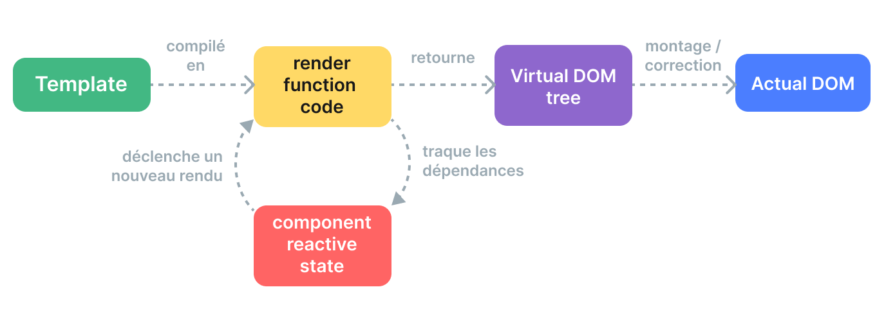

# Mécanismes de rendu {#rendering-mechanism}

Comment Vue fait pour partir d'un template et le transformer en nœuds du DOM ? Comment Vue met-il à jour ces nœuds du DOM de manière efficace ? Nous allons tenter d'élucider ces questions en nous plongeant dans les mécanismes de rendu internes de Vue.

## DOM virtuel {#virtual-dom}

Vous avez probablement entendu parler du terme "virtual DOM", sur lequel le système de rendu de Vue s'appuie.

Le DOM virtuel (VDOM) est un concept de programmation dans lequel une représentation idéale, ou "virtuelle", d'une interface utilisateur est conservée en mémoire et synchronisée avec le DOM "réel". Le concept a été lancé par [React](https://reactjs.org/), et a été adapté dans de nombreux autres frameworks avec différentes implémentations, y compris Vue.

Le DOM virtuel est plus un modèle qu'une technologie spécifique, il n'y a donc pas d'implémentation canonique. Nous pouvons illustrer ce concept à l'aide d'un exemple simple :

```js
const vnode = {
  type: 'div',
  props: {
    id: 'hello'
  },
  children: [
    /* d'autres vnodes */
  ]
}
```

Ici, un `vnode` est un objet JavaScript simple (un "nœud virtuel") représentant un élément `<div>`. Il contient toutes les informations dont nous avons besoin pour créer l'élément réel. Il contient également d'autres vnodes enfants, ce qui en fait la racine d'un arbre du DOM virtuel.

Un moteur d'exécution peut parcourir un arbre du DOM virtuel et construire un arbre du DOM réel à partir de celui-ci. Ce processus est appelé le **montage**.

Si nous avons deux copies d'arbres du DOM virtuel, le moteur de rendu peut également parcourir et comparer les deux arbres, en déterminant les différences, et appliquer ces changements au DOM réel. Ce processus est appelé **patch**, également connu sous le nom de "diffing" ou "réconciliation".

Le principal avantage du DOM virtuel est qu'il donne au développeur la possibilité de créer, inspecter et composer de manière programmatique les structures d'interface utilisateur souhaitées de façon déclarative, tout en laissant la manipulation directe du DOM au moteur de rendu.

## Pipeline de rendu {#render-pipeline}

Au niveau le plus élevé, voici ce qui se passe lorsqu'un composant Vue est monté :

1. **Compilation** : Les templates Vue sont compilés en **fonctions de rendu** : fonctions qui retournent des arbres du DOM virtuel. Cette étape peut être effectuée soit à l'avance via un outil de build, soit à la volée en utilisant le compilateur d'exécution.

2. **Montage** : Le moteur d'exécution invoque les fonctions de rendu, parcourt l'arbre du DOM virtuel retourné et crée des nœuds DOM réels en fonction. Cette étape est réalisée comme un [effet réactif](./reactivity-in-depth), et garde donc la trace de toutes les dépendances réactives qui ont été utilisées.

3. **Correction** (Patch) : Quand une dépendance utilisée pendant le montage change, l'effet est ré-exécuté. Cette fois, un nouvel arbre du DOM virtuel mis à jour est créé. Le moteur d'exécution parcourt le nouvel arbre, le compare avec l'ancien et applique les mises à jour nécessaires au DOM réel.



<!-- https://www.figma.com/file/3PBt9OrE2B9Qx6QTPLs7tl/render-pipeline?node-id=0%3A1&t=SiamAt8Jd3WM5P7I-0-->

## Templates vs. Fonctions de rendu {#templates-vs-render-functions}

Les templates Vue sont compilés en fonctions de rendu du DOM virtuel. Vue fournit également des API qui nous permettent de sauter l'étape de compilation des templates et de créer directement des fonctions de rendu. Celles-ci sont plus flexibles que les templates pour incorporer des logiques très dynamiques, car vous pouvez travailler avec les vnodes en utilisant toute la puissance de JavaScript.

Dans ce cas, pourquoi Vue recommande-t-il les templates par défaut ? Il y a un plusieurs raisons :

1. Les templates se rapprochent du HTML réel. Il est donc plus facile de réutiliser des extraits HTML existants, d'appliquer les meilleures pratiques en matière d'accessibilité, de créer un style avec du CSS, et pour les designers de comprendre le code et de le modifier.

2. Les templates sont plus faciles à analyser statiquement en raison de leur syntaxe plus déterministe. Cela permet au compilateur de templates de Vue d'appliquer de nombreuses optimisations au moment de la compilation afin d'améliorer les performances du DOM virtuel (que nous aborderons plus loin).

En pratique, les templates sont suffisants pour la plupart des cas d'utilisation d'une application. Les fonctions de rendu ne sont généralement utilisées que dans les composants réutilisables qui doivent gérer une logique de rendu hautement dynamique. L'utilisation des fonctions de rendu est abordée plus en détail dans [Fonctions de rendu et JSX](./render-function).

## DOM virtuel basé sur la compilation {#compiler-informed-virtual-dom}

L'implémentation du DOM virtuel dans React et la plupart de ses autres implémentations sont purement basées sur l'exécution : l'algorithme de réconciliation ne peut pas faire d'hypothèses sur l'arbre du DOM virtuel entrant, il doit donc traverser entièrement l'arbre et différencier les props de chaque vnode afin d'assurer la correction. En outre, même si une partie de l'arbre ne change jamais, de nouveaux vnodes sont toujours créés pour eux à chaque nouveau rendu, ce qui entraîne une charge mémoire inutile. C'est l'un des aspects les plus critiqués du DOM virtuel : le processus de réconciliation quelque peu brutal sacrifie l'efficacité au profit de la déclarativité et de l'exactitude.

Cependant d'autres façons de faire existent. Dans Vue, le framework a le contrôle à la fois pendant la compilation et l'exécution. Cela nous permet de mettre en œuvre de nombreuses optimisations au moment de la compilation dont seul un moteur de rendu étroitement intégré peut tirer parti. Le compilateur peut analyser statiquement le template et laisser des indications dans le code généré afin que le moteur d'exécution puisse gagner du temps lorsque cela est possible. Dans le même temps, l'utilisateur peut toujours avoir le contrôle jusqu'à la fonction de rendu pour agir de manière plus directe lorsque cela est nécessaire. Nous appelons cette approche hybride le **DOM virtuel basé sur la compilation**.

Nous aborderons ci-dessous quelques optimisations importantes réalisées par le compilateur de templates Vue dans le but d'améliorer les performances d'exécution du DOM virtuel.

### Cache Statique {#cache-static}

Il arrive régulièrement que certaines parties d'un template ne contiennent pas de liaisons dynamiques :

```vue-html{2-3}
<div>
  <div>foo</div> <!-- en cache -->
  <div>bar</div> <!-- en cache -->
  <div>{{ dynamic }}</div>
</div>
```

[Inspection dans l'explorateur de template](https://template-explorer.vuejs.org/#eyJzcmMiOiI8ZGl2PlxuICA8ZGl2PmZvbzwvZGl2PiA8IS0tIGNhY2hlZCAtLT5cbiAgPGRpdj5iYXI8L2Rpdj4gPCEtLSBjYWNoZWQgLS0+XG4gIDxkaXY+e3sgZHluYW1pYyB9fTwvZGl2PlxuPC9kaXY+XG4iLCJvcHRpb25zIjp7ImhvaXN0U3RhdGljIjp0cnVlfX0=)

Les divs `foo` et `bar` sont statiques - recréer des vnodes et les différencier à chaque rendu est inutile. Le moteur de rendu crée ces vnodes lors du rendu initial, les met en cache et réutilise les mêmes vnodes lors de chaque rendu ultérieur. Le moteur de rendu est également capable de ne pas les différencier quand il remarque que l'ancien et le nouveau vnode sont les mêmes.

En outre, lorsqu'il y a suffisamment d'éléments statiques consécutifs, ils seront condensés en un seul "vnode statique" qui contient une simple chaîne de caractères HTML pour tous ces nœuds ([Exemple](https://template-explorer.vuejs.org/#eyJzcmMiOiI8ZGl2PlxuICA8ZGl2IGNsYXNzPVwiZm9vXCI+Zm9vPC9kaXY+XG4gIDxkaXYgY2xhc3M9XCJmb29cIj5mb288L2Rpdj5cbiAgPGRpdiBjbGFzcz1cImZvb1wiPmZvbzwvZGl2PlxuICA8ZGl2IGNsYXNzPVwiZm9vXCI+Zm9vPC9kaXY+XG4gIDxkaXYgY2xhc3M9XCJmb29cIj5mb288L2Rpdj5cbiAgPGRpdj57eyBkeW5hbWljIH19PC9kaXY+XG48L2Rpdj4iLCJzc3IiOmZhbHNlLCJvcHRpb25zIjp7ImhvaXN0U3RhdGljIjp0cnVlfX0=)). Ces vnodes statiques sont montés en modifiant directement `innerHTML`.

### Marques de correction {#patch-flags}

Nous pouvons également déduire de nombreuses informations concernant un élément unique possédant des liaisons dynamiques au moment de la compilation :

```vue-html
<!-- seulement une liaison de classe -->
<div :class="{ active }"></div>

<!-- seulement des liaisons de value et de l'id -->
<input :id="id" :value="value">

<!-- seulement un texte -->
<div>{{ dynamic }}</div>
```

[Inspection dans l'explorateur de template](https://template-explorer.vuejs.org/#eyJzcmMiOiI8ZGl2IDpjbGFzcz1cInsgYWN0aXZlIH1cIj48L2Rpdj5cblxuPGlucHV0IDppZD1cImlkXCIgOnZhbHVlPVwidmFsdWVcIj5cblxuPGRpdj57eyBkeW5hbWljIH19PC9kaXY+Iiwib3B0aW9ucyI6e319)

Lors de la génération du code de la fonction de rendu pour ces éléments, Vue encode le type de mise à jour dont chacun d'entre eux a besoin directement dans l'appel de création de vnode :

```js{3}
createElementVNode("div", {
  class: _normalizeClass({ active: _ctx.active })
}, null, 2 /* CLASS */)
```

Le dernier argument, `2`, est une [option de correction](https://github.com/vuejs/core/blob/main/packages/shared/src/patchFlags.ts). Un élément peut avoir plusieurs marques de correction, qui seront fusionnées en un seul nombre. Le moteur d'exécution peut alors vérifier les marques en utilisant des [opérations sur les bits](https://en.wikipedia.org/wiki/Bitwise_operation) pour déterminer s'il doit effectuer certaines opération :

```js
if (vnode.patchFlag & PatchFlags.CLASS /* 2 */) {
  // met à jour la classe de l'élément
}
```

Les vérifications par bit sont extrêmement rapides. Grâce aux marques de correction, Vue est en mesure d'effectuer le moins d'opérations possible lors de la mise à jour des éléments avec des liaisons dynamiques.

Vue encode également le type des enfants d'un vnode. Par exemple, un template qui possède plusieurs nœuds racines est représenté comme un fragment. Dans la plupart des cas, nous savons avec certitude que l'ordre de ces nœuds racines ne changera jamais, de sorte que cette information peut également être fournie au moment de l'exécution en tant qu'indicateur de patch :

```js{4}
export function render() {
  return (_openBlock(), _createElementBlock(_Fragment, null, [
    /* enfants */
  ], 64 /* STABLE_FRAGMENT */))
}
```

Lors de l'exécution, la réconciliation de l'ordre des enfants pour le fragment racine peut donc être totalement ignorée.

### Réduction d'un arbre {#tree-flattening}

Si vous regardez à nouveau le code généré dans l'exemple précédent, vous remarquerez que la racine de l'arbre du DOM virtuel retourné est créée en utilisant un appel spécial à `createElementBlock()` :

```js{2}
export function render() {
  return (_openBlock(), _createElementBlock(_Fragment, null, [
    /* enfants */
  ], 64 /* STABLE_FRAGMENT */))
}
```

Conceptuellement, un "bloc" est une partie du template qui a une structure interne stable. Dans notre cas, le modèle template n'a qu'un seul bloc car il ne contient pas de directives structurelles comme `v-if` et `v-for`.

Chaque bloc traque tous les nœuds descendants (pas seulement les enfants directs) possédant des marques de correction. Par exemple :

```vue-html{3,5}
<div> <!-- root block -->
  <div>...</div>         <!-- non traqué -->
  <div :id="id"></div>   <!-- traqué -->
  <div>                  <!-- non traqué -->
    <div>{{ bar }}</div> <!-- traqué -->
  </div>
</div>
```

Il en résulte un tableau réduit qui ne contient que les nœuds descendants dynamiques :

```
div (block root)
- div with :id binding
- div with {{ bar }} binding
```

Lorsque ce composant doit effectuer un nouveau rendu, il ne doit parcourir que l'arbre réduit au lieu de l'arbre complet. C'est ce qu'on appelle la réduction de l'arbre (**Tree Flattening**), et cela réduit considérablement le nombre de nœuds qui doivent être traversés pendant la réconciliation virtuelle du DOM. Toutes les parties statiques du template sont ignorées.

Les directives `v-if` et `v-for` vont créer de nouveaux nœuds pour un bloc :

```vue-html
<div> <!-- bloc racine -->
  <div>
    <div v-if> <!-- bloc if -->
      ...
    </div>
  </div>
</div>
```

Un bloc enfant est traqué à l'intérieur du tableau des descendants dynamiques du bloc parent. Cela permet au bloc parent de conserver une structure stable.

### Conséquences sur l'hydratation SSR {#impact-on-ssr-hydration}

Les marques de correction et la réduction des arbres améliorent également considérablement les performances de Vue en matière d'[hydratation SSR](/guide/scaling-up/ssr#client-hydration) :

- L'hydratation d'un seul élément peut utiliser des chemins rapides basés sur les marques de correction du vnode correspondant.

- Seuls les nœuds de bloc et leurs descendants dynamiques doivent être parcourus pendant l'hydratation, ce qui permet d'obtenir une hydratation partielle au niveau du template.
