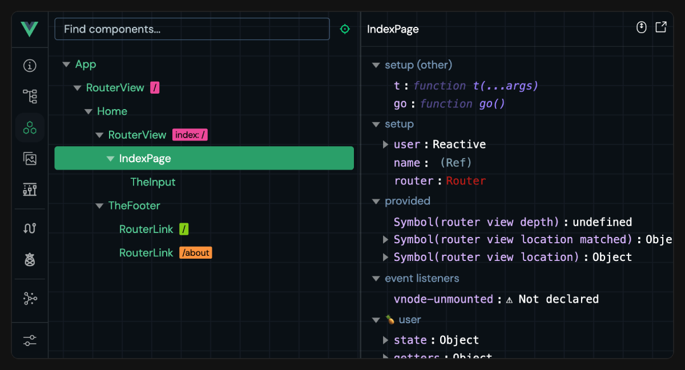

<script setup>
import { VTCodeGroup, VTCodeGroupTab } from '@vue/theme'
</script>

# Outils {#tooling}

## Essayer en ligne {#try-it-online}

Vous n'avez pas besoin d'installer quoi que ce soit sur votre machine pour essayer les composants monofichiers de Vue - il existe des terrains de jeu en ligne qui vous permettent de le faire directement dans le navigateur :

- [Terrain de jeu des composants monofichiers de Vue](https://play.vuejs.org)
  - Toujours déployé à partir du dernier commit
  - Conçu pour inspecter les résultats de la compilation d'un composant
- [Vue + Vite sur StackBlitz](https://vite.new/vue)
  - Environnement semblable à un environnement de développement classique exécutant le serveur de développement Vite dans le navigateur.
  - Le plus proche de la configuration locale

Il est également recommandé d'utiliser ces terrains de jeu en ligne pour fournir des reproductions lors du signalement de bugs.

## Squelette d'un projet {#project-scaffolding}

### Vite {#vite}

[Vite](https://vitejs.dev/) est un outil de construction léger et rapide avec un support de première classe pour les composants monofichiers de Vue. Il a été créé par Evan You, qui est également l'auteur de Vue !

Pour commencer avec Vite + Vue, exécutez simplement :

::: code-group

```sh [npm]
$ npm create vue@latest
```

```sh [pnpm]
$ pnpm create vue@latest
```

```sh [yarn]
# Avec Yarn Moderne (v2+)
$ yarn create vue@latest

# Avec Yarn ^v4.11
$ yarn dlx create-vue@latest
```

```sh [bun]
$ bun create vue@latest
```

:::

Cette commande installera et exécutera [create-vue](https://github.com/vuejs/create-vue), l'outil officiel d'élaboration d'un projet Vue.

- Pour en savoir plus sur Vite, consultez la [doc Vite](https://vitejs.dev).
- Pour configurer le comportement spécifique de Vue dans un projet Vite, par exemple en passant des options au compilateur Vue, consultez la documentation de [@vitejs/plugin-vue](https://github.com/vitejs/vite-plugin-vue/tree/main/packages/plugin-vue#readme).

Les deux terrains de jeu en ligne mentionnés ci-dessus prennent également en charge le téléchargement de fichiers en tant que projet Vite.

### Vue CLI {#vue-cli}

[Vue CLI](https://cli.vuejs.org/) est la chaîne d'outils officielle basée sur webpack pour Vue. Elle est maintenant en mode maintenance et nous recommandons de commencer les nouveaux projets avec Vite, à moins que vous ne dépendiez de fonctionnalités spécifiques à webpack. Vite offrira une expérience de développement supérieure dans la plupart des cas.

Pour des informations sur la migration de Vue CLI vers Vite :

- [Guide de migration de Vue CLI -> Vite sur VueSchool.io](https://vueschool.io/articles/vuejs-tutorials/how-to-migrate-from-vue-cli-to-vite/)
- [Outils / Plugins utiles pour la migration automatique](https://github.com/vitejs/awesome-vite#vue-cli)

### Note sur la compilation des templates dans le navigateur {#note-on-in-browser-template-compilation}

Lorsque Vue est utilisé sans outil de build, les templates de composants sont écrits soit directement dans le HTML de la page, soit directement sous forme de chaînes de caractères JavaScript. Dans ce cas, Vue doit envoyer le compilateur de templates au navigateur afin d'effectuer la compilation des templates à la volée. D'un autre côté, le compilateur ne serait pas nécessaire si nous pré-compilions les templates avec une étape de build. Pour réduire la taille du paquet client, Vue fournit [différents "builds"](https://unpkg.com/browse/vue@3/dist/) optimisées pour différents cas d'utilisation.

- Les fichiers de build qui commencent par `vue.runtime.*` sont des **builds spécifiques à l'exécution** : ils n'incluent pas le compilateur. Lorsque vous utilisez ces builds, tous les templates doivent être pré-compilés via une étape de build.

- Les fichiers de build qui n'incluent pas `.runtime` sont des **builds complets** : ils incluent le compilateur et supportent la compilation des templates directement dans le navigateur. Cependant, ils augmentent la taille de ~14kb.

Nos configurations d'outils par défaut utilisent le build spécifique à l'exécution puisque tous les templates dans les composants monofichiers sont pré-compilés. Si, pour une raison quelconque, vous avez besoin de compiler les templates dans le navigateur même avec une étape de build, vous pouvez le faire en configurant l'outil de build afin de créer un alias entre `vue` et `vue/dist/vue.esm-bundler.js` à la place.

Si vous recherchez une alternative plus légère pour une utilisation sans étape de build, consultez [petite-vue](https://github.com/vuejs/petite-vue).

## Support des environnements de développement {#ide-support}

- La configuration IDE recommandée est [VS Code](https://code.visualstudio.com/) + l'extension [Vue Language Features (Volar)](https://github.com/johnsoncodehk/volar) (précédemment Volar). L'extension fournit la coloration syntaxique, la prise en charge de TypeScript et l'intellisense pour les expressions des templates et les props des composants.

  :::tip
  Vue - Official remplace [Vetur](https://marketplace.visualstudio.com/items?itemName=octref.vetur), notre précédente extension officielle VS Code pour Vue 2. Si vous avez Vetur actuellement installé, assurez-vous de le désactiver dans les projets Vue 3.
  :::

- [WebStorm](https://www.jetbrains.com/webstorm/) offre également un excellent support intégré pour les composants monofichiers de Vue.

- D'autres IDE qui prennent en charge le [Language Service Protocol](https://microsoft.github.io/language-server-protocol/) (LSP) peuvent également exploiter les fonctionnalités de base de Volar via le LSP :

  - Support de Sublime Text via [LSP-Volar](https://github.com/sublimelsp/LSP-volar).

  - Support de vim / Neovim via [coc-volar](https://github.com/yaegassy/coc-volar).

  - Support emacs via [lsp-mode](https://emacs-lsp.github.io/lsp-mode/page/lsp-volar/)

## Outils de développement du navigateur {#browser-devtools}

L'extension du navigateur Vue devtools vous permet d'explorer l'arborescence des composants d'une application Vue, d'inspecter l'état des composants individuels, de suivre les événements de gestion de l'état et d'analyser les performances.



- [Documentation](https://devtools.vuejs.org/)
- [Extension Chrome](https://chromewebstore.google.com/detail/vuejs-devtools/nhdogjmejiglipccpnnnanhbledajbpd)
- [Addon Firefox](https://addons.mozilla.org/fr/firefox/addon/vue-js-devtools/)
- [Plugin Vite](https://devtools.vuejs.org/guide/vite-plugin)
- [Application autonome Electron](https://devtools.vuejs.org/guide/installation.html#standalone)

## TypeScript {#typescript}

Article principal : [Utiliser Vue avec TypeScript](/guide/typescript/overview).

- [Extension Vue - Official](https://github.com/vuejs/language-tools) fournit une vérification de type pour les composants monofichiers utilisant des blocs `<script lang="ts">`, y compris les expressions de templates et la validation de props entre composants.

- Utilisez [`vue-tsc`](https://github.com/vuejs/language-tools/tree/master/packages/tsc) pour effectuer la même vérification de type depuis la ligne de commande, ou pour générer des fichiers `d.ts` pour les composants monofichiers.

## Testing {#testing}

Article principal : [Guide de test](/guide/scaling-up/testing).

- [Cypress](https://www.cypress.io/) est recommandé pour les tests E2E. Il peut également être utilisé pour les tests de composants pour les composants monofichiers Vue via le [Cypress Component Test Runner](https://docs.cypress.io/guides/component-testing/introduction).

- [Vitest](https://vitest.dev/) est un exécuteur de tests créé par les membres de l'équipe Vue / Vite qui se concentre sur la vitesse. Il est spécifiquement conçu pour les applications basées sur Vite afin de fournir la même boucle de feedback instantané pour les tests unitaires / de composants.

- [Jest](https://jestjs.io/) peut fonctionner avec Vite via [vite-jest](https://github.com/sodatea/vite-jest). Cependant, ceci n'est recommandé que si vous avez des suites de test existantes basées sur Jest que vous devez migrer vers une configuration basée sur Vite, car Vitest fournit des fonctionnalités similaires avec une intégration beaucoup plus efficace.

## Linting {#linting}

L'équipe Vue maintient [eslint-plugin-vue](https://github.com/vuejs/eslint-plugin-vue), un plugin [ESLint](https://eslint.org/) qui supporte les règles de linting spécifiques aux composants monofichiers.

Les utilisateurs utilisant Vue CLI avant peuvent être habitués à avoir des linters configurés via des loaders webpack. Cependant, lorsque vous utilisez une configuration de build basée sur Vue, notre recommandation générale est la suivante :

1. `npm install -D eslint eslint-plugin-vue`, puis suivez le [guide de configuration](https://eslint.vuejs.org/user-guide/#usage) d'`eslint-plugin-vue`.

2. Configurez les extensions ESLint de votre environnement de développement, par exemple [ESLint pour VS Code](https://marketplace.visualstudio.com/items?itemName=dbaeumer.vscode-eslint), afin d'obtenir un feedback du linter directement dans votre éditeur pendant le développement. Cela évite également les coûts inutiles de linting lors du démarrage du serveur de développement.

3. Exécutez ESLint dans le cadre de la commande de build de production, afin d'obtenir un feedback complet sur le linter avant de l'envoyer en production.

4. (Facultatif) Configurez des outils tels que [lint-staged](https://github.com/okonet/lint-staged) pour vérifier uniquement les fichiers modifiés d'un commit git.

## Mise en page {#formatting}

- L'extension VS Code [Vue - Official](https://github.com/vuejs/language-tools) permet de formater les composants monofichiers de Vue.

- Autrement, [Prettier](https://prettier.io/) offre une prise en charge intégrée du formatage des composants monofichiers de Vue.

## Intégrations de blocs personnalisés dans les composants monofichiers {#sfc-custom-block-integrations}

Les blocs personnalisés sont compilés en importations en provenance du même fichier Vue avec des requêtes différentes. C'est à l'outil de build sous-jacent de gérer ces demandes d'importation.

- Si vous utilisez Vite, un plugin Vite personnalisé doit être utilisé pour transformer les blocs personnalisés assortis en JavaScript exécutable. [Exemple](https://github.com/vitejs/vite-plugin-vue/tree/main/packages/plugin-vue#example-for-transforming-custom-blocks)

- Si vous utilisez Vue CLI ou entièrement webpack, un loader webpack doit être configuré pour transformer les blocs correspondants. [Exemple](https://vue-loader.vuejs.org/guide/custom-blocks.html)

## Packages de bas niveau {#lower-level-packages}

### `@vue/compiler-sfc` {#vue-compiler-sfc}

- [Documentation](https://github.com/vuejs/core/tree/main/packages/compiler-sfc)

Ce paquet fait partie du noyau de Vue monorepo et est toujours publié avec la même version que le paquet principal `vue`. Il est inclus en tant que dépendance du paquet principal `vue` et disponible sous `vue/compiler-sfc` afin que vous n'ayez pas besoin de l'installer individuellement.

Le paquet lui-même fournit des utilitaires de bas niveau pour traiter les composants monofichiers de Vue et est seulement destiné aux auteurs d'outils qui ont besoin de supporter les composants monofichiers de Vue dans des outils personnalisés.

:::tip
Préférez toujours utiliser ce paquet via l'importation profonde `vue/compiler-sfc` car cela garantit que sa version est synchronisée avec le moment d'exécution de Vue.
:::

### `@vitejs/plugin-vue` {#vitejs-plugin-vue}

- [Documentation](https://github.com/vitejs/vite-plugin-vue/tree/main/packages/plugin-vue)

Plugin officiel qui permet le support des composants monofichiers de Vue dans Vite.

### `vue-loader` {#vue-loader}

- [Documentation](https://vue-loader.vuejs.org/)

Le loader officiel qui assure le support des composants monofichiers de Vue dans webpack. Si vous utilisez Vue CLI, consultez également la [documentation sur la modification des options `vue-loader` dans Vue CLI](https://cli.vuejs.org/guide/webpack.html#modifying-options-of-a-loader).

## Autres terrains de jeu en ligne {#other-online-playgrounds}

- [Terrain de jeu VueUse](https://play.vueuse.org)
- [Vue + Vite sur Repl.it](https://replit.com/@templates/VueJS-with-Vite)
- [Vue sur CodeSandbox](https://codesandbox.io/p/devbox/github/codesandbox/sandbox-templates/tree/main/vue-vite)
- [Vue sur Codepen](https://codepen.io/pen/editor/vue)
- [Vue sur WebComponents.dev](https://webcomponents.dev/create/cevue)

<!-- TODO ## Backend Framework Integrations -->
