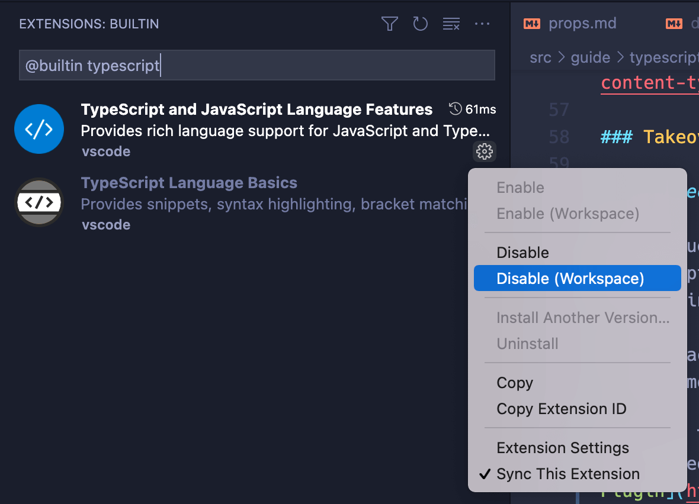

# Utiliser Vue avec Typescript {#using-vue-with-typescript}

Un système de typage comme TypeScript peut détecter de nombreuses erreurs courantes via une analyse statique au moment du build. Cela réduit le risque d'erreurs d'exécution en production et nous permet également de refactoriser le code avec plus de confiance dans les applications à grande échelle. TypeScript améliore également l'ergonomie des développeurs via l'auto-complétion basée sur le type dans les IDE.

Vue est écrit en TypeScript lui-même et fournit un support TypeScript nativement. Tous les packages Vue officiels sont livrés avec des déclarations de types prêts à l'emploi.

## Configuration du projet {#project-setup}

[`create-vue`](https://github.com/vuejs/create-vue), l'outil officiel de création de projet, offre les options pour construire un projet propulsé par [Vite](https://vitejs.dev/) et fonctionnant avec TypeScript.

### Vue d'ensemble {#overview}

Avec une configuration basée sur Vite, le serveur de développement et le bundler ne font que de transpiler et n'effectuent aucune vérification de type. Cela garantit que le serveur de développement Vite reste extrêmement rapide même lorsque vous utilisez TypeScript.

- Pendant le développement, nous vous recommandons de vous fier à une bonne [configuration de votre IDE](#ide-support) pour un feedback instantané sur les erreurs de type.

- Si vous utilisez des SFC, utilisez [`vue-tsc`](https://github.com/johnsoncodehk/volar/tree/master/vue-language-tools/vue-tsc) pour la vérification du type en ligne de commande et pour la génération de déclarations de type. `vue-tsc` fonctionne avec `tsc`, l'interface de ligne de commande officielle de TypeScript. Il fonctionne en grande partie de la même manière que `tsc` sauf qu'il prend en charge les SFC de Vue en plus des fichiers TypeScript. Vous pouvez exécuter `vue-tsc` en mode *watch* en parallèle avec le serveur de développement Vite, ou utiliser un plugin Vite comme [vite-plugin-checker](https://vite-plugin-checker.netlify.app/) qui exécute les vérifications dans un thread de travail séparé.

- Vue CLI prend également en charge TypeScript, mais n'est plus recommandé. Voir [les notes ci-dessous](#note-on-vue-cli-and-ts-loader).

### Support des IDE {#ide-support}

- [Visual Studio Code](https://code.visualstudio.com/) (VSCode) est fortement recommandé pour son excellent support prêt à l'emploi pour TypeScript.

  - [Volar](https://marketplace.visualstudio.com/items?itemName=Vue.volar) est l'extension VSCode officielle qui fournit la prise en charge de TypeScript pour les SFC de Vue, ainsi que de nombreuses autres fonctionnalités intéressantes.

    :::tip
    Volar remplace [Vetur](https://marketplace.visualstudio.com/items?itemName=octref.vetur), notre précédente extension VSCode officielle pour Vue 2. Si Vetur est actuellement installé, assurez-vous de le désactiver dans les projets Vue 3 .
    :::

  - [TypeScript Vue Plugin](https://marketplace.visualstudio.com/items?itemName=Vue.vscode-typescript-vue-plugin) est également nécessaire pour obtenir la prise en charge du type pour les importations `*.vue` dans les fichiers TS.

- [WebStorm](https://www.jetbrains.com/webstorm/) fournit également une prise en charge prête à l'emploi pour TypeScript et Vue. D'autres IDE JetBrains les prennent également en charge, soit prêts à l'emploi, soit via [un plugin gratuit](https://plugins.jetbrains.com/plugin/9442-vue-js).

### Configurer `tsconfig.json` {#configuring-tsconfig-json}

Les projets construits via `create-vue` incluent un `tsconfig.json` préconfiguré. La configuration de base est résumée dans le package [`@vue/tsconfig`](https://github.com/vuejs/tsconfig). Au sein du projet, nous utilisons [Project References](https://www.typescriptlang.org/docs/handbook/project-references.html) pour nous assurer que les types de code corrects s'exécutent dans différents environnements (par exemple, le code d'application et le code de test doivent avoir différentes variables globales).

Lors de la configuration manuelle de `tsconfig.json`, certaines options notables incluent :

- [`compilerOptions.isolatedModules`](https://www.typescriptlang.org/tsconfig#isolatedModules) est défini sur `true` car Vite utilise [esbuild](https://esbuild.github.io/) pour transpiler TypeScript et est soumis à des limitations de transpilation de fichier unique.

- Si vous utilisez l'Options API, vous devez définir [`compilerOptions.strict`](https://www.typescriptlang.org/tsconfig#strict) sur `true` (ou au moins activer [`compilerOptions.noImplicitThis`](https://www.typescriptlang.org/tsconfig#noImplicitThis), qui fait partie de l'indicateur `strict`) pour tirer parti de la vérification de type de `this` dans les options de composant. Sinon, `this` sera traité comme `any`.

- Si vous avez configuré des alias de résolveur dans votre outil de construction, par exemple l'alias `@/*` configuré par défaut dans un projet `create-vue`, vous devez également le configurer pour TypeScript via [`compilerOptions.paths`](https://www.typescriptlang.org/tsconfig#paths).

Voir aussi :

- [Documentation officielle des options du compilateur TypeScript](https://www.typescriptlang.org/docs/handbook/compiler-options.html)
- [Avertissements concernant la compilation TypeScript d'esbuild](https://esbuild.github.io/content-types/#typescript-caveats)

### Mode prise de contrôle Volar {#volar-takeover-mode}

> Cette section s'applique uniquement à VSCode + Volar.

Pour que les SFC de Vue et TypeScript fonctionnent ensemble, Volar crée une instance de service de langage TS distincte avec un support spécifique à Vue et l'utilise dans les SFC. Dans le même temps, les fichiers TS simples sont toujours gérés par le service de langage TS intégré de VSCode, c'est pourquoi nous avons besoin du [plugin TypeScript Vue](https://marketplace.visualstudio.com/items?itemName=Vue.vscode-typescript-vue-plugin) pour prendre en charge les importations SFC dans les fichiers TS. Cette configuration par défaut fonctionne, mais pour chaque projet, nous exécutons deux instances de service de langage TS : une pour Volar, une pour le service intégré de VSCode. Ceci est un peu inefficace et peut entraîner des problèmes de performances dans les grands projets.

Volar fournit une fonctionnalité appelée "Mode prise de contrôle" (ou Takeover Mode) pour améliorer les performances. En mode prise de contrôle, Volar prend en charge les fichiers Vue et TS à l'aide d'une seule instance de service de langage TS.

Pour activer l'activer, vous devez désactiver le service de langage TS intégré de VSCode dans **l'espace de travail de votre projet uniquement** en suivant ces étapes :

1. Dans l'espace de travail de votre projet, affichez la palette de commandes avec `Ctrl + Shift + P` (macOS : `Cmd + Shift + P`).
2. Tapez `built` et sélectionnez "Extensions : Afficher les extensions intégrées".
3. Tapez `typescript` dans la zone de recherche d'extension (ne supprimez pas le préfixe `@builtin`).
4. Cliquez sur la petite icône d'engrenage de "Fonctionnalités du langage TypeScript et JavaScript", et sélectionnez "Désactiver (espace de travail)".
5. Rechargez l'espace de travail. Le mode Prise de contrôle sera activé lorsque vous ouvrirez un fichier Vue ou TS.



### Note on Vue CLI and `ts-loader` {#note-on-vue-cli-and-ts-loader}

In webpack-based setups such as Vue CLI, it is common to perform type checking as part of the module transform pipeline, for example with `ts-loader`. This, however, isn't a clean solution because the type system needs knowledge of the entire module graph to perform type checks. Individual module's transform step simply is not the right place for the task. It leads to the following problems:

- `ts-loader` can only type check post-transform code. This doesn't align with the errors we see in IDEs or from `vue-tsc`, which map directly back to the source code.

- Type checking can be slow. When it is performed in the same thread / process with code transformations, it significantly affects the build speed of the entire application.

- We already have type checking running right in our IDE in a separate process, so the cost of dev experience slow down simply isn't a good trade-off.

If you are currently using Vue 3 + TypeScript via Vue CLI, we strongly recommend migrating over to Vite. We are also working on CLI options to enable transpile-only TS support, so that you can switch to `vue-tsc` for type checking.

## General Usage Notes {#general-usage-notes}

### `defineComponent()` {#definecomponent}

To let TypeScript properly infer types inside component options, we need to define components with [`defineComponent()`](/api/general.html#definecomponent):

```ts
import { defineComponent } from 'vue'

export default defineComponent({
  // type inference enabled
  props: {
    name: String,
    msg: { type: String, required: true }
  },
  data() {
    return {
      count: 1
    }
  },
  mounted() {
    this.name // type: string | undefined
    this.msg // type: string
    this.count // type: number
  }
})
```

`defineComponent()` also supports inferring the props passed to `setup()` when using Composition API without `<script setup>`:

```ts
import { defineComponent } from 'vue'

export default defineComponent({
  // type inference enabled
  props: {
    message: String
  },
  setup(props) {
    props.message // type: string | undefined
  }
})
```

See also:

- [Note on webpack Treeshaking](/api/general.html#note-on-webpack-treeshaking)
- [type tests for `defineComponent`](https://github.com/vuejs/core/blob/main/test-dts/defineComponent.test-d.tsx)

:::tip
`defineComponent()` also enables type inference for components defined in plain JavaScript.
:::

### Usage in Single-File Components {#usage-in-single-file-components}

To use TypeScript in SFCs, add the `lang="ts"` attribute to `<script>` tags. When `lang="ts"` is present, all template expressions also enjoy stricter type checking.

```vue
<script lang="ts">
import { defineComponent } from 'vue'

export default defineComponent({
  data() {
    return {
      count: 1
    }
  }
})
</script>

<template>
  <!-- type checking and auto-completion enabled -->
  {{ count.toFixed(2) }}
</template>
```

`lang="ts"` can also be used with `<script setup>`:

```vue
<script setup lang="ts">
// TypeScript enabled
import { ref } from 'vue'

const count = ref(1)
</script>

<template>
  <!-- type checking and auto-completion enabled -->
  {{ count.toFixed(2) }}
</template>
```

### TypeScript in Templates {#typescript-in-templates}

The `<template>` also supports TypeScript in binding expressions when `<script lang="ts">` or `<script setup lang="ts">` is used. This is useful in cases where you need to perform type casting in template expressions.

Here's a contrived example:

```vue
<script setup lang="ts">
let x: string | number = 1
</script>

<template>
  <!-- error because x could be a string -->
  {{ x.toFixed(2) }}
</template>
```

This can be worked around with an inline type cast:

```vue{6}
<script setup lang="ts">
let x: string | number = 1
</script>

<template>
  {{ (x as number).toFixed(2) }}
</template>
```

:::tip
If using Vue CLI or a webpack-based setup, TypeScript in template expressions requires `vue-loader@^16.8.0`.
:::

## API-Specific Recipes {#api-specific-recipes}

- [TS with Composition API](./composition-api)
- [TS with Options API](./options-api)
